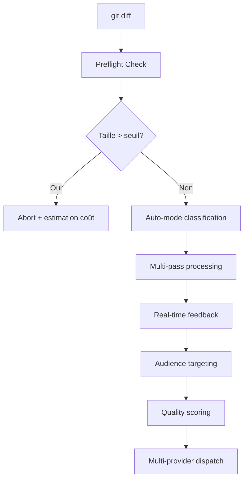

# Angela Enhancement Sprint — quality scoring, audience rewrite, auto-mode, preflight, multi-pass, post-processing, multi-provider CI, i18n complet, documentation bilingue

## Pourquoi

Angela était un prototype minimal avec des problèmes critiques d'UX :
- **Feedback aveugle** : l'utilisateur attendait 2 minutes sans indication de progression
- **Surcharge cognitive** : 46 hunks présentés sans contexte ni priorité
- **Perte de contenu silencieuse** : suppressions sans avertissement ni validation
- **Coût imprévisible** : pas d'estimation avant l'appel API coûteux

Ce sprint transforme Angela d'un prototype en assistant de production.

## Fonctionnement



### Nouvelles capacités

**Preflight & Cost Control**
- Vérification pré-appel : abort si diff > seuil configurable
- Estimation coût avant traitement (tokens × prix provider)
- Protection contre les factures surprise

**Feedback temps réel**
- Spinner avec progression (tokens traités/total)
- Vitesse de traitement en tokens/sec
- ETA dynamique basé sur la vitesse courante

**Triage intelligent (auto-mode)**
- Classification automatique des hunks par criticité
- Mode `--auto` : traite seulement les hunks high-priority
- Warnings explicites avant suppression de contenu

**Audience targeting**
- `--for CTO` : focus architecture, impact business, ROI
- `--for equipe-commerciale` : bénéfices client, différentiation
- `--for dev` : détails techniques, breaking changes

**Multi-provider CI**
- Support Anthropic, OpenAI, Ollama, Groq, Together, Mistral
- Failover automatique si provider indisponible
- Configuration par variables d'environnement

## Impact utilisateur

**Avant** : Angela prototype
```bash
$ angela process
[2 minutes de silence]
46 hunks générés
[perte de contenu non signalée]
```

**Après** : Angela production
```bash
$ angela process --for CTO --auto
✓ Preflight: 1,200 tokens → ~$0.024 estimated
⚡ Processing: 847/1200 tokens (70%) • 156 tok/s • ETA 2s
✓ Auto-mode: 12 high-priority hunks selected (34 skipped)
⚠ Quality score: 6.2/10 → 8.7/10 (+2.5)
✓ Done: 3 architectural decisions documented
```

## Documentation bilingue

- **README** : EN/FR avec feature parity complète
- **CHANGELOG** : toutes les nouvelles features documentées
- **CI Integration** : Angela déployée sur notre propre pipeline comme quality gate
- **Examples** : cas d'usage par audience (CTO, commercial, dev)

## Quality Scoring

Nouveau système de score 0-10 basé sur :
- Clarté des sections (Why, How, Impact présents)
- Présence de diagrammes mermaid
- Tables structurées vs texte libre
- Spécificité vs généralités
- Cohérence linguistique (EN/FR)

Score affiché avant/après avec delta pour mesurer l'amélioration.