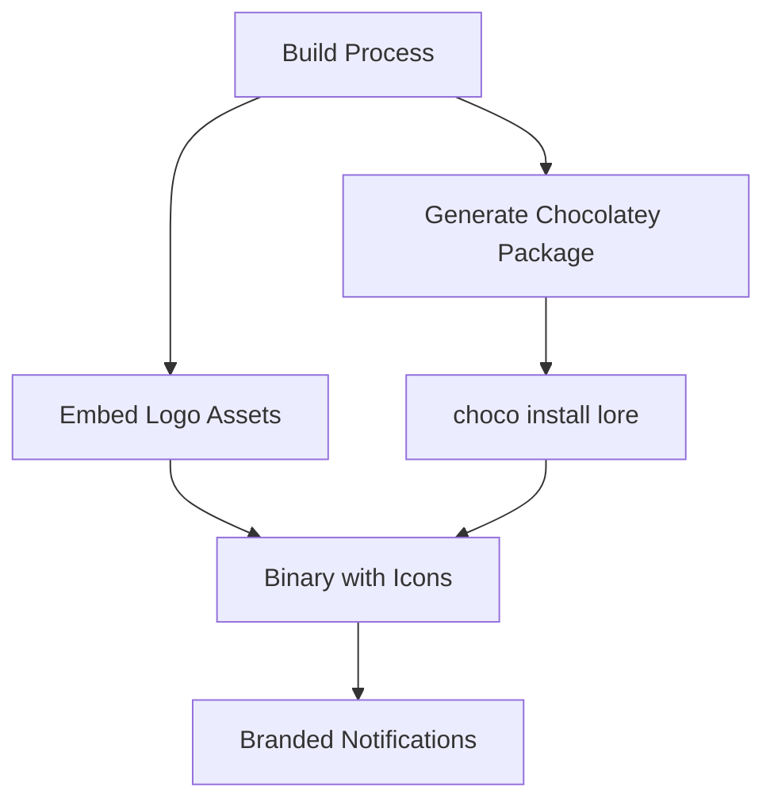

# Enable Chocolatey Package Distribution and Embedded Logo

## Why

Lore currently requires manual installation via GitHub releases or building from source. This creates friction for Windows developers who expect `choco install lore` to work.

The embedded logo solves notification icon issues where Lore shows generic system icons instead of its branded logo, reducing visual clarity in system notifications.

## What Changed

Two distribution improvements:
- **Chocolatey package**: Windows package manager integration
- **Embedded logo**: Binary includes logo assets for notifications

## How It Works



**Chocolatey Integration:**
- Package metadata points to GitHub releases
- Auto-updates when new versions are published
- Standard Windows package management workflow

**Embedded Logo:**
- Logo assets compiled into binary at build time
- System notifications use embedded icons instead of generic defaults
- Cross-platform notification branding

## User Impact

**Before:**
- Windows users: download .exe manually or build from source
- Notifications: generic system icons

**After:**
- Windows users: `choco install lore` or `choco upgrade lore`
- Notifications: Lore-branded icons across all platforms

## How to Verify

**Chocolatey Package:**
```bash
choco search lore
choco install lore
lore --version
```

**Embedded Logo:**
1. Trigger a Lore notification (e.g., commit hook prompt)
2. Verify notification shows Lore logo, not generic icon
3. Test on Windows, macOS, and Linux

Expected: Consistent branded notifications across all platforms.