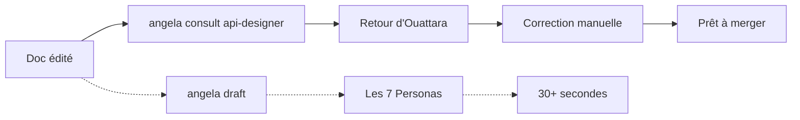

# lore angela consult

Consultation ad-hoc d'un persona unique — hors-ligne, sans IA, sans modification.

## Synopsis

```bash
lore angela consult <persona> [nom-de-fichier]
lore angela consult                            # liste les personas disponibles
```

## Pourquoi

Après avoir poli un document ou effectué des modifications manuelles, vous avez besoin d'un retour ciblé d'un expert précis sans relancer tout le pipeline draft. `consult` vous donne une critique instantanée et focalisée à travers la lentille d'un seul persona.

La commande `draft` complète lance 7 personas et prend 30+ secondes. Parfois vous avez juste besoin qu'Ouattara vérifie vos exemples API ou qu'Affoue valide que votre narration tient la route. C'est une consultation de 50ms, pas une revue complète.



## Comment ça marche

`consult` charge la lentille draft-check du persona spécifié et l'applique à votre document tel quel. Aucun appel IA, aucune modification de fichier, aucune clé API requise.

**Entrée :** Document + identifiant du persona
**Sortie :** Retour focalisé depuis la perspective de cet expert
**Durée :** < 50ms

## Arguments

| Argument | Requis | Description |
|----------|--------|-------------|
| `persona` | Oui (ou omettre pour lister) | Identifiant du persona (ex. `api-designer`, `storyteller`) |
| `nom-de-fichier` | Oui (quand persona fourni) | Document à analyser |

## Personas disponibles

Lancez sans argument pour voir la liste :

```bash
lore angela consult
```

```text
Personas disponibles :

  📖 storyteller           Affoue
                            Clarté narrative et storytelling authentique

  ✏️ tech-writer            Salou
                            Précision et clarté d'écriture technique

  🔍 qa-reviewer            Kouame
                            Assurance qualité et critères de validation

  🏗️ architect              Doumbia
                            Conception système, compromis et scalabilité

  🎨 ux-designer            Gougou
                            Empathie utilisateur, modèles mentaux et accessibilité

  📊 business-analyst       Beda
                            Traçabilité des exigences et valeur métier

  🔌 api-designer           Ouattara
                            Contrats API, docs prêtes pour le synthesizer, sémantique HTTP
```

## Exemples

```bash
# Demander à Ouattara de vérifier la complétude API
lore angela consult api-designer feature-auth.md

# Demander à Affoue de vérifier la qualité narrative
lore angela consult storyteller decision-database.md

# Demander à Kouame les critères de vérification
lore angela consult qa-reviewer bugfix-login.md

# Fonctionne aussi sur des docs externes (pas de lore init nécessaire)
lore angela consult tech-writer --path ./docs-externes/ guide-api.md
```

## Exemples de sortie

Quand des problèmes sont trouvés :

```text
→ .lore/docs/feature-auth.md
  Consultation : 🔌 Ouattara — Contrats API, docs prêtes pour le synthesizer, sémantique HTTP

  warning  persona        [🔌 Ouattara] Endpoints listés sans exemple de requête HTTP
  info     persona        [🔌 Ouattara] Endpoints sans réponses d'erreur documentées

2 suggestion(s).
```

Quand aucun problème n'est trouvé :

```text
→ .lore/docs/feature-account-statement.md
  Consultation : 🔌 Ouattara — Contrats API, docs prêtes pour le synthesizer, sémantique HTTP

  Aucune suggestion — Ouattara ne voit rien à ajouter sur ce doc en l'état.
```

## Cas d'usage courants

| Situation | Commande | Quand |
|-----------|----------|-------|
| Vérification API pré-merge | `consult api-designer doc.md` | Après édition manuelle de docs API |
| Revue de flux narratif | `consult storyteller doc.md` | Après restructuration du contenu |
| Vérification de clarté technique | `consult tech-writer doc.md` | Après ajout d'explications complexes |
| Validation d'architecture | `consult architect adr-042.md` | Avant publication d'ADR |

## Scénario concret

Vous avez poli votre doc feature API avec Angela. Le polish a amélioré la narration, mais vous n'êtes pas sûr que le contrat API soit complet :

```bash
lore angela consult api-designer feature-account-statement.md
```

Ouattara trouve : endpoints sans réponses d'erreur, champs DTO sans colonne requis/optionnel. Vous corrigez manuellement, puis le doc est prêt à merger.

## Complétion shell

La complétion par tabulation fonctionne sur les deux arguments :

- `lore angela consult <TAB>` → liste les noms de personas
- `lore angela consult api-designer <TAB>` → liste les fichiers dans `.lore/docs/`

## Voir aussi

- [lore angela draft](angela-draft.fr.md) — Analyse structurelle complète (tous les personas)
- [lore angela polish](angela-polish.fr.md) — Réécriture IA + enrichissement synthesizer
- [lore angela review](angela-review.fr.md) — Vérification de cohérence corpus
