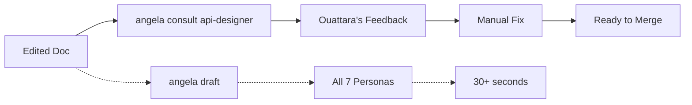

# lore angela consult

Ad-hoc single-persona consultation — offline, no AI, no write.

## Synopsis

```bash
lore angela consult <persona> [filename]
lore angela consult                        # lists available personas
```

## Why

After polishing a document or making manual edits, you need targeted feedback from a specific expert without running the full draft pipeline. `consult` gives you instant, focused critique from one persona's lens.

The full `draft` command runs 7 personas and takes 30+ seconds. Sometimes you just need Ouattara to check your API examples or Affoue to verify your narrative flows. That's a 50ms consultation, not a full review.



## How It Works

`consult` loads the specified persona's draft-check lens and applies it to your document as-is. No AI calls, no file modifications, no API keys required.

**Input:** Document + persona identifier  
**Output:** Focused feedback from that expert's perspective  
**Time:** < 50ms  

## Arguments

| Argument | Required | Description |
|----------|----------|-------------|
| `persona` | Yes (or omit for listing) | Persona identifier (e.g. `api-designer`, `storyteller`) |
| `filename` | Yes (when persona given) | Document to analyze |

## Available Personas

Run without arguments to see the list:

```bash
lore angela consult
```

```text
Personas disponibles :

  📖 storyteller           Affoue
                            Narrative clarity and authentic storytelling

  ✏️ tech-writer            Salou
                            Technical writing precision and clarity

  🔍 qa-reviewer            Kouame
                            Quality assurance and validation criteria

  🏗️ architect              Doumbia
                            System design, trade-offs, and scalability

  🎨 ux-designer            Gougou
                            User empathy, mental models, and accessibility

  📊 business-analyst       Beda
                            Requirements traceability and business value

  🔌 api-designer           Ouattara
                            API contracts, synthesizer-ready docs, HTTP semantics
```

## Examples

```bash
# Ask Ouattara about API completeness
lore angela consult api-designer feature-auth.md

# Ask Affoue about narrative quality
lore angela consult storyteller decision-database.md

# Ask Kouame about verification criteria
lore angela consult qa-reviewer bugfix-login.md

# Works on external docs too (no lore init needed)
lore angela consult tech-writer --path ./external-docs/ api-guide.md
```

## Output Examples

When issues are found:

```text
→ .lore/docs/feature-auth.md
  Consultation : 🔌 Ouattara — API contracts, synthesizer-ready docs, HTTP semantics

  warning  persona        [🔌 Ouattara] Endpoints listed without an HTTP request example
  info     persona        [🔌 Ouattara] Endpoints without documented error responses

2 suggestion(s).
```

When no issues are found:

```text
→ .lore/docs/feature-account-statement.md
  Consultation : 🔌 Ouattara — API contracts, synthesizer-ready docs, HTTP semantics

  Aucune suggestion — Ouattara ne voit rien à ajouter sur ce doc en l'état.
```

## Common Use Cases

| Situation | Command | When |
|-----------|---------|------|
| Pre-merge API check | `consult api-designer doc.md` | After manual API doc edits |
| Narrative flow review | `consult storyteller doc.md` | After restructuring content |
| Technical clarity check | `consult tech-writer doc.md` | After adding complex explanations |
| Architecture validation | `consult architect adr-042.md` | Before publishing ADRs |

## Real World Scenario

You polished your API feature doc with Angela. The polish improved the narrative, but you're unsure if the API contract is complete:

```bash
lore angela consult api-designer feature-account-statement.md
```

Ouattara finds: endpoints without error responses, DTO fields missing a required column. You fix those manually, then the doc is ready for merge.

## Shell Completion

Tab completion works on both arguments:

- `lore angela consult <TAB>` → lists persona names
- `lore angela consult api-designer <TAB>` → lists files in `.lore/docs/`

## See Also

- [lore angela draft](angela-draft.md) — Full structural analysis (all personas)
- [lore angela polish](angela-polish.md) — AI rewrite + synthesizer enrichment
- [lore angela review](angela-review.md) — Corpus-wide coherence check
