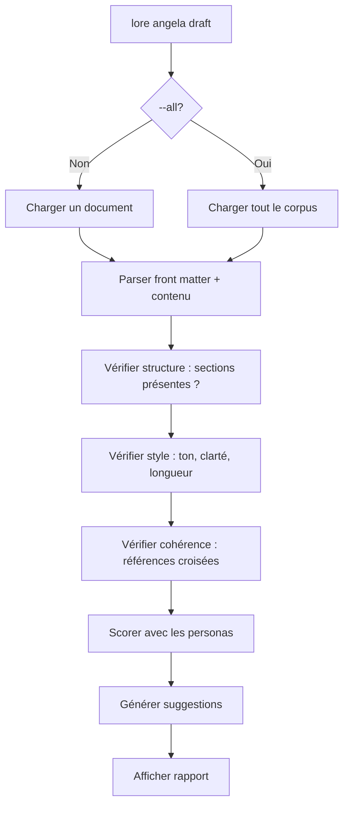

# lore angela draft

Analyse structurelle zéro-API de vos documents — pas d'internet requis.

## Synopsis

```text
lore angela draft [fichier] [flags]
```

## Qu'est-ce que ça fait ?

`lore angela draft` vérifie la structure, le style et la cohérence de vos documents **entièrement hors ligne** — sans appel réseau ni clé API.

## Scénario concret

> Avant de pousser votre PR, vous voulez vérifier que les 3 nouveaux documents sont bien structurés — sans dépenser de crédits API :
>
> ```bash
> lore angela draft --all
> # 2 docs à revoir, 1 est excellent
> ```
>
> Gratuit, hors ligne, instantané. Corrigez les problèmes, puis polissez avec l'IA.


<!-- Generate: vhs assets/vhs/angela-draft-polish.tape -->

## Arguments

| Argument | Requis | Description |
|----------|--------|-------------|
| `fichier` | Non | Document spécifique à analyser (défaut : le plus récent) |

## Flags

| Flag | Type | Défaut | Description |
|------|------|--------|-------------|
| `--all` | bool | `false` | Analyser chaque document du corpus |
| `--verbose`, `-v` | bool | `false` | Avec `--all` : afficher chaque suggestion en détail (par défaut, seuls les avertissements sont affichés) |
| `--path` | string | `.lore/docs` | Chemin vers un répertoire markdown (mode autonome — pas de `lore init` requis) |
| `--interactive`, `-i` | bool | `false` | Lancer le TUI interactif pour parcourir les findings |
| `--autofix` | string | | Appliquer des corrections automatiques : `safe` ou `aggressive` |
| `--dry-run` | bool | `false` | Prévisualiser les corrections autofix sous forme de diff unifié sans écrire |
| `--diff-only` | bool | `false` | Afficher uniquement les findings NEW et RESOLVED (masquer PERSISTING) — utile en CI |
| `--reset-state` | bool | `false` | Supprimer le fichier d'état draft et traiter tous les findings actuels comme NEW |
| `--persona` | string | | Forcer un seul persona (ex : `--persona api-designer`). Raccourci pour `--personas manual --manual-personas <name>` |
| `--personas` | string | `auto` | Mode de sélection des personas : `auto`, `manual`, `all`, `none` |
| `--manual-personas` | strings | | Noms de personas pour `--personas manual` (ex : `storyteller,architect`) |
| `--synthesizers` | strings | | Surcharger les synthesizers activés pour ce run (ex : `api-postman`) |
| `--no-synthesizers` | bool | `false` | Désactiver tous les Example Synthesizers pour ce run |

## Mode autonome

Angela analyse **n'importe quel répertoire de fichiers Markdown**, même sans `lore init` :

```bash
# Analyser les docs d'un projet externe
lore angela draft --all --path ./mon-projet/docs

# Un seul fichier dans un répertoire personnalisé
lore angela draft --path ./wiki api-guide.md
```

En mode autonome :
- Les fichiers **avec** front matter YAML reçoivent l'analyse complète (type, tags, scope)
- Les fichiers **sans** front matter reçoivent des métadonnées synthétiques (type=note, tags depuis le nom de fichier)
- Pas besoin de `.lorerc` — les valeurs par défaut s'appliquent
- Les vérifications croisées VHS tape/doc s'exécutent si un répertoire `assets/vhs/` est trouvé

Ce mode rend Angela utilisable comme **gate de qualité en CI** sur n'importe quelle documentation Markdown. Voir le guide [Angela en CI](../guides/angela-ci.md).

## Ce qui est vérifié

| Catégorie | Ce que ça cherche | Exemple de finding |
|-----------|-------------------|-------------------|
| **Structure** | Sections manquantes (Why, Alternatives, Impact) | "Section 'Alternatives Considered' manquante" |
| **Style** | Voix passive, langage vague, problèmes de ton | "Voix passive excessive dans la section Why" |
| **Cohérence** | Contradictions ou connexions avec d'autres docs | "Lié : feature-add-auth-2026-02-15.md" |
| **Complétude** | Sections vides ou trop courtes | "La section Why ne fait que 5 mots — enrichissez" |

### Types de documents : strict vs libre

Angela sélectionne un profil d'analyse selon le champ `type` du front matter :

| Profil | Types | Vérifications de structure | Notation |
|--------|-------|----------------------------|----------|
| **Strict** | `decision`, `feature`, `bugfix`, `refactor` | Exige `## What` / `## Why` / `## Alternatives` / `## Impact` | Poids fort sur `## Why`, références liées, champ `status` |
| **Libre** | Tout le reste (`note`, `guide`, `tutorial`, `reference`, `index`, `release`, `blog-post`, `howto`, `concept`, `explanation`, `landing`, `faq`, type personnalisé) | Aucune exigence de sections | Rééquilibré : structure, densité, code, paragraphes |

Le profil libre rend Angela utilisable sans risque sur n'importe quel site
mkdocs / docusaurus / astro / diátaxis sans générer de faux warnings sur
les sections Lore manquantes. Un tutoriel bien écrit peut légitimement
atteindre 95/100 (A) sur le profil libre ; avant cette séparation, il
plafonnait à F.

**Les paires de traductions** (par ex. `installation.md` et
`installation.fr.md`) sont détectées automatiquement et ne sont jamais
signalées comme doublons. Codes de langue supportés : `fr`, `en`, `es`,
`de`, `it`, `pt`, `zh`, `ja`, `ko`, `ru`, `ar`, `nl`, `pl`.

## Sortie (document unique)

```bash
lore angela draft decision-database-2026-02-10.md
```

```text
lore angela draft — decision-database-2026-02-10.md
  Reviewed by: Salou + Doumbia  (relevance: 7)

  error    structure       Section "Impact" manquante — les décisions doivent décrire les conséquences
  warning  tone            "On a juste pris PostgreSQL" — évitez "juste", ça affaiblit la décision
  info     coherence       Lié : feature-user-model-2026-02-12.md (mentionne le même schéma)

3 suggestions
```

### Comprendre les sévérités

| Sévérité | Signification | Action |
|----------|---------------|--------|
| **error** | Quelque chose d'important manque | Corrigez avant de considérer le doc "terminé" |
| **warning** | Pourrait être mieux | Améliorez quand vous avez le temps |
| **info** | Informatif — connexions et contexte | Bon à savoir, pas d'action nécessaire |

## Sortie (corpus entier `--all`)

```bash
lore angela draft --all
```

Par défaut, Angela affiche une ligne de résumé pour chaque document et le
détail inline de chaque **avertissement** (les problèmes à corriger en priorité) :

```text
lore angela draft --all — 12 documents

  B    review   decision-database-2026-02-10.md      3 suggestions (2 avertissements)
         warning  structure      Section "Impact" manquante
         warning  completeness   La section "Why" ne fait que 5 mots
  C    review   feature-rate-limit-2026-03-16.md      1 suggestions
  A    ok       refactor-extract-auth-2026-03-01.md
  A    ok       feature-add-jwt-2026-02-15.md
  ...

2/12 documents nécessitent une attention. 4 suggestions au total.
Utilisez --verbose (-v) pour voir toutes les suggestions en détail.
```

### `--verbose` / `-v`

Pour voir toutes les suggestions (info, warning, error), passez `-v` :

```bash
lore angela draft --all -v
```

```text
  B    review   decision-database-2026-02-10.md      3 suggestions (2 avertissements)
         warning  structure      Section "Impact" manquante
         warning  completeness   La section "Why" ne fait que 5 mots
         info     coherence      Lié : feature-user-model-2026-02-12.md
```

## Flux



## Questions fréquentes

### "Ai-je besoin d'une clé API ?"

**Non.** `angela draft` est 100% local. Il utilise des règles et heuristiques intégrées. C'est un linter sophistiqué pour la documentation.

### "Différence entre `draft` et `polish` ?"

| | `angela draft` | `angela polish` |
|---|---|---|
| **Réseau** | Aucun (hors ligne) | 1 appel API |
| **Coût** | Gratuit | Utilise des crédits API |
| **Ce qu'il fait** | Signale les problèmes | Réécrit le document |
| **Sortie** | Liste de suggestions | Diff interactif |

> **Bonne pratique :** Toujours `draft` d'abord (gratuit), corriger les problèmes faciles, puis `polish` (coûte des crédits) pour la touche finale.

### "C'est quoi les 'personas' ?"

Angela utilise 7 relecteurs virtuels avec des perspectives différentes. Les 3 meilleurs s'activent selon le type de document et son contenu :

| Persona | Icône | Focus |
|---------|-------|-------|
| **Affoue** (Storyteller) | 📖 | Clarté narrative, sections "Why" |
| **Salou** (Tech Writer) | ✏️ | Précision technique, structure |
| **Kouame** (QA Reviewer) | 🔍 | Critères de validation, cas limites |
| **Doumbia** (Architect) | 🏗️ | Compromis, conception système |
| **Gougou** (UX Designer) | 🎨 | Empathie utilisateur, accessibilité |
| **Beda** (Business Analyst) | 📊 | Valeur business, exigences |
| **Ouattara** (API Designer) | 🔌 | Contrats API, exemples HTTP, complétude des DTO |

Chaque persona exécute des vérifications locales et produit des suggestions typées. Par exemple, Affoue vérifie que la section "Why" raconte une histoire plutôt que de lister des bullets. Kouame vérifie que les affirmations ont des critères de vérification. Ouattara vérifie que les endpoints disposent d'exemples de requêtes HTTP, de réponses d'erreur, et que les champs DTO possèdent une colonne requis/optionnel.

Pour forcer un persona spécifique :

```bash
lore angela draft doc.md --persona api-designer
```

Pour consulter un seul persona de façon ponctuelle (après un polish par exemple) :

```bash
lore angela consult api-designer doc.md
```

### "C'est quoi `pending_enrichment` ?"

Quand les synthesizers activés détectent qu'un document pourrait être enrichi avec du contenu auto-généré (comme des exemples HTTP Postman à partir des sections endpoint/filtre), draft émet une suggestion `synthesizer` :

```text
info     synthesizer    pending_enrichment: api-postman peut générer 3 bloc(s) ready-to-use
                        — lance `lore angela polish --synthesizer-dry-run` pour prévisualiser
```

Il s'agit d'une information — le synthesizer a détecté des opportunités mais n'a encore rien généré. Pour prévisualiser :

```bash
lore angela polish doc.md --synthesizer-dry-run
```

Pour appliquer les blocs directement (hors ligne, sans IA) :

```bash
lore angela polish doc.md --synthesize
```

Voir [lore angela polish](angela-polish.md) pour tous les détails sur la famille de synthesizers.

## TUI interactif (`--interactive`)

```bash
lore angela draft decision-database.md --interactive
```

Le TUI vous guide à travers chaque finding pour agir sans quitter le terminal :

```text
Angela Draft — decision-database-2026-02-10.md
────────────────────────────────────────────────────────
  1/3  error    structure    Section "Impact" manquante
  2/3  warning  tone         "juste pris" — évitez les formules qui minimisent
  3/3  info     coherence    Lié : feature-user-model-2026-02-12.md

[a] ajouter stub  [r] ajouter aux related  [e] éditer  [i] ignorer  [n] suivant  [q] quitter
```

| Touche | Action |
|--------|--------|
| `a` | Insérer une section stub dans le document |
| `r` | Ajouter le doc référencé au champ `related` du front matter |
| `e` | Ouvrir le document dans `$EDITOR` à la ligne concernée |
| `i` | Ignorer ce finding (persisté dans l'état — ne réapparaîtra plus) |
| `b` | Ignorer en lot tous les findings restants de cette sévérité |
| `n` / `→` | Finding suivant |
| `p` / `←` | Finding précédent |
| `q` | Quitter |

Si aucun TTY n'est disponible (CI, sortie redirigée), le TUI bascule gracieusement vers la sortie texte brut.

## Moteur autofix (`--autofix`)

Le moteur autofix applique des **corrections mécaniques et déterministes** directement sur le document sans appel API :

```bash
# Prévisualiser ce qui serait corrigé (dry run)
lore angela draft decision-database.md --autofix safe --dry-run

# Appliquer les corrections safe
lore angela draft decision-database.md --autofix safe

# Appliquer toutes les corrections incluant les réécritures plus agressives
lore angela draft decision-database.md --autofix aggressive
```

### Corrections safe (les deux modes)

| Correcteur | Ce qu'il corrige |
|------------|-----------------|
| **date** | Met à jour `date:` dans le front matter à la date du jour si manquant |
| **type** | Infère `type:` depuis le schéma de nom de fichier (ex : `decision-` → `decision`) |
| **code-fences** | Ajoute des tags de langage aux fences ` ``` ` nues (détecte 25+ langages) |
| **malformed-date** | Corrige `date: 2026/04/12` → `date: 2026-04-12` |
| **tags** | Génère `tags:` via TF-IDF depuis le contenu du document si manquant |

### Corrections aggressive uniquement

| Correcteur | Ce qu'il corrige |
|------------|-----------------|
| **section-stub** | Insère des stubs `## Impact` / `## Alternatives Considered` vides si les sections manquent |
| **related** | Ajoute `related:` dans le front matter avec les références croisées inférées |

Une sauvegarde est créée avant chaque écriture (`.lore/backups/<fichier>-<timestamp>.md`).

**Sortie dry run :**

```diff
--- decision-database-2026-02-10.md (original)
+++ decision-database-2026-02-10.md (fixed)
@@ -1,5 +1,6 @@
 ---
 type: decision
+tags: [postgresql, database, auth]
 date: 2026-02-10
```

## État différentiel (`--diff-only`, `--reset-state`)

Angela suit le cycle de vie des findings entre les runs pour éviter la fatigue d'alertes :

| Statut | Signification |
|--------|---------------|
| `NEW` | Finding apparu pour la première fois dans ce run |
| `PERSISTING` | Finding existait au run précédent et existe toujours |
| `RESOLVED` | Finding existait avant mais a disparu |
| `REGRESSED` | Finding était ignoré/résolu mais est revenu |

Avec `--diff-only`, seuls les findings `NEW` et `RESOLVED` sont affichés — idéal pour les gates CI :

```bash
# CI : échouer uniquement sur les nouveaux problèmes
lore angela draft --all --diff-only
```

L'état est stocké dans `.lore/angela/draft-state/<fichier>.json`. Pour repartir de zéro :

```bash
lore angela draft decision-database.md --reset-state
```

## Tips & Tricks

- **Avant chaque PR :** `lore angela draft --all` pour attraper les problèmes de qualité.
- **`draft` avant `polish` :** Corrigez les problèmes gratuits d'abord, puis dépensez les crédits API.
- **Le score est relatif :** 7/10 c'est bien, 9/10 c'est excellent. Ne visez pas 10/10 sur chaque doc.
- **Autofix d'abord :** `--autofix safe --dry-run` pour prévisualiser les corrections mécaniques, puis appliquez-les avant `--interactive`.
- **Intégration CI :** `--diff-only` + `--reset-state` au premier run = zéro faux positifs sur les docs existants.
- **Personnalisez les règles :** Dans `.lorerc` sous `angela.style_guide` pour les conventions d'équipe.

## Codes de sortie

| Code | Signification |
|------|---------------|
| `0` | Succès (même si suggestions trouvées) |
| `1` | Erreur (`.lore/` non trouvé, fichier non trouvé) |

## Voir aussi

- [lore angela polish](angela-polish.md) — Réécriture assistée par IA (étape suivante)
- [lore angela consult](angela-consult.md) — Consultation ponctuelle d'un seul persona
- [lore angela review](angela-review.md) — Revue de cohérence corpus via IA
- [Angela en CI](../guides/angela-ci.md) — Utiliser Angela comme quality gate en CI
- [Types de documents](../guides/document-types.md) — Quelles sections chaque type attend
