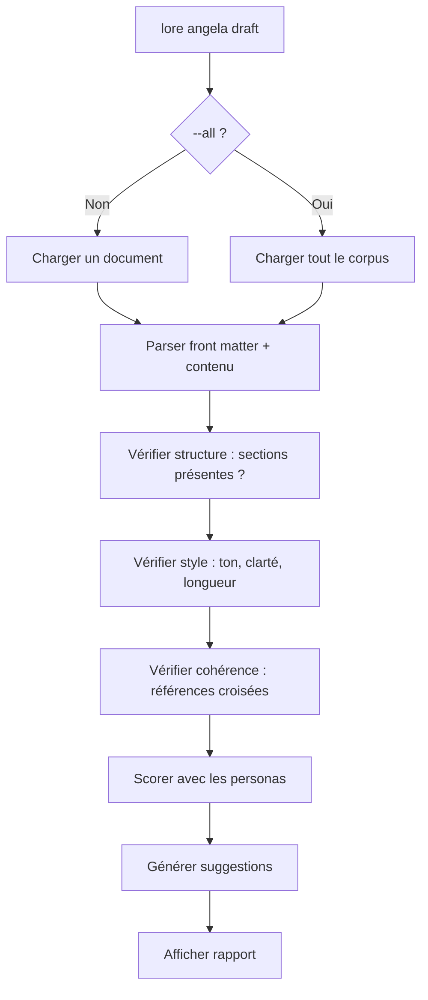

# lore angela draft

Analyse structurelle zéro-API de vos documents — pas d'internet requis.

## Synopsis

```
lore angela draft [fichier] [flags]
```

## Qu'est-ce que ça fait ?

`lore angela draft` c'est comme avoir un coach d'écriture qui relit votre document — sauf que ce coach travaille **entièrement hors ligne**. Il vérifie la structure, le style et la cohérence sans aucun appel réseau ni clé API.

> **Analogie :** Imaginez un correcteur orthographique, mais au lieu de vérifier l'orthographe, il vérifie : "Avez-vous expliqué *pourquoi* ? Avez-vous mentionné les alternatives ? Est-ce cohérent avec vos autres documents ?" Tout localement, tout gratuit.

## Scénario concret

> Avant de pousser votre PR, vous voulez vérifier que les 3 nouveaux documents sont bien structurés — sans dépenser de crédits API :
>
> ```bash
> lore angela draft --all
> # 2 docs à revoir, 1 est excellent
> ```
>
> Gratuit, hors ligne, instantané. Corrigez les problèmes, PUIS polissez avec l'IA.

## Arguments

| Argument | Requis | Description |
|----------|--------|-------------|
| `fichier` | Non | Document spécifique à analyser (défaut : le plus récent) |

## Flags

| Flag | Type | Défaut | Description |
|------|------|--------|-------------|
| `--all` | bool | `false` | Analyser chaque document du corpus |

## Ce qui est vérifié

| Catégorie | Ce que ça cherche | Exemple de finding |
|-----------|-------------------|-------------------|
| **Structure** | Sections manquantes (Why, Alternatives, Impact) | "Section 'Alternatives Considered' manquante" |
| **Style** | Voix passive, langage vague, problèmes de ton | "Voix passive excessive dans la section Why" |
| **Cohérence** | Contradictions ou connexions avec d'autres docs | "Lié : feature-add-auth-2026-02-15.md" |
| **Complétude** | Sections vides ou trop courtes | "La section Why ne fait que 5 mots — enrichissez" |

## Comprendre les sévérités

| Sévérité | Signification | Action |
|----------|---------------|--------|
| **error** | Quelque chose d'important manque | Corrigez avant de considérer le doc "terminé" |
| **warning** | Pourrait être mieux | Améliorez quand vous avez le temps |
| **info** | Informatif — connexions et contexte | Bon à savoir, pas d'action nécessaire |

## Sortie (document unique)

```bash
lore angela draft decision-database-2026-02-10.md
```

```
Analysing  decision-database-2026-02-10.md
Score: 7.2/10 par Technical Writer + Architect

SEVERITY   CATEGORY        MESSAGE
error      structure       Section "Impact" manquante — les décisions doivent décrire les conséquences
warning    tone            "On a juste pris PostgreSQL" — évitez "juste", ça affaiblit la décision
info       coherence       Lié : feature-user-model-2026-02-12.md (mentionne le même schéma)

3 suggestions
```

## Sortie (corpus entier `--all`)

```bash
lore angela draft --all
```

```
Analysing 12 documents in corpus...

STATUS     FILENAME                          DETAILS
review     decision-database-2026-02-10.md   3 suggestions (avg 7.2/10)
review     feature-rate-limit-2026-03-16.md  1 suggestion  (avg 8.1/10)
ok         refactor-extract-auth-2026-03-01.md  (9.4/10)

12 docs reviewed, 2 with issues, 4 suggestions total
```

## Flux



## Questions fréquentes

### "Ai-je besoin d'une clé API ?"

**Non.** `angela draft` est 100% local. Utilise des règles et heuristiques intégrées. C'est un linter sophistiqué pour la documentation.

### "Différence entre `draft` et `polish` ?"

| | `angela draft` | `angela polish` |
|---|---|---|
| **Réseau** | Aucun (hors ligne) | 1 appel API |
| **Coût** | Gratuit | Utilise des crédits API |
| **Ce qu'il fait** | Signale les problèmes | Réécrit le document |
| **Sortie** | Liste de suggestions | Diff interactif |

> **Bonne pratique :** Toujours `draft` d'abord (gratuit), corriger les problèmes faciles, puis `polish` (coûte des crédits).

### "C'est quoi les 'personas' ?"

Angela utilise des reviewers virtuels avec des perspectives différentes. Chaque persona note le document de son angle :
- **Technical Writer** — C'est clair et bien structuré ?
- **Architect** — Le contenu technique est exact ?
- **New Developer** — Un nouveau comprendrait ?

Le score final est la moyenne des personas actives.

## Tips & Tricks

- **Avant chaque PR :** `lore angela draft --all` pour attraper les problèmes de qualité.
- **`draft` avant `polish` :** Corrigez les problèmes gratuits d'abord, puis dépensez les crédits.
- **Le score est relatif :** 7/10 c'est bien, 9/10 c'est excellent. Ne visez pas 10/10 sur chaque doc.
- **Personnalisez les règles :** Dans `.lorerc` sous `angela.style_guide`.

## Codes de sortie

| Code | Signification |
|------|---------------|
| `0` | Succès (même si suggestions trouvées) |
| `1` | Erreur (`.lore/` non trouvé, fichier non trouvé) |

## Voir aussi

- [lore angela polish](angela-polish.md) — Réécriture assistée par IA (étape suivante)
- [lore angela review](angela-review.md) — Revue de cohérence corpus
- [Types de documents](../guides/document-types.md) — Quelles sections chaque type attend
