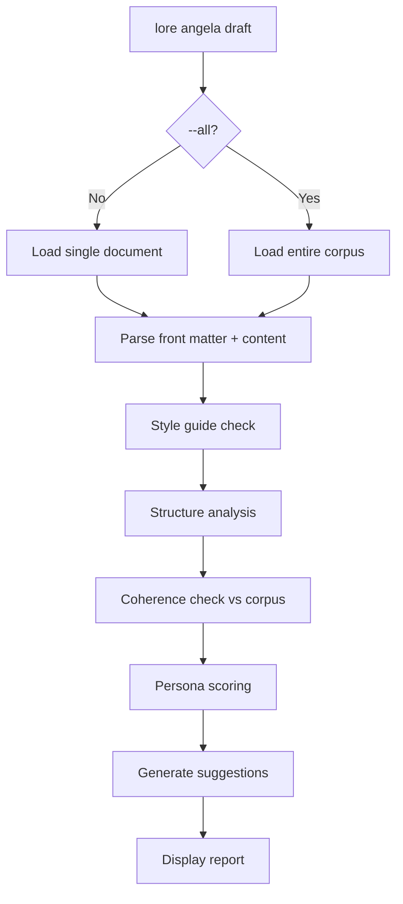

# lore angela draft

Analyse structurelle des documents sans appel API.

## Synopsis

```
lore angela draft [filename] [flags]
```

## Description

Analyse les documents localement — **aucun appel réseau, aucune clé API nécessaire**. Vérifie la qualité structurelle, la conformité au guide de style, la cohérence avec le corpus et génère des suggestions actionnables.

## Arguments

| Argument | Requis | Description |
|----------|--------|-------------|
| `filename` | Non | Document spécifique (par défaut : le plus récent) |

## Flags

| Flag | Type | Défaut | Description |
|------|------|--------|-------------|
| `--all` | bool | `false` | Analyser l'ensemble du corpus |

## Contenu de l'analyse

- **Notation par persona** — Chaque persona active note le document (score moyen /10)
- **Structure** — Sections manquantes (Why, Alternatives, Impact)
- **Guide de style** — Conformité avec les règles de style configurées dans `.lorerc`
- **Cohérence** — Références croisées avec les autres documents du corpus
- **Suggestions** — Améliorations actionnables avec sévérité (error, warning, info)

## Sortie (document unique)

```
Analyzing  decision-auth-strategy-2026-03-07.md
Score: 7.2/10 by Technical Writer + Architect

SEVERITY   CATEGORY        MESSAGE
error      structure       Missing "Alternatives Considered" section
warning    tone            Passive voice overused in "Why" section
info       cohérence       Related: feature-add-auth-2026-02-15.md

3 suggestions
```

## Sortie (corpus entier avec `--all`)

```
Analyzing 12 documents in corpus...

STATUS     FILENAME                          DETAILS
review     decision-auth-2026-03-07.md       5 suggestions (avg 7.2/10)
review     feature-rate-limit-2026-03-16.md  2 suggestions (avg 8.1/10)
ok         refactor-extract-auth-2026-03-01.md  (9.4/10)

12 docs reviewed, 2 with issues, 7 suggestions total
```

## Flux de processus



## Tips & Tricks

- Lancez `lore angela draft` avant `lore angela polish` — corrigez les problèmes structurels localement avant de dépenser des crédits API.
- `--all` est parfait avant une release : scannez l'ensemble du corpus pour détecter les problèmes de qualité.
- Le guide de style est configurable dans `.lorerc` sous `angela.style_guide`.
- Aucune clé API requise — fonctionne entièrement hors ligne.

## Codes de sortie

| Code | Signification |
|------|---------------|
| `0` | Succès (même si des suggestions ont été trouvées) |
| `1` | Erreur (`.lore/` introuvable, fichier introuvable) |

## Voir aussi

- [lore angela polish](angela-polish.fr.md) — Réécriture assistée par IA
- [lore angela review](angela-review.fr.md) — Revue IA de l'ensemble du corpus
