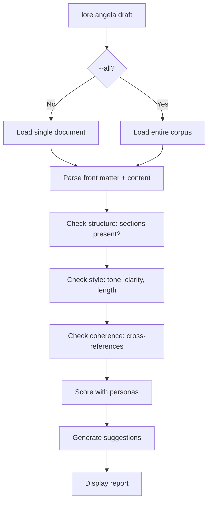

# lore angela draft

Zero-API structural analysis of your documents — no internet required.

## Synopsis

```text
lore angela draft [filename] [flags]
```

## What Does This Do?

`lore angela draft` works like a writing coach that operates **entirely offline**. It checks structure, style, and consistency without any network calls or API keys.

> **Analogy:** Like a spell-checker, but for documentation quality — "Did you explain *why*? Did you mention alternatives? Is this consistent with your other documents?" All local, all free.

## Real World Scenario

> Before pushing your PR, you want to verify that 3 new documents are well-structured — without spending API credits:
>
> ```bash
> lore angela draft --all
> # 2 docs need attention, 1 is great
> ```
>
> Free, offline, instant. Fix the issues, then polish with AI.


<!-- Generate: vhs assets/vhs/angela-draft-polish.tape -->

## Arguments

| Argument | Required | Description |
|----------|----------|-------------|
| `filename` | No | Specific document to analyze (default: most recent) |

## Flags

| Flag | Type | Default | Description |
|------|------|---------|-------------|
| `--all` | bool | `false` | Analyze every document in the corpus |
| `--verbose`, `-v` | bool | `false` | With `--all`: print every suggestion inline (default shows warnings only) |
| `--path` | string | `.lore/docs` | Path to a markdown directory (standalone mode — no `lore init` required) |
| `--interactive`, `-i` | bool | `false` | Launch interactive fix-it TUI to walk through findings |
| `--autofix` | string | | Apply mechanical fixes automatically: `safe` or `aggressive` |
| `--dry-run` | bool | `false` | Preview autofix changes as a unified diff without writing |
| `--diff-only` | bool | `false` | Show only NEW and RESOLVED findings (hide PERSISTING) — useful for CI |
| `--reset-state` | bool | `false` | Delete the draft state file and treat all current findings as NEW |

## Standalone Mode

Angela analyzes **any directory of Markdown files**, even without `lore init`:

```bash
# Analyze docs in an external project
lore angela draft --all --path ./my-project/docs

# Single file in a custom directory
lore angela draft --path ./wiki api-guide.md
```

In standalone mode:
- Files **with** YAML front matter get full analysis (type, tags, scope)
- Files **without** front matter get synthetic metadata (type=note, tags from filename)
- No `.lorerc` needed — sensible defaults apply
- VHS tape/doc cross-checks run if an `assets/vhs/` directory is found

This makes Angela usable as a **CI quality gate** on any Markdown documentation. See the [Angela in CI](../guides/angela-ci.md) guide.

## What It Checks

| Category | What it looks for | Example finding |
|----------|-------------------|-----------------|
| **Structure** | Missing sections (Why, Alternatives, Impact) | "Missing 'Alternatives Considered' section" |
| **Style** | Passive voice, vague language, tone issues | "Passive voice overused in Why section" |
| **Coherence** | Contradictions or connections with other docs | "Related: feature-add-auth-2026-02-15.md" |
| **Completeness** | Empty or too-short sections | "Why section is only 5 words — consider expanding" |

### Document types: strict vs. free-form

Angela selects an analysis profile based on the `type` field in front matter:

| Profile | Types | Structure check | Scoring |
|---------|-------|-----------------|---------|
| **Strict** | `decision`, `feature`, `bugfix`, `refactor` | Requires `## What` / `## Why` / `## Alternatives` / `## Impact` | Heavy weight on `## Why`, related refs, `status` field |
| **Free-form** | Everything else (`note`, `guide`, `tutorial`, `reference`, `index`, `release`, `blog-post`, `howto`, `concept`, `explanation`, `landing`, `faq`, any custom type) | No section requirements | Rebalanced: structure, density, code, paragraphs |

The free-form profile lets Angela run safely on any MkDocs, Docusaurus, Astro, or Diátaxis site without false-positive warnings about missing lore sections. A well-written tutorial can legitimately score 95/100 (A) on the free-form profile; before this split, it plateaued at F.

**Translation pairs** (e.g. `installation.md` and `installation.fr.md`)
are detected automatically and never flagged as duplicates. Supported
language codes: `fr`, `en`, `es`, `de`, `it`, `pt`, `zh`, `ja`, `ko`,
`ru`, `ar`, `nl`, `pl`.

## Output (Single Document)

```bash
lore angela draft decision-database-2026-02-10.md
```

```text
lore angela draft — decision-database-2026-02-10.md
  Reviewed by: Sialou + Doumbia  (relevance: 7)

  error    structure       Missing "Impact" section — decisions should describe consequences
  warning  tone            "We just picked PostgreSQL" — avoid "just", it undermines the decision
  info     coherence       Related: feature-user-model-2026-02-12.md (mentions same schema)

3 suggestions
```

### Understanding Severity

| Severity | Meaning | Action |
|----------|---------|--------|
| **error** | Something important is missing | Fix before considering the doc "done" |
| **warning** | Could be better | Improve when you have time |
| **info** | Informational — connections and context | Good to know, no action needed |

## Output (Corpus-wide `--all`)

```bash
lore angela draft --all
```

By default, Angela prints a summary line for each document and inline details for every **warning** (issues you should act on):

```text
lore angela draft --all — 12 documents

  B    review   decision-database-2026-02-10.md      3 suggestions (2 warnings)
         warning  structure      Missing "Impact" section
         warning  completeness   "Why" section is only 5 words
  C    review   feature-rate-limit-2026-03-16.md      1 suggestions
  A    ok       refactor-extract-auth-2026-03-01.md
  A    ok       feature-add-jwt-2026-02-15.md
  ...

2/12 documents need attention. 4 total suggestions.
Run with --verbose (-v) to see every suggestion.
```

### `--verbose` / `-v`

To see every suggestion (info, warning, error), pass `-v`:

```bash
lore angela draft --all -v
```

```text
  B    review   decision-database-2026-02-10.md      3 suggestions (2 warnings)
         warning  structure      Missing "Impact" section
         warning  completeness   "Why" section is only 5 words
         info     coherence      Related: feature-user-model-2026-02-12.md
```

## Process Flow



## Common Questions

### "Do I need an API key for this?"

**No.** `angela draft` is 100% local. It uses built-in rules and heuristics, not AI. Think of it as a sophisticated linter for documentation.

### "What's the difference between `draft` and `polish`?"

| | `angela draft` | `angela polish` |
|---|---|---|
| **Network** | None (offline) | 1 API call |
| **Cost** | Free | Uses API credits |
| **What it does** | Points out problems | Rewrites the document |
| **Output** | Suggestions list | Interactive diff |

> **Best practice:** Always run `draft` first (free), fix the easy issues, then `polish` (costs credits) for the finishing touch.

### "What are 'personas'?"

Angela uses 6 virtual reviewers, each with a distinct perspective. The top 3 activate based on document type and content:

| Persona | Icon | Focus |
|---------|------|-------|
| **Affoue** (Storyteller) | 📖 | Narrative clarity, "Why" sections |
| **Sialou** (Tech Writer) | ✏️ | Technical precision, structure |
| **Kouame** (QA Reviewer) | 🔍 | Validation criteria, edge cases |
| **Doumbia** (Architect) | 🏗️ | Trade-offs, system design |
| **Gougou** (UX Designer) | 🎨 | User empathy, accessibility |
| **Beda** (Business Analyst) | 📊 | Business value, requirements |

Each persona runs local checks and produces typed suggestions. For example, Affoue checks that the "Why" section tells a story rather than just listing bullets. Kouame checks that claims have verification criteria.

## Interactive Fix-it TUI (`--interactive`)

```bash
lore angela draft decision-database.md --interactive
```

The TUI walks you through every finding so you can act without leaving the terminal:

```text
Angela Draft — decision-database-2026-02-10.md
────────────────────────────────────────────────────────
  1/3  error    structure    Missing "Impact" section
  2/3  warning  tone         "just picked" — avoid downplaying language
  3/3  info     coherence    Related: feature-user-model-2026-02-12.md

[a] add stub  [r] add to related  [e] edit  [i] ignore  [n] next  [q] quit
```

| Key | Action |
|-----|--------|
| `a` | Insert a stub section in the document |
| `r` | Add the referenced doc to the `related` front matter field |
| `e` | Open the document in `$EDITOR` at the relevant line |
| `i` | Ignore this finding (persisted to state — won't reappear) |
| `b` | Batch ignore all remaining findings of this severity |
| `n` / `→` | Next finding |
| `p` / `←` | Previous finding |
| `q` | Quit |

If no TTY is available (CI, piped output), the TUI falls back gracefully to plain text output.

## Autofix Engine (`--autofix`)

The autofix engine applies **mechanical, deterministic fixes** directly to the document without an API call:

```bash
# Preview what would be fixed (dry run)
lore angela draft decision-database.md --autofix safe --dry-run

# Apply safe fixes
lore angela draft decision-database.md --autofix safe

# Apply all fixable issues including more aggressive rewrites
lore angela draft decision-database.md --autofix aggressive
```

### Safe fixes (both modes)

| Fixer | What it fixes |
|-------|---------------|
| **date** | Updates `date:` front matter to today's date if missing |
| **type** | Infers `type:` from the filename pattern (e.g., `decision-` → `decision`) |
| **code-fences** | Adds language tags to bare ` ``` ` fences (detects 25+ languages) |
| **malformed-date** | Fixes `date: 2026/04/12` → `date: 2026-04-12` |
| **tags** | Generates `tags:` via TF-IDF from document content if missing |

### Aggressive-only fixes

| Fixer | What it fixes |
|-------|---------------|
| **section-stub** | Inserts empty `## Impact` / `## Alternatives Considered` stubs if sections are missing |
| **related** | Adds `related:` front matter with inferred cross-references |

A backup is created before any write (`.lore/backups/<filename>-<timestamp>.md`).

**Dry run output:**

```diff
--- decision-database-2026-02-10.md (original)
+++ decision-database-2026-02-10.md (fixed)
@@ -1,5 +1,6 @@
 ---
 type: decision
+tags: [postgresql, database, auth]
 date: 2026-02-10
```

## Differential State (`--diff-only`, `--reset-state`)

Angela tracks the lifecycle of findings across runs to avoid alert fatigue:

| Status | Meaning |
|--------|---------|
| `NEW` | Finding appeared for the first time in this run |
| `PERSISTING` | Finding existed in the previous run and still exists |
| `RESOLVED` | Finding existed before but is now gone |
| `REGRESSED` | Finding was ignored/resolved but has come back |

With `--diff-only`, only `NEW` and `RESOLVED` findings are shown — perfect for CI gates:

```bash
# CI: only fail on new issues
lore angela draft --all --diff-only
```

State is stored in `.lore/angela/draft-state/<filename>.json`. To start fresh:

```bash
lore angela draft decision-database.md --reset-state
```

## Tips & Tricks

- **Before every PR:** Run `lore angela draft --all` to catch quality issues.
- **Run `draft` before `polish`:** Fix free issues first, then spend API credits on polish.
- **The score is relative:** 7/10 is good, 9/10 is excellent. Don't aim for 10/10 on every doc.
- **Autofix first:** Run `--autofix safe --dry-run` to preview mechanical fixes, then apply them before `--interactive`.
- **CI integration:** `--diff-only` + `--reset-state` on first run = zero false positives on existing docs.
- **Customize style rules** in `.lorerc` under `angela.style_guide` for team conventions.

## Exit Codes

| Code | Meaning |
|------|---------|
| `0` | Success (even if suggestions found) |
| `1` | Error (`.lore/` not found, file not found) |

## See Also

- [lore angela polish](angela-polish.md) — AI-assisted rewrite (next step)
- [lore angela review](angela-review.md) — Corpus-wide coherence via AI
- [Document Types](../guides/document-types.md) — What sections each type expects
