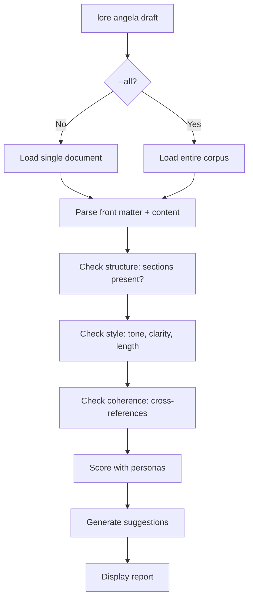

# lore angela draft

Zero-API structural analysis of your documents — no internet required.

## Synopsis

```
lore angela draft [filename] [flags]
```

## What Does This Do?

`lore angela draft` is like having a writing coach review your document — except this coach works **entirely offline**. It checks structure, style, and consistency without making any network calls or needing an API key.

> **Analogy:** Imagine a spell-checker, but instead of checking spelling, it checks: "Did you explain *why*? Did you mention alternatives? Is this consistent with your other documents?" All locally, all free.

## Arguments

| Argument | Required | Description |
|----------|----------|-------------|
| `filename` | No | Specific document to analyze (default: most recent) |

## Flags

| Flag | Type | Default | Description |
|------|------|---------|-------------|
| `--all` | bool | `false` | Analyze every document in the corpus |

## What It Checks

| Category | What it looks for | Example finding |
|----------|-------------------|-----------------|
| **Structure** | Missing sections (Why, Alternatives, Impact) | "Missing 'Alternatives Considered' section" |
| **Style** | Passive voice, vague language, tone issues | "Passive voice overused in Why section" |
| **Coherence** | Contradictions or connections with other docs | "Related: feature-add-auth-2026-02-15.md" |
| **Completeness** | Empty or too-short sections | "Why section is only 5 words — consider expanding" |

## Output (Single Document)

```bash
lore angela draft decision-database-2026-02-10.md
```

```
Analyzing  decision-database-2026-02-10.md
Score: 7.2/10 by Technical Writer + Architect

SEVERITY   CATEGORY        MESSAGE
error      structure       Missing "Impact" section — decisions should describe consequences
warning    tone            "We just picked PostgreSQL" — avoid "just", it undermines the decision
info       coherence       Related: feature-user-model-2026-02-12.md (mentions same schema)

3 suggestions
```

### Understanding Severity

| Severity | Meaning | Action |
|----------|---------|--------|
| **error** | Something important is missing | Fix before considering the doc "done" |
| **warning** | Could be better | Improve when you have time |
| **info** | Informational — connections and context | Good to know, no action needed |

## Output (Corpus-wide `--all`)

```bash
lore angela draft --all
```

```
Analyzing 12 documents in corpus...

STATUS     FILENAME                          DETAILS
review     decision-database-2026-02-10.md   3 suggestions (avg 7.2/10)
review     feature-rate-limit-2026-03-16.md  1 suggestion  (avg 8.1/10)
ok         refactor-extract-auth-2026-03-01.md  (9.4/10)
ok         feature-add-jwt-2026-02-15.md     (9.0/10)
...

12 docs reviewed, 2 with issues, 4 suggestions total
```

## Process Flow



## Common Questions

### "Do I need an API key for this?"

**No.** `angela draft` is 100% local. It uses built-in rules and heuristics, not AI. Think of it as a sophisticated linter for documentation.

### "What's the difference between `draft` and `polish`?"

| | `angela draft` | `angela polish` |
|---|---|---|
| **Network** | None (offline) | 1 API call |
| **Cost** | Free | Uses API credits |
| **What it does** | Points out problems | Rewrites the document |
| **Output** | Suggestions list | Interactive diff |

> **Best practice:** Always run `draft` first (free), fix the easy issues, then `polish` (costs credits) for the finishing touch.

### "What are 'personas'?"

Angela uses virtual reviewers with different perspectives. Each persona scores the document from their angle:
- **Technical Writer** — Is it clear and well-structured?
- **Architect** — Is the technical content accurate?
- **New Developer** — Would a newcomer understand this?

The final score is the average across active personas.

## Tips & Tricks

- **Before every PR:** Run `lore angela draft --all` to catch quality issues.
- **Run `draft` before `polish`:** Fix free issues first, then spend API credits on polish.
- **The score is relative:** 7/10 is good, 9/10 is excellent. Don't aim for 10/10 on every doc.
- **Customize style rules** in `.lorerc` under `angela.style_guide` for team conventions.

## Exit Codes

| Code | Meaning |
|------|---------|
| `0` | Success (even if suggestions found) |
| `1` | Error (`.lore/` not found, file not found) |

## See Also

- [lore angela polish](angela-polish.md) — AI-assisted rewrite (next step)
- [lore angela review](angela-review.md) — Corpus-wide coherence via AI
- [Document Types](../guides/document-types.md) — What sections each type expects
