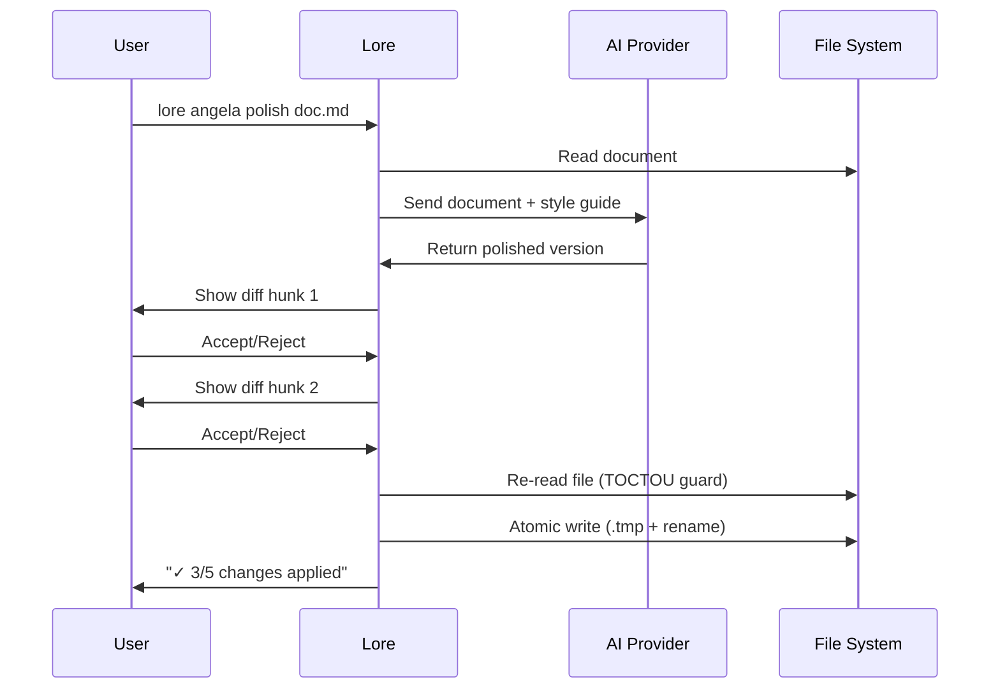

# lore angela polish

Réécriture de document assistée par IA avec revue de diff interactive.

## Synopsis

```
lore angela polish <filename> [flags]
```

## Description

Envoie un document au fournisseur IA configuré pour réécriture. Affiche un diff interactif — acceptez où rejetez chaque modification individuellement. Les écritures atomiques garantissent la préservation de l'original jusqu'à confirmation des changements.

**Nécessite** un fournisseur IA configuré dans `.lorerc` où `.lorerc.local`.

## Arguments

| Argument | Requis | Description |
|----------|--------|-------------|
| `filename` | Oui | Document à polir |

## Flags

| Flag | Type | Défaut | Description |
|------|------|--------|-------------|
| `--dry-run` | bool | `false` | Afficher le diff sans appliquer les modifications |
| `--yes` | bool | `false` | Accepter toutes les modifications sans confirmation |

## Diff interactif

Chaque modification est présentée sous forme de hunk :

```diff
--- original
+++ polished
@@ -5,3 +5,5 @@
 ## Why
-Stateless auth scales better
+Stateless authentication scales better than server-side sessions.
+JWT tokens are self-contained, eliminating the need for a session store
+and enabling horizontal scaling without shared state.

Accept this change? [y/n/q]
```

- `y` — Accepter ce hunk
- `n` — Rejeter ce hunk
- `q` — Quitter (conserver les modifications acceptées jusqu'ici)

## Flux de processus



## Dispositifs de sécurité

- **Protection TOCTOU** — Relit le fichier avant l'écriture. Si le fichier a changé depuis l'appel IA, abandonne avec une erreur.
- **Écriture atomique** — `.tmp` + `os.Rename()` empêche la corruption.
- **Tout rejeté** — Code de sortie 0, aucune modification. L'original reste intact.
- **Mise à jour du frontmatter** — Ajoute `angela_mode: "polish"` aux métadonnées.

## Exemples

```bash
# Polish interactif (par défaut)
lore angela polish decision-auth-strategy-2026-03-07.md
# → Affiche les hunks du diff, accepter/rejeter chacun

# Aperçu sans appliquer
lore angela polish decision-auth-strategy-2026-03-07.md --dry-run

# Tout accepter (scripting)
lore angela polish decision-auth-strategy-2026-03-07.md --yes
```

## Prérequis

```yaml
# .lorerc.local (ou variables d'environnement)
ai:
  provider: "anthropic"     # où openai, ollama
  model: "claude-sonnet-4-20250514"
```

Ou : `lore config set-key anthropic`

## Tips & Tricks

- Lancez toujours `lore angela draft` d'abord — corrigez les problèmes structurels localement avant de payer pour l'IA.
- Utilisez `--dry-run` pour prévisualiser les modifications de l'IA sans risque.
- L'IA voit votre guide de style (s'il est configuré) et le contexte du corpus.
- Un seul appel API par document. Planifiez votre budget en conséquence.

## Codes de sortie

| Code | Signification |
|------|---------------|
| `0` | Succès (ou aucune modification / tout rejeté) |
| `1` | Erreur (pas de fournisseur, fichier introuvable, conflit TOCTOU) |

## Voir aussi

- [lore angela draft](angela-draft.fr.md) — Analyse sans API d'abord
- [lore config](config.fr.md) — Configurer le fournisseur IA
