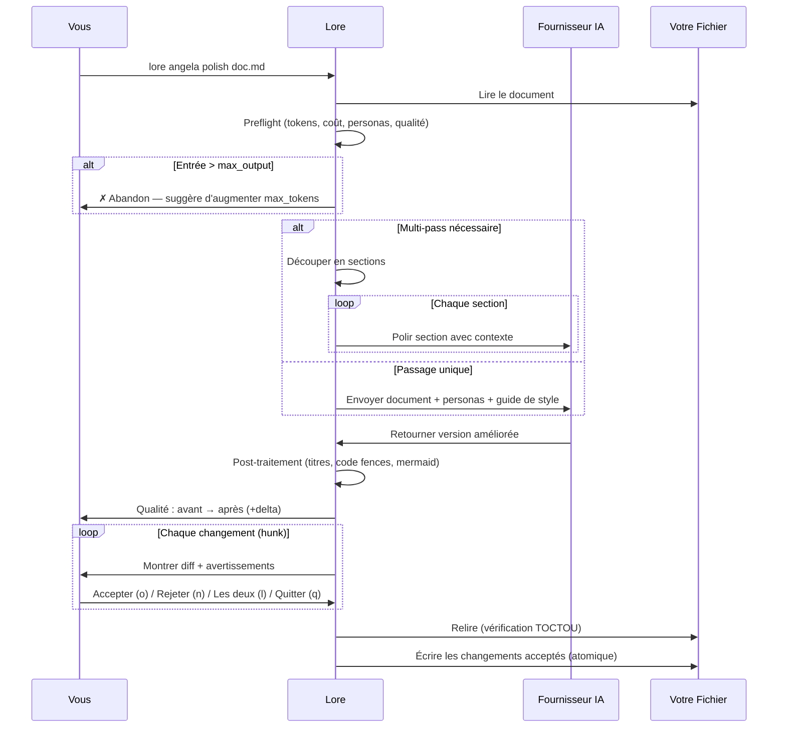

# lore angela polish

Réécriture de document assistée par IA avec revue de diff interactive.

## Synopsis

```
lore angela polish <fichier> [flags]
```

## Qu'est-ce que ça fait ?

`lore angela polish` envoie votre document à une IA (Claude, GPT, ou un modèle local) et reçoit une version améliorée. Vous passez en revue chaque changement individuellement — acceptez ce qui vous plaît, rejetez ce qui ne va pas.

> **Analogie :** C'est comme envoyer votre essai à un éditeur professionnel. Il renvoie des modifications suivies. Vous cliquez "Accepter" ou "Rejeter" sur chacune. Votre original n'est jamais perdu.

**Nécessite** un fournisseur IA configuré (clé API nécessaire).

## Scénario concret

> Votre document "decision-database" est un brouillon rapide d'il y a 2 semaines. Avant de le partager avec l'équipe :
>
> ```bash
> lore angela polish decision-database-2026-02-10.md
> ```
>
> L'IA suggère 5 améliorations. Vous en acceptez 3, rejetez 2. Le doc passe de "qualité brouillon" à "qualité publication" en 60 secondes.

## Arguments

| Argument | Requis | Description |
|----------|--------|-------------|
| `fichier` | Oui | Le document à polir |

## Flags

| Flag | Type | Défaut | Description |
|------|------|--------|-------------|
| `--dry-run` | bool | `false` | Prévisualiser les changements sans les appliquer |
| `--yes` | bool | `false` | Accepter tous les changements automatiquement |
| `--for` | string | | Réécrire pour une audience cible (ex : `"CTO"`, `"équipe commerciale"`) |
| `--auto` / `-a` | bool | `false` | Auto-accepter les ajouts, auto-rejeter les suppressions, demander uniquement pour les modifications |

## Comment ça marche (étape par étape)

### Étape 1/3 : Préparation

```bash
lore angela polish decision-database-2026-02-10.md
```

```
[1/3] Préparation de decision-database-2026-02-10.md…
      ~3012 tokens → | max ←: 8192 tokens | timeout: 60s
      Personas : 📖 Affoue (12), ✏️ Sialou (10), 🏗️ Doumbia (6)
      Qualité : 52/100 (C)
      Coût estimé : ~$0.0042
```

Angela effectue des **vérifications préalables** avant de dépenser des crédits API :

- **Estimation de tokens** — combien seront envoyés vs. le maximum autorisé
- **Personas** — quels relecteurs virtuels sont activés (basé sur le type de doc + contenu)
- **Score de qualité** — qualité actuelle du document (0-100, notes A–F)
- **Estimation du coût** — coût API estimé en USD
- **Abandon** — si l'entrée dépasse `max_output`, Angela s'arrête et suggère d'augmenter `angela.max_tokens` dans `.lorerc`

Si le document est volumineux, Angela le détecte et utilise le **mode multi-pass** (polish section par section avec résumés de contexte).

### Étape 2/3 : Appel IA

Angela envoie votre document à l'IA avec :

- Le contenu du document
- Votre guide de style (si configuré dans `.lorerc`)
- Les directives des personas activées
- Les règles de langue (tout nouveau contenu dans la langue du document)
- Les règles de préservation (ne pas supprimer sections, code, tableaux existants)

Un spinner avec compte à rebours affiche la progression. Après la réponse :

```
      ✓ Réponse IA reçue en 8.2s
      Tokens : 3012 → 4521 ← | Modèle : claude-sonnet-4-20250514
      Vitesse : 551 tok/s (rapide)
      Coût : ~$0.0038
```

### Étape 3/3 : Revue des changements

```
[3/3] Calcul du diff…
      5 modifications | Qualité : 52/100 (C) → 78/100 (B) (+26)
```

Vous passez en revue chaque changement avec sa position dans le document :

```
--- Modification 1/5 ---
  @@ ligne 12 (4 lignes) @@
 ## Why
- On a pris PostgreSQL parce qu'il a des transactions
+ PostgreSQL a été choisi pour ses garanties de transactions ACID.
+ Le flux de paiement nécessite des opérations atomiques sur plusieurs tables,
+ et le driver pgx offre une excellente intégration Go.

Appliquer ? [o]ui / [n]on / [l]es deux / [q]uitter :
```

| Touche | Action |
|--------|--------|
| `o` | Accepter ce changement (remplacer l'original par la version IA) |
| `n` | Rejeter (garder l'original) |
| `l` | Les deux — l'original reste, les nouvelles lignes sont ajoutées en dessous |
| `q` | Quitter — garder les changements acceptés jusqu'ici |

> **L'option `[l]es deux`** n'apparaît que quand le hunk contient à la fois des suppressions et des ajouts. Pour les ajouts purs, seul `o/n/q` est affiché.

### Avertissements de hunk

Angela vous prévient avant de décider sur les changements potentiellement destructeurs :

```
⚠ Angela supprime 24 lignes (net -18). Considérez [l]es deux.
⚠ Ce changement supprime la section : ## 4. Logique Métier
⚠ Ce changement supprime 2 bloc(s) de code.
```

Les avertissements se déclenchent quand :
- **Perte nette > 15 lignes** — suppression significative de contenu
- **Titres de section** (## ou ###) supprimés
- **Blocs de code** supprimés
- **Lignes de tableau** (> 3) supprimées

## Réécriture pour audience (`--for`)

Réécrivez votre document pour une audience spécifique :

```bash
lore angela polish doc.md --for "équipe commerciale"
```

Angela demande s'il faut créer un **nouveau fichier** (original inchangé) ou **écraser** l'original :

```
      Audience cible : équipe commerciale
      [n]ouveau fichier (garder l'original) / [é]craser l'original ?
```

- **Nouveau fichier** → écrit dans `doc.équipe-commerciale.md`, original intact
- **Écraser** → passe au diff interactif sur l'original

Quand `--for` est actif :
- Les personas correspondant à l'audience reçoivent un boost de +20 (ex : `"commercial"` booste Business Analyst et Storyteller)
- Le prompt IA inclut des instructions de réécriture spécifiques : simplifier le jargon, ajuster la profondeur, recadrer pour l'audience
- Les résultats de review incluent un champ `relevance` (high / medium / low) pour chaque finding

## Mode auto (`--auto`)

```bash
lore angela polish doc.md --auto
```

Le mode auto classifie chaque hunk et décide automatiquement quand c'est possible :

| Type de hunk | Décision | Justification |
|--------------|----------|---------------|
| **Ajout pur** | Auto-accepté | Nouveau contenu, rien de perdu |
| **Cosmétique** (espaces) | Auto-accepté | Pas de changement sémantique |
| **Suppression pure** | Auto-rejeté | Prévient la perte de contenu |
| **Suppression majeure** (net > 15) | Auto-rejeté | Prévient la perte significative |
| **Modification** | Demande interactive | Nécessite un jugement humain |

```
  [auto] ✓ +diagramme mermaid (addition)
  [auto] ✓ correction d'espaces (cosmétique)
  [auto] ✗ -12 lignes incluant ## Impact (suppression → rejeté)

--- Modification 3/5 (à examiner) ---
  @@ ligne 42 (8 lignes) @@
  ...

  Auto : 2 acceptés, 1 rejeté, 2 examinés
```

## Score de qualité

Angela note votre document avant et après le polish sur une échelle de 0 à 100 :

| Note | Score | Signification |
|------|-------|---------------|
| **A** | 85+ | Qualité publication |
| **B** | 70–84 | Bon, améliorations mineures possibles |
| **C** | 50–69 | Travail nécessaire |
| **D** | 30–49 | Lacunes majeures |
| **F** | < 30 | Contenu minimal |

Le score est basé sur 11 critères : section Why (15pts), diagrammes (15pts), tableaux (10pts), blocs de code (10pts), tags de code (5pts), structure (10pts), front matter (10pts), références (5pts), densité (10pts), propreté (5pts), style (5pts).

## Protections de sécurité

| Protection | Comment ça marche |
|------------|-------------------|
| **Revue interactive** | Vous voyez chaque changement avant application |
| **Écriture atomique** | `.tmp` + `os.Rename()` — si ça échoue, l'original est intact |
| **Garde TOCTOU** | Lore relit le fichier avant d'écrire. Si quelqu'un l'a modifié pendant que l'IA travaillait, Lore annule |
| **Tout rejeté = pas de changement** | Si vous rejetez chaque hunk, le fichier est intact |

> **C'est quoi TOCTOU ?** "Time Of Check, Time Of Use" — une vérification de sécurité qui empêche d'écraser des changements faits entre le moment où Lore a lu le fichier et celui où il essaie d'écrire.

## Flux



## Prérequis

Un fournisseur IA doit être configuré. Trois options :

### Option 1 : Anthropic (Claude)
```bash
lore config set-key anthropic
```
```yaml
# .lorerc
ai:
  provider: "anthropic"
  model: "claude-sonnet-4-20250514"
```

### Option 2 : OpenAI (GPT)
```bash
lore config set-key openai
```
```yaml
ai:
  provider: "openai"
  model: "gpt-4o"
```

### Option 3 : Ollama (Local, Gratuit)
```yaml
# .lorerc (pas de clé API nécessaire !)
ai:
  provider: "ollama"
  model: "llama3.1"
  endpoint: "http://localhost:11434"
```

### Option 4 : Toute API compatible OpenAI

Groq, Together, Mistral, Azure OpenAI, vLLM, LM Studio — tout endpoint compatible OpenAI fonctionne avec `provider: "openai"` :

```yaml
# .lorerc
ai:
  provider: "openai"
  model: "mixtral-8x7b-32768"
  endpoint: "https://api.groq.com"
```
```bash
lore config set-key openai
# → Entrer la clé API : gsk_...  (votre clé Groq/Together/Mistral)
```

## Exemples

```bash
# Polish interactif (le plus courant)
lore angela polish decision-database-2026-02-10.md

# Prévisualiser (pas de modifications)
lore angela polish decision-database-2026-02-10.md --dry-run

# Accepter tout (faire confiance à l'IA)
lore angela polish decision-database-2026-02-10.md --yes

# Mode auto : accepter ajouts, rejeter suppressions, demander les modifications
lore angela polish decision-database-2026-02-10.md --auto

# Réécrire pour une audience cible (crée un nouveau fichier)
lore angela polish doc.md --for "CTO"
lore angela polish doc.md --for "équipe commerciale"
lore angela polish doc.md --for "nouveau développeur"

# Combiner auto + audience
lore angela polish doc.md --for "CTO" --auto
```

## Questions fréquentes

### "Combien ça coûte ?"

Angela affiche le **coût estimé avant l'appel** et le **coût réel après**. Un appel API par document (ou un par section en mode multi-pass). Coût typique :

- **Claude Sonnet :** ~$0.01–0.03 par document
- **Claude Haiku :** ~$0.001–0.005 par document
- **GPT-4o :** ~$0.01–0.05 par document
- **Ollama :** Gratuit (tourne localement)

Vous pouvez contrôler le max tokens (et donc le coût) avec `angela.max_tokens` dans `.lorerc`.

### "Le résultat de l'IA est de mauvaise qualité / contenu inventé"

La qualité de `polish` dépend de **deux choses** :

1. **Le modèle IA utilisé.** Les petits modèles locaux (llama3.2, phi3) peuvent halluciner du contenu, inventer des sections sans rapport avec votre document, ou ignorer les instructions. Les modèles plus grands (Claude Sonnet, GPT-4o, llama3.1:70b) suivent beaucoup mieux le prompt de polish.
2. **Ce que vous avez écrit au départ.** Un document d'une ligne "just testing" ne donne rien à l'IA — elle remplira le vide avec du contenu inventé. Plus vous fournissez de contexte (un vrai "Why", des détails concrets, des compromis réels), meilleur sera le résultat.

> **Règle d'or :** poubelle en entrée, poubelle en sortie. Écrivez un premier brouillon solide (même brut), puis polissez. N'attendez pas que l'IA crée du contenu à partir de rien.

### "Et si l'IA fait de mauvaises suggestions ?"

C'est pour ça qu'il y a la revue interactive. Rejetez ce qui ne va pas. L'IA est un assistant, pas le patron.

### "Faut-il lancer `draft` d'abord ?"

**Oui.** `lore angela draft` est gratuit et attrape les problèmes structurels. Corrigez ceux-là d'abord, puis `polish` pour le style. Vous économiserez des crédits et obtiendrez de meilleurs résultats.

### "Peut-on polish le même document plusieurs fois ?"

Oui. Vous pouvez re-polish autant de fois que vous voulez. Chaque appel envoie la version **actuelle** (avec les améliorations précédentes) à l'IA. Workflow typique :

1. `lore angela polish doc.md --yes` — premier passage, auto-accept
2. Éditez le doc manuellement (ajoutez alternatives, impact, nouveau contexte)
3. `lore angela polish doc.md --yes` — second passage, améliore aussi vos ajouts


<!-- Generate: vhs assets/vhs/angela-repolish.tape -->

Chaque re-polish est un appel API. L'IA voit la version améliorée, pas l'originale.

## Personas

Angela utilise 6 relecteurs virtuels. Les 3 meilleurs sont activés selon le type de document, le contenu et l'audience :

| Persona | Icône | Focus | Activé par |
|---------|-------|-------|------------|
| **Affoue** (Storyteller) | 📖 | Clarté narrative, sections "Why" | Décisions, notes ; `--for commercial/sales` |
| **Sialou** (Tech Writer) | ✏️ | Précision technique, structure | Features, refactors ; `--for développeur` |
| **Kouame** (QA Reviewer) | 🔍 | Critères de validation, cas limites | Bugfixes ; `--for qa/audit` |
| **Doumbia** (Architect) | 🏗️ | Compromis, conception système | Décisions, refactors ; `--for CTO` |
| **Gougou** (UX Designer) | 🎨 | Empathie utilisateur, accessibilité | Features ; `--for design/ux` |
| **Beda** (Business Analyst) | 📊 | Valeur business, exigences | Features, releases ; `--for commercial/CEO` |

Avec `--for`, les personas correspondantes reçoivent un boost de +20. Par exemple, `--for "CTO"` booste Architect et Business Analyst.

## Post-traitement

Après la réponse IA, Angela applique des transformations locales (sans appel API) :

1. **Numéros de titres** — restaure `## 4. Titre` si l'IA a supprimé les numéros
2. **Langages de code fences** — détecte le langage depuis le contenu et ajoute le tag aux fences `` ``` `` nues (supporte 25+ langages)
3. **Indentation mermaid** — normalise l'indentation dans les blocs de diagrammes mermaid

## Tips & Tricks

- **`draft` puis `polish` :** Toujours l'analyse gratuite d'abord.
- **`--dry-run` la première fois :** Prévisualisez avant de vous engager.
- **`--auto` pour les gros diffs :** Laissez Angela gérer les cas évidents, ne revoyez que les modifications.
- **`--for` pour le partage d'équipe :** Générez des versions adaptées sans modifier l'original.
- **Ollama pour expérimenter :** Modèle local pour tester sans dépenser.
- **Re-polish est sûr :** Chaque appel relit le fichier actuel. Aucun risque d'écraser vos éditions.
- **Après polish :** Le front matter reçoit `angela_mode: "polish"` automatiquement.
- **Multi-pass automatique :** Pour les gros documents, Angela découpe en sections pour rester dans les limites de tokens.

## Codes de sortie

| Code | Signification |
|------|---------------|
| `0` | Succès (ou pas de changement / tout rejeté) |
| `1` | Erreur (pas de fournisseur, fichier non trouvé, conflit TOCTOU) |

## Voir aussi

- [lore angela draft](angela-draft.md) — Analyse gratuite (lancez d'abord)
- [lore angela review](angela-review.md) — Vérification cohérence corpus
- [lore config](config.md) — Configurer le fournisseur IA
