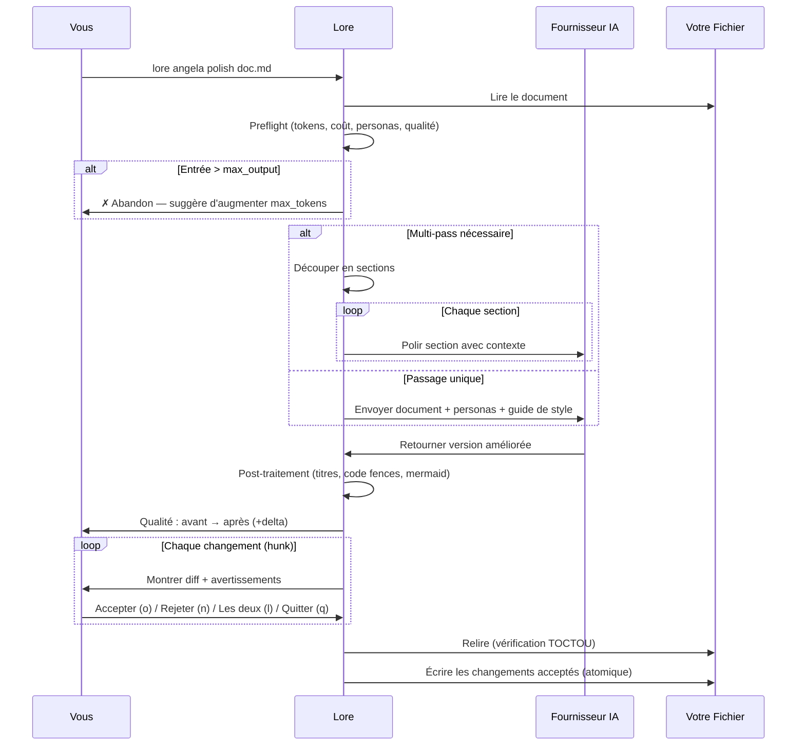

# lore angela polish

Réécriture de document assistée par IA avec revue de diff interactive.

## Synopsis

```text
lore angela polish <fichier> [flags]
```

## Qu'est-ce que ça fait ?

`lore angela polish` envoie votre document à une IA (Claude, GPT, ou un modèle local) et retourne une version améliorée. Passez en revue chaque changement individuellement — acceptez ce qui vous convient, rejetez ce qui ne va pas.

**Nécessite** un fournisseur IA configuré (clé API nécessaire).

## Scénario concret

> Votre document "decision-database" est un brouillon rapide d'il y a 2 semaines. Avant de le partager avec l'équipe :
>
> ```bash
> lore angela polish decision-database-2026-02-10.md
> ```
>
> L'IA suggère 5 améliorations. Vous en acceptez 3, rejetez 2. Le doc passe de "qualité brouillon" à "qualité publication" en 60 secondes.

## Arguments

| Argument | Requis | Description |
|----------|--------|-------------|
| `fichier` | Oui | Le document à polir |

## Flags

| Flag | Type | Défaut | Description |
|------|------|--------|-------------|
| `--dry-run` | bool | `false` | Prévisualiser les changements sans les appliquer (contenu poli sur stdout, diff sur stderr) |
| `--yes` | bool | `false` | Accepter tous les changements automatiquement |
| `--for` | string | | Réécrire pour une audience cible (ex : `"CTO"`, `"équipe commerciale"`) |
| `--auto` / `-a` | bool | `false` | Auto-accepter les ajouts, auto-rejeter les suppressions, demander uniquement pour les modifications |
| `--interactive` / `-i` | bool | `false` | Passer en revue les changements section par section dans un TUI |
| `--incremental` | bool | `false` | Re-polir uniquement les sections modifiées (ignore les sections inchangées) |
| `--full` | bool | `false` | Forcer un polish complet même si `incremental` est activé dans la config |
| `--synthesize` | bool | `false` | Appliquer les propositions du Example Synthesizer (hors ligne, sans IA) et écrire dans le doc |
| `--synthesizer-dry-run` | bool | `false` | Prévisualiser les propositions du synthesizer sans écrire |
| `--synthesizers` | strings | | Surcharger les synthesizers activés pour ce run (ex : `api-postman`) |
| `--no-synthesizers` | bool | `false` | Désactiver tous les Example Synthesizers pour ce run |
| `--set-status` | string | | Mettre à jour le `status` du frontmatter après application (ex : `reviewed`, `published`) |
| `--persona` | string | | Forcer un seul persona pour ce run |
| `--arbitrate-rule` | string | | Règle de résolution non-interactive pour les sections en doublon produites par l'IA : `first`, `second`, `both`, `abort`. Requis en non-TTY quand des doublons sont détectés. Mutuellement exclusif avec `--interactive`. |
| `--verbose` / `-v` | bool | `false` | Afficher sur stderr les événements d'intégrité structurelle (frontmatter leaké strippé, détails d'arbitrage). Toujours enregistré dans `polish.log` indépendamment. |

## Comment ça marche (étape par étape)

### Étape 1/3 : Préparation

```bash
lore angela polish decision-database-2026-02-10.md
```

```text
[1/3] Préparation de decision-database-2026-02-10.md…
      ~3012 tokens → | max ←: 8192 tokens | timeout: 60s
      Personas : 📖 Affoue (12), ✏️ Salou (10), 🏗️ Doumbia (6)
      Qualité : 52/100 (C)
      Coût estimé : ~$0.0042
```

Angela effectue des **vérifications préalables** avant de dépenser des crédits API :

- **Estimation de tokens** — tokens à envoyer vs. maximum autorisé
- **Personas** — quels relecteurs virtuels s'activent (selon le type de doc et le contenu)
- **Score de qualité** — qualité actuelle du document (0-100, notes A–F)
- **Estimation du coût** — coût API estimé en USD
- **Abandon** — si l'entrée dépasse `max_output`, Angela s'arrête et suggère d'augmenter `angela.max_tokens` dans `.lorerc`

Pour les documents volumineux, Angela utilise automatiquement le **mode multi-pass** (polish section par section avec résumés de contexte).

### Étape 2/3 : Appel IA

Angela envoie votre document à l'IA avec :

- Le contenu du document
- Votre guide de style (si configuré dans `.lorerc`)
- Les directives des personas activées
- Les règles de langue (tout nouveau contenu dans la langue du document)
- Les règles de préservation (ne pas supprimer sections, code, tableaux existants)

Un spinner avec compte à rebours affiche la progression. Après la réponse :

```text
      ✓ Réponse IA reçue en 8.2s
      Tokens : 3012 → 4521 ← | Modèle : claude-sonnet-4-20250514
      Vitesse : 551 tok/s (rapide)
      Coût : ~$0.0038
```

### Étape 3/3 : Revue des changements

```text
[3/3] Calcul du diff…
      5 modifications | Qualité : 52/100 (C) → 78/100 (B) (+26)
```

Passez en revue chaque changement avec sa position dans le document :

```text
--- Modification 1/5 ---
  @@ ligne 12 (4 lignes) @@
 ## Why
- On a pris PostgreSQL parce qu'il a des transactions
+ PostgreSQL a été choisi pour ses garanties de transactions ACID.
+ Le flux de paiement nécessite des opérations atomiques sur plusieurs tables,
+ et le driver pgx offre une excellente intégration Go.

Appliquer ? [o]ui / [n]on / [l]es deux / [q]uitter :
```

| Touche | Action |
|--------|--------|
| `o` | Accepter ce changement (remplacer l'original par la version IA) |
| `n` | Rejeter (garder l'original) |
| `l` | Les deux — l'original reste, les nouvelles lignes sont ajoutées en dessous |
| `q` | Quitter — garder les changements acceptés jusqu'ici |

> **L'option `[l]es deux`** n'apparaît que quand le hunk contient à la fois des suppressions et des ajouts. Pour les ajouts purs, seul `o/n/q` est affiché.

### Avertissements de hunk

Angela vous prévient avant les changements potentiellement destructeurs :

```text
⚠ Angela supprime 24 lignes (net -18). Considérez [l]es deux.
⚠ Ce changement supprime la section : ## 4. Logique Métier
⚠ Ce changement supprime 2 bloc(s) de code.
```

Les avertissements se déclenchent quand :
- **Perte nette > 15 lignes** — suppression significative de contenu
- **Titres de section** (## ou ###) supprimés
- **Blocs de code** supprimés
- **Lignes de tableau** (> 3) supprimées

## Famille Example Synthesizer (`--synthesize`)

La famille de synthesizers est un pipeline **hors ligne** qui génère automatiquement des blocs de contenu structuré à partir des informations déjà présentes dans votre document — sans appel IA, sans clé API, sans coût. Le premier synthesizer, `api-postman`, génère des exemples de requêtes HTTP+JSON Postman à partir de vos tables d'endpoints et listes de filtres.

### Comment ça marche

1. Le synthesizer lit la table `### Endpoints` de votre doc, la liste `### Filtres` (ou la table `### Référence des champs`), et la section `## Sécurité`.
2. Il construit un body JSON avec les champs requis en variables Postman (`{{month}}`), les champs optionnels à `null`, et les champs injectés par le serveur **exclus** (zéro hallucination — chaque champ en sortie est traçable jusqu'à un span littéral dans votre doc).
3. Il écrit le bloc dans votre doc sous un nouveau sous-titre après `### Endpoints`.

### Prévisualiser ce qui serait généré

```bash
lore angela polish doc.md --synthesizer-dry-run
```

### Appliquer les blocs

```bash
lore angela polish doc.md --synthesize
```

### Appliquer + promouvoir le statut

```bash
lore angela polish doc.md --synthesize --set-status reviewed
```

### Fonctionne aussi sur les docs externes

Le synthesizer fonctionne sur **n'importe quel** fichier Markdown — même en dehors d'un projet Lore natif :

```bash
# Projet externe avec sa propre structure de docs
lore angela polish my-api-spec.md --synthesize
```

Le synthesizer utilise le parser de frontmatter permissif : les docs provenant de sites MkDocs, Docusaurus ou Hugo avec un front matter YAML partiel ou absent sont acceptés. Pas besoin de `lore init`.

### Garanties de sécurité (Invariants I4–I7)

| Invariant | Ce qu'il garantit |
|-----------|-------------------|
| **I4** zéro-hallucination | Chaque champ du body JSON généré possède un span d'évidence littéral pointant vers la ligne source où le nom du champ apparaît |
| **I5** sécurité-d'abord | Les champs déclarés comme injectés par le serveur dans la section Sécurité du doc sont exclus par construction |
| **I5-bis** fail-safe | Quand aucune section Sécurité n'existe, la liste bien connue (`tenantId`, `authenticatedUsername`, `principalId` + noms spécifiques au projet depuis `.lorerc`) filtre les champs probablement injectés par le serveur ET émet un warning `missing-security-section` |
| **I6** idempotence | Relancer `--synthesize` sur un doc inchangé produit zéro diff (cache basé sur la signature dans le frontmatter) |
| **I7** pas de merge silencieux | Les modifications de contenu synthétisé précédemment accepté passent toujours par la revue de diff — le synthesizer n'écrase jamais les éditions utilisateur |

### Configuration (`.lorerc`)

```yaml
angela:
  synthesizers:
    enabled:
      - api-postman           # activé par défaut depuis 8-18
    well_known_server_fields:
      - tenantId
      - authenticatedUsername
      - principalId
    per_synthesizer:
      review:
        severity: info        # sévérité des findings de review (info/warning/error)
```

## Cycle de vie des statuts (`--set-status`)

Mettez à jour le champ `status` du frontmatter en une seule commande :

```bash
# Mise à jour de statut seule (sans IA, sans synthesize)
lore angela polish doc.md --set-status published

# Combiné avec synthesize
lore angela polish doc.md --synthesize --set-status reviewed
```

Relancer avec une valeur différente est toujours sûr — le champ est écrasé, jamais rejeté. Cycle de vie courant : `draft → reviewed → published`.

## Réécriture pour audience (`--for`)

Réécrivez votre document pour une audience spécifique :

```bash
lore angela polish doc.md --for "équipe commerciale"
```

Angela demande s'il faut créer un **nouveau fichier** (original inchangé) ou **écraser** l'original :

```text
      Audience cible : équipe commerciale
      [n]ouveau fichier (garder l'original) / [é]craser l'original ?
```

- **Nouveau fichier** → écrit dans `doc.équipe-commerciale.md`, original intact
- **Écraser** → passe au diff interactif sur l'original

Quand `--for` est actif :
- Les personas correspondant à l'audience reçoivent un boost de +20 (ex : `"commercial"` booste Business Analyst et Storyteller)
- Le prompt IA inclut des instructions de réécriture spécifiques : simplifier le jargon, ajuster la profondeur, recadrer pour l'audience
- Les résultats de review incluent un champ `relevance` (high / medium / low)

## Mode auto (`--auto`)

```bash
lore angela polish doc.md --auto
```

Le mode auto classifie chaque hunk et décide automatiquement quand c'est possible :

| Type de hunk | Décision | Justification |
|--------------|----------|---------------|
| **Ajout pur** | Auto-accepté | Nouveau contenu, rien de perdu |
| **Cosmétique** (espaces) | Auto-accepté | Pas de changement sémantique |
| **Suppression pure** | Auto-rejeté | Prévient la perte de contenu |
| **Suppression majeure** (net > 15) | Auto-rejeté | Prévient la perte significative |
| **Modification** | Demande interactive | Nécessite un jugement humain |

```text
  [auto] ✓ +diagramme mermaid (addition)
  [auto] ✓ correction d'espaces (cosmétique)
  [auto] ✗ -12 lignes incluant ## Impact (suppression → rejeté)

--- Modification 3/5 (à examiner) ---
  @@ ligne 42 (8 lignes) @@
  ...

  Auto : 2 acceptés, 1 rejeté, 2 examinés
```

## TUI interactif (`--interactive`)

```bash
lore angela polish decision-database.md --interactive
```

Le TUI affiche chaque section de votre document côte à côte (original vs. version IA) et vous laisse décider par section :

```text
Angela Polish — decision-database-2026-02-10.md
Section 2/5: ## Why
────────────────────────────────────────────────────────
Original :
  On a pris PostgreSQL parce qu'il a des transactions.

Version IA :
  PostgreSQL a été choisi pour ses garanties de transactions ACID.
  Le flux de paiement nécessite des opérations atomiques sur plusieurs
  tables, et le driver pgx offre une excellente intégration Go.

[a] accepter  [r] rejeter  [b] les deux  [e] éditer  [s] passer  [q] quitter
```

| Touche | Action |
|--------|--------|
| `a` | Accepter la version IA pour cette section |
| `r` | Rejeter — garder l'original |
| `b` | Les deux — l'original reste, la version IA ajoutée en dessous |
| `e` | Ouvrir `$EDITOR` pour fusionner manuellement les deux versions |
| `s` | Passer (décider plus tard) |
| `q` | Quitter — garder les décisions prises jusqu'ici |

Les sections supprimées par l'IA sont affichées avec un avertissement et défaut à `rejeter` sauf acceptation explicite.

## Polish incrémental (`--incremental`)

```bash
lore angela polish decision-database.md --incremental
```

Le mode incrémental compare le document actuel contre la dernière version polie stockée dans `.lore/angela/polish-state/`. Seules les **sections modifiées** sont envoyées à l'IA — les sections inchangées sont conservées telles quelles.

Cela réduit considérablement les coûts API quand vous n'avez modifié qu'une ou deux sections d'un grand document :

```text
[1/3] Préparation de decision-database-2026-02-10.md…
      Mode incrémental : 2/5 sections modifiées
      ~480 tokens → (était 3012 sans incrémental)
      Coût : ~$0.0008 (était ~$0.0042)
```

Activez en permanence dans `.lorerc` :

```yaml
angela:
  incremental: true  # défaut pour tous les runs polish
```

Utilisez `--full` pour forcer un re-polish complet du document :

```bash
lore angela polish decision-database.md --full
```

## Score de qualité

Angela note votre document avant et après le polish sur une échelle de 0 à 100 :

| Note | Score | Signification |
|------|-------|---------------|
| **A** | 85+ | Qualité publication |
| **B** | 70–84 | Bon, améliorations mineures possibles |
| **C** | 50–69 | Travail nécessaire |
| **D** | 30–49 | Lacunes majeures |
| **F** | < 30 | Contenu minimal |

Le score est basé sur 11 critères : section Why (15pts), diagrammes (15pts), tableaux (10pts), blocs de code (10pts), tags de code (5pts), structure (10pts), front matter (10pts), références (5pts), densité (10pts), propreté (5pts), style (5pts).

## Protections de sécurité

| Protection | Comment ça marche |
|------------|-------------------|
| **Revue interactive** | Vous voyez chaque changement avant application |
| **Écriture atomique** | Les changements sont écrits dans un fichier `.tmp`, puis renommés. En cas d'échec, l'original est intact |
| **Garde TOCTOU** | Lore relit le fichier avant d'écrire. Si quelqu'un l'a modifié pendant que l'IA travaillait, Lore annule plutôt que d'écraser |
| **Tout rejeté = pas de changement** | Si vous rejetez chaque hunk, le fichier est intact |

> **C'est quoi TOCTOU ?** "Time Of Check, Time Of Use" — une vérification de sécurité qui empêche d'écraser des changements faits entre le moment où Lore a lu le fichier et celui où il essaie d'écrire.

## Flux



## Prérequis

Un fournisseur IA doit être configuré. Quatre options :

### Option 1 : Anthropic (Claude)
```bash
lore config set-key anthropic
# → Entrer la clé API : sk-ant-...
```
```yaml
# .lorerc
ai:
  provider: "anthropic"
  model: "claude-sonnet-4-20250514"
```

### Option 2 : OpenAI (GPT)
```bash
lore config set-key openai
# → Entrer la clé API : sk-...
```
```yaml
ai:
  provider: "openai"
  model: "gpt-4o"
```

### Option 3 : Ollama (Local, Gratuit)
```yaml
# .lorerc (pas de clé API nécessaire !)
ai:
  provider: "ollama"
  model: "llama3.1"
  endpoint: "http://localhost:11434"
```

### Option 4 : Toute API compatible OpenAI

Groq, Together, Mistral, Azure OpenAI, vLLM, LM Studio — tout endpoint compatible OpenAI fonctionne avec `provider: "openai"` :

```yaml
# .lorerc
ai:
  provider: "openai"
  model: "mixtral-8x7b-32768"
  endpoint: "https://api.groq.com"
```
```bash
lore config set-key openai
# → Entrer la clé API : gsk_...  (votre clé Groq/Together/Mistral)
```

## Exemples

```bash
# Polish interactif (le plus courant)
lore angela polish decision-database-2026-02-10.md

# Prévisualiser (pas de modifications)
lore angela polish decision-database-2026-02-10.md --dry-run

# Accepter tout (faire confiance à l'IA)
lore angela polish decision-database-2026-02-10.md --yes

# Mode auto : accepter ajouts, rejeter suppressions, demander les modifications
lore angela polish decision-database-2026-02-10.md --auto

# Réécrire pour une audience cible (crée un nouveau fichier)
lore angela polish doc.md --for "CTO"
lore angela polish doc.md --for "équipe commerciale"
lore angela polish doc.md --for "nouveau développeur"

# Combiner auto + audience
lore angela polish doc.md --for "CTO" --auto
```

## Questions fréquentes

### "Combien ça coûte ?"

Angela affiche le **coût estimé avant l'appel** et le **coût réel après**. Un appel API par document (ou un par section en mode multi-pass). Coût typique :

- **Claude Sonnet :** ~$0.01–0.03 par document
- **Claude Haiku :** ~$0.001–0.005 par document
- **GPT-4o :** ~$0.01–0.05 par document
- **Ollama :** Gratuit (tourne localement)

Contrôlez le max tokens (et donc le coût) avec `angela.max_tokens` dans `.lorerc`.

### "Le résultat de l'IA est de mauvaise qualité / contenu inventé" { #qualite-ia-warning }

La qualité de `polish` dépend de **deux choses** :

1. **Le modèle IA.** Les petits modèles locaux (llama3.2, phi3) peuvent halluciner du contenu, inventer des sections sans rapport, ou ignorer les instructions. Les modèles plus grands (Claude Sonnet, GPT-4o, llama3.1:70b) suivent le prompt de polish de façon fiable.
2. **Ce que vous avez écrit au départ.** Un placeholder d'une ligne ne donne rien à l'IA — elle remplira le vide avec du contenu inventé. Plus vous fournissez de contexte (un vrai "Why", des détails concrets, des compromis réels), meilleur sera le résultat.

> **Règle d'or :** poubelle en entrée, poubelle en sortie. Écrivez un premier brouillon solide, même brut, puis polissez. N'attendez pas que l'IA crée du contenu à partir de rien.

### "Et si l'IA fait de mauvaises suggestions ?"

C'est pour ça qu'il y a la revue interactive. Rejetez ce qui ne va pas. L'IA est un assistant, pas le patron.

### "Faut-il lancer `draft` d'abord ?"

**Oui.** `lore angela draft` est gratuit et attrape les problèmes structurels. Corrigez ceux-là d'abord, puis `polish` pour le style. Vous économiserez des crédits et obtiendrez de meilleurs résultats.

### "Peut-on polish le même document plusieurs fois ?"

Oui. Re-polish autant de fois que nécessaire. Chaque appel envoie la version **actuelle** (avec les améliorations précédentes) à l'IA. Workflow typique :

1. `lore angela polish doc.md --yes` — premier passage, auto-accept
2. Éditez le doc manuellement (ajoutez alternatives, impact, nouveau contexte)
3. `lore angela polish doc.md --yes` — second passage, améliore aussi vos ajouts


<!-- Generate: vhs assets/vhs/angela-repolish.tape -->

Chaque re-polish est un appel API. L'IA voit la version améliorée, pas l'originale.

## Personas

Angela utilise 7 relecteurs virtuels. Les 3 meilleurs s'activent selon le type de document, le contenu et l'audience :

| Persona | Icône | Focus | Activé par |
|---------|-------|-------|------------|
| **Affoue** (Storyteller) | 📖 | Clarté narrative, sections "Why" | Décisions, notes ; `--for commercial/sales` |
| **Salou** (Tech Writer) | ✏️ | Précision technique, structure | Features, refactors ; `--for développeur` |
| **Kouame** (QA Reviewer) | 🔍 | Critères de validation, cas limites | Bugfixes ; `--for qa/audit` |
| **Doumbia** (Architect) | 🏗️ | Compromis, conception système | Décisions, refactors ; `--for CTO` |
| **Gougou** (UX Designer) | 🎨 | Empathie utilisateur, accessibilité | Features ; `--for design/ux` |
| **Beda** (Business Analyst) | 📊 | Valeur business, exigences | Features, releases ; `--for commercial/CEO` |
| **Ouattara** (API Designer) | 🔌 | Exemples API, réponses d'erreur, complétude des DTO | Feature/API docs avec endpoints ; `--for api/postman/integration` |

Avec `--for`, les personas correspondantes reçoivent un boost de +20. Par exemple, `--for "CTO"` booste Architect et Business Analyst.

Pour forcer un seul persona pour ce run :

```bash
lore angela polish doc.md --persona api-designer
```

## Vérification des hallucinations

Après chaque polish (y compris incrémental), Angela exécute une vérification locale zéro-API pour détecter les affirmations factuelles que l'IA aurait pu inventer.

### Comment ça marche

1. **Diff de phrases** — Divise le texte original et poli en phrases. Identifie les phrases du texte poli absentes de l'original (nouveau texte ajouté par l'IA).
2. **Extraction d'affirmations** — Scanne chaque nouvelle phrase pour :
   - **Métriques** — "200ms", "45%", "3 Go", "15 req/s"
   - **Versions** — "v2.0", "15.3", "1.2.3"
   - **Nombres d'action** — "réduit de 200", "diminué de 50" (grands nombres précédés de verbes d'action)
   - **Noms propres tech** — PostgreSQL, Redis, Kubernetes, React, et 50+ autres
3. **Vérification de source** — Pour chaque affirmation extraite, vérifie que son token principal apparaît dans le document original ou le résumé du corpus. Les affirmations sans source sont signalées comme non étayées.

### Sortie

```text
⚠ Vérification hallucinations : 2 affirmations non étayées dans la version polie
  metric      "200ms response time" — absent de l'original
  proper-noun "PostgreSQL" — absent de l'original

Ces affirmations peuvent avoir été inventées par l'IA. Vérifiez avant d'accepter.
```

Si des affirmations non étayées sont détectées :
- Avec `--yes` : un avertissement est affiché et le fichier est quand même écrit (vous avez accepté tous les changements)
- Sans `--yes` : la boucle de revue met en évidence les hunks suspects pour que vous puissiez les rejeter

La vérification est **déterministe** (sans appel API) et s'exécute en moins de 10ms même sur de grands documents.

## Post-traitement

Après la réponse IA, Angela applique des transformations locales (sans appel API) :

1. **Numéros de titres** — restaure `## 4. Titre` si l'IA a supprimé les numéros
2. **Langages de code fences** — détecte le langage depuis le contenu et ajoute le tag aux fences `` ``` `` nues (supporte 25+ langages)
3. **Indentation mermaid** — normalise l'indentation dans les blocs de diagrammes mermaid

## Tips & Tricks

- **`draft` puis `polish` :** Toujours l'analyse gratuite d'abord, corrigez les problèmes faciles, puis polissez.
- **`--dry-run` la première fois :** Prévisualisez les suggestions de l'IA avant de vous engager dans la revue.
- **`--auto` pour les gros diffs :** Laissez Angela gérer les cas évidents, ne revoyez que les modifications.
- **`--for` pour le partage d'équipe :** Générez des versions adaptées sans modifier l'original.
- **Ollama pour expérimenter :** Utilisez un modèle local pour tester sans dépenser de crédits.
- **Re-polish est sûr :** Chaque appel relit le fichier actuel. Aucun risque d'écraser vos éditions.
- **Après polish :** Les octets de votre frontmatter sont préservés byte-pour-byte (invariant I24). Polish ne re-sérialise jamais le YAML — styles de quote, commentaires et ordre des clés survivent. Voir *Garde-fous d'intégrité structurelle* ci-dessous.
- **Multi-pass automatique :** Pour les gros documents, Angela découpe en sections pour rester dans les limites de tokens.

## Garde-fous d'intégrité structurelle

Polish applique sept invariants (I24–I30) qui protègent votre document d'une corruption accidentelle — que l'IA dérape, qu'un fournisseur renvoie une réponse malformée, ou qu'un script CI lance la commande dans un contexte inattendu. Chaque garde-fou est silencieux sur le chemin heureux ; quand il se déclenche, polish refuse proprement ou vous laisse arbitrer.

### Frontmatter préservé byte-pour-byte (I24)

Polish lit le bloc `---...---` de la source et ré-attache les **mêmes octets** au corps réécrit. Pas de re-sérialisation YAML : styles de quote (`date: "2026-04-10"` vs `date: 2026-04-10`), ordre des clés, commentaires inline et lignes vides sont préservés.

> **Pourquoi c'est important :** un aller-retour par `yaml.Marshal` reformate silencieusement votre metadata. Sur des dizaines de polish la dérive s'accumule et pollue les diffs. L'identité byte-à-byte stoppe la dérive dès le run 1.

### Le prompt IA exclut le frontmatter (I25)

Angela retire `---...---` avant d'envoyer le corps au fournisseur. L'IA ne voit jamais votre metadata, ne peut jamais la leak, la réécrire, ou inventer de nouvelles clés. Les hard rules du prompt système enfoncent le clou : **« Return ONLY the improved BODY. »**

### `---` leaké strippé de la sortie IA (I26)

Si le fournisseur ignore les consignes et renvoie un doc complet avec un header `---`-délimité, polish le strippe via une sanitize en deux passes (YAML parsable d'abord, puis fallback malformé-mais-délimité). Silencieux par défaut ; `--verbose` affiche une note stderr :

```text
      • stripped leaked frontmatter from AI output (142 bytes, line 1)
```

### Les sections en doublon déclenchent l'arbitrage (I27)

Si l'IA émet deux fois le même `## Heading`, polish **ne déduplique jamais en silence**. Deux chemins :

**TTY (interactif) :**

```text
[group 1/1] — "## Why" has 2 occurrences

  [1] line 3  (42 words)
      First version: the rationale behind the choice...

  [2] line 12 (38 words)
      Second version: with a different angle...

  [1] keep first   [2] keep second   [b] keep both   [a] abort   [f] full view
  Choice:
```

**Non-TTY (CI) :** passez `--arbitrate-rule=first|second|both|abort`. Sans le flag, polish refuse proprement :

```text
⚠  AI output contains 1 duplicate section group(s); interactive arbitration unavailable (non-TTY).
        "## Why" × 2
      Re-run in a TTY, or use --arbitrate-rule=<first|second|both|abort>.
```

### Source corrompue refusée avant l'appel IA (I28)

Si votre fichier source a un bloc frontmatter malformé, polish refuse **avant** de contacter le fournisseur — zéro token consommé, zéro charge sur votre facture API :

```text
✗  cannot polish: source frontmatter is not valid YAML.
      Run `lore doctor` to inspect, or `lore angela polish --restore decision-auth.md` to roll back.
```

Lancez `lore doctor` pour voir l'erreur de parse exacte, puis éditez à la main ou restaurez depuis un backup polish.

### L'abort est atomique (I29)

Quand vous choisissez `[a] abort` au prompt ou que `--arbitrate-rule=abort` matche, la commande sort proprement :

- Octets source intacts (mtime + contenu identiques)
- **Aucun backup écrit** — le répertoire `polish-backups/` est inchangé
- Une seule entrée dans `polish.log` enregistre `result: "aborted_arbitrate"` pour l'audit

### Chaque run écrit exactement une ligne de log (I30)

Chaque état terminal de `polish` écrit exactement une ligne JSONL dans `<state_dir>/polish.log` (sauf `--dry-run`, sans effet de bord par contrat). Exemple :

```json
{"ts":"2026-04-19T14:32:01Z","file":"decision-auth.md","op":"polish","mode":"full","result":"written","exit":0,"ai":{"provider":"anthropic","model":"claude-sonnet-4-6","prompt_tokens":1240,"completion_tokens":820},"findings":{"leaked_fm":{"stripped":true,"bytes":142},"duplicates":[{"heading":"## Why","count":2,"resolution":"rule:first"}]}}
```

Champs enregistrés : mode (full/incremental/interactive/dry-run), résultat (`written`, `aborted_corrupt_src`, `aborted_arbitrate`, `ai_error`), exit code, usage IA (provider/modèle/tokens), findings structurels (bytes frontmatter leaké + résolutions de doublons).

La rétention est pilotée par `angela.polish.log.retention_days` (défaut 30) et `angela.polish.log.max_size_mb` (défaut 10). Voir [`lore doctor --prune`](doctor.md#elaguer-les-artefacts-generes) pour déclencher le nettoyage manuellement.

## Codes de sortie

| Code | Signification |
|------|---------------|
| `0` | Succès (ou pas de changement / tout rejeté) |
| `1` | Erreur (pas de fournisseur, fichier non trouvé, conflit TOCTOU, source corrompue, arbitrage aborté) |

## Voir aussi

- [lore angela draft](angela-draft.md) — Analyse gratuite (lancez d'abord)
- [lore angela consult](angela-consult.md) — Consultation ponctuelle d'un seul persona
- [lore angela review](angela-review.md) — Vérification cohérence corpus
- [Angela en CI](../guides/angela-ci.md) — Utiliser Angela comme quality gate en CI (pipeline draft + synthesize + review)
- [lore config](config.md) — Configurer le fournisseur IA
