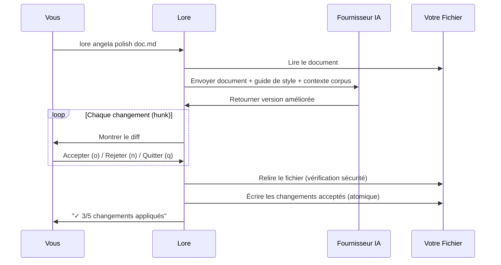

# lore angela polish

Réécriture de document assistée par IA avec revue de diff interactive.

## Synopsis

```
lore angela polish <fichier> [flags]
```

## Qu'est-ce que ça fait ?

`lore angela polish` envoie votre document à une IA (Claude, GPT, ou un modèle local) et reçoit une version améliorée. Vous passez en revue chaque changement individuellement — acceptez ce qui vous plaît, rejetez ce qui ne va pas.

> **Analogie :** C'est comme envoyer votre essai à un éditeur professionnel. Il renvoie des modifications suivies. Vous cliquez "Accepter" ou "Rejeter" sur chacune. Votre original n'est jamais perdu.

**Nécessite** un fournisseur IA configuré (clé API nécessaire).

## Scénario concret

> Votre document "decision-database" est un brouillon rapide d'il y a 2 semaines. Avant de le partager avec l'équipe :
>
> ```bash
> lore angela polish decision-database-2026-02-10.md
> ```
>
> L'IA suggère 5 améliorations. Vous en acceptez 3, rejetez 2. Le doc passe de "qualité brouillon" à "qualité publication" en 60 secondes.

## Arguments

| Argument | Requis | Description |
|----------|--------|-------------|
| `fichier` | Oui | Le document à polir |

## Flags

| Flag | Type | Défaut | Description |
|------|------|--------|-------------|
| `--dry-run` | bool | `false` | Prévisualiser les changements sans les appliquer |
| `--yes` | bool | `false` | Accepter tous les changements automatiquement |

## Comment ça marche (étape par étape)

### 1. Vous lancez la commande

```bash
lore angela polish decision-database-2026-02-10.md
```

### 2. Lore envoie votre document à l'IA

L'IA reçoit : votre document + votre guide de style (si configuré) + le contexte des documents liés.

### 3. Vous passez en revue chaque changement

```diff
--- original
+++ poli
@@ -5,3 +5,5 @@
 ## Why
-On a pris PostgreSQL parce qu'il a des transactions
+PostgreSQL a été choisi pour ses garanties de transactions ACID.
+Le flux de paiement nécessite des opérations atomiques sur plusieurs tables,
+et le driver pgx offre une excellente intégration Go.

Accepter ce changement ? [o/n/q]
```

| Touche | Action |
|--------|--------|
| `o` | Accepter ce changement |
| `n` | Rejeter (garder l'original) |
| `q` | Quitter — garder les changements acceptés jusqu'ici |

### 4. Lore applique vos changements acceptés

```
✓ 3/5 changements appliqués
```

## Protections de sécurité

| Protection | Comment ça marche |
|------------|-------------------|
| **Revue interactive** | Vous voyez chaque changement avant application |
| **Écriture atomique** | `.tmp` + `os.Rename()` — si ça échoue, l'original est intact |
| **Garde TOCTOU** | Lore relit le fichier avant d'écrire. Si quelqu'un l'a modifié pendant que l'IA travaillait, Lore annule |
| **Tout rejeté = pas de changement** | Si vous rejetez chaque hunk, le fichier est intact |

> **C'est quoi TOCTOU ?** "Time Of Check, Time Of Use" — une vérification de sécurité qui empêche d'écraser des changements faits entre le moment où Lore a lu le fichier et celui où il essaie d'écrire.

## Flux



## Prérequis

Un fournisseur IA doit être configuré. Trois options :

### Option 1 : Anthropic (Claude)
```bash
lore config set-key anthropic
```
```yaml
# .lorerc
ai:
  provider: "anthropic"
  model: "claude-sonnet-4-20250514"
```

### Option 2 : OpenAI (GPT)
```bash
lore config set-key openai
```
```yaml
ai:
  provider: "openai"
  model: "gpt-4o"
```

### Option 3 : Ollama (Local, Gratuit)
```yaml
# .lorerc (pas de clé API nécessaire !)
ai:
  provider: "ollama"
  model: "llama3"
  endpoint: "http://localhost:11434"
```

## Exemples

```bash
# Polish interactif (le plus courant)
lore angela polish decision-database-2026-02-10.md

# Prévisualiser (pas de modifications)
lore angela polish decision-database-2026-02-10.md --dry-run

# Accepter tout (faire confiance à l'IA)
lore angela polish decision-database-2026-02-10.md --yes
```

## Questions fréquentes

### "Combien ça coûte ?"

Un appel API par document. Coût typique :
- **Claude Sonnet :** ~$0.01–0.03 par document
- **GPT-4o :** ~$0.01–0.05 par document
- **Ollama :** Gratuit (tourne localement)

### "Le résultat de l'IA est de mauvaise qualité / contenu inventé"

La qualité de `polish` dépend de **deux choses** :

1. **Le modèle IA utilisé.** Les petits modèles locaux (llama3.2, phi3) peuvent halluciner du contenu, inventer des sections sans rapport avec votre document, ou ignorer les instructions. Les modèles plus grands (Claude Sonnet, GPT-4o, llama3.1:70b) suivent beaucoup mieux le prompt de polish.
2. **Ce que vous avez écrit au départ.** Un document d'une ligne "just testing" ne donne rien à l'IA — elle remplira le vide avec du contenu inventé. Plus vous fournissez de contexte (un vrai "Why", des détails concrets, des compromis réels), meilleur sera le résultat.

> **Règle d'or :** poubelle en entrée, poubelle en sortie. Écrivez un premier brouillon solide (même brut), puis polissez. N'attendez pas que l'IA crée du contenu à partir de rien.

### "Et si l'IA fait de mauvaises suggestions ?"

C'est pour ça qu'il y a la revue interactive. Rejetez ce qui ne va pas. L'IA est un assistant, pas le patron.

### "Faut-il lancer `draft` d'abord ?"

**Oui.** `lore angela draft` est gratuit et attrape les problèmes structurels. Corrigez ceux-là d'abord, puis `polish` pour le style. Vous économiserez des crédits et obtiendrez de meilleurs résultats.

### "Peut-on polish le même document plusieurs fois ?"

Oui. Vous pouvez re-polish autant de fois que vous voulez. Chaque appel envoie la version **actuelle** (avec les améliorations précédentes) à l'IA. Workflow typique :

1. `lore angela polish doc.md --yes` — premier passage, auto-accept
2. Éditez le doc manuellement (ajoutez alternatives, impact, nouveau contexte)
3. `lore angela polish doc.md --yes` — second passage, améliore aussi vos ajouts


<!-- Generate: vhs assets/vhs/angela-repolish.tape -->

Chaque re-polish est un appel API. L'IA voit la version améliorée, pas l'originale.

## Tips & Tricks

- **`draft` puis `polish` :** Toujours l'analyse gratuite d'abord.
- **`--dry-run` la première fois :** Prévisualisez avant de vous engager.
- **Ollama pour expérimenter :** Modèle local pour tester sans dépenser.
- **Un appel API par doc :** Budgétez en conséquence.
- **Re-polish est sûr :** Chaque appel relit le fichier actuel. Aucun risque d'écraser vos éditions.
- **Après polish :** Le front matter reçoit `angela_mode: "polish"` automatiquement.

## Codes de sortie

| Code | Signification |
|------|---------------|
| `0` | Succès (ou pas de changement / tout rejeté) |
| `1` | Erreur (pas de fournisseur, fichier non trouvé, conflit TOCTOU) |

## Voir aussi

- [lore angela draft](angela-draft.md) — Analyse gratuite (lancez d'abord)
- [lore angela review](angela-review.md) — Vérification cohérence corpus
- [lore config](config.md) — Configurer le fournisseur IA
