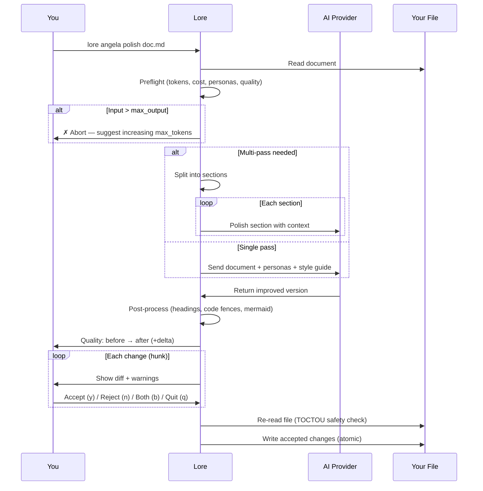

# lore angela polish

AI-assisted document rewrite with interactive diff review — plus an **offline synthesizer family** that auto-generates API examples, SQL queries, and other structured content from information already present in your doc. Works on Lore-native projects **and** external Markdown directories (MkDocs, Docusaurus, Hugo, hand-rolled docs).

## Synopsis

```text
lore angela polish <filename> [flags]
```

## What Does This Do?

`lore angela polish` sends your document to an AI (Claude, GPT, or a local model) and returns an improved version. Review each change individually — accept what you like, reject what you don't.

> **Analogy:** It's like sending your essay to a professional editor. They send back tracked changes. You click "Accept" or "Reject" on each one. Your original is never lost.

**Requires:** An AI provider configured (API key needed).

## Real World Scenario

> Your "decision-database" doc is a quick brain dump from two weeks ago. Before sharing it with the team, you want it polished:
>
> ```bash
> lore angela polish decision-database-2026-02-10.md
> ```
>
> The AI suggests 5 improvements. You accept 3, reject 2. The doc goes from "draft quality" to "publication quality" in 60 seconds.

## Arguments

| Argument | Required | Description |
|----------|----------|-------------|
| `filename` | Yes | The document to polish |

## Flags

| Flag | Type | Default | Description |
|------|------|---------|-------------|
| `--dry-run` | bool | `false` | Preview changes without applying them (polished content to stdout, diff to stderr) |
| `--yes` | bool | `false` | Accept all changes automatically |
| `--for` | string | | Rewrite for a target audience (e.g., `"CTO"`, `"équipe commerciale"`) |
| `--auto` / `-a` | bool | `false` | Auto-accept additions, auto-reject deletions, ask only for modifications |
| `--interactive` / `-i` | bool | `false` | Review polish changes section-by-section in a TUI |
| `--incremental` | bool | `false` | Re-polish only changed sections (skips unchanged sections) |
| `--full` | bool | `false` | Force full polish even if `incremental` is enabled in config |
| `--synthesize` | bool | `false` | Apply Example Synthesizer proposals (offline, no AI) and write to doc |
| `--synthesizer-dry-run` | bool | `false` | Preview synthesizer proposals without writing |
| `--synthesizers` | strings | | Override enabled synthesizers for this run (e.g. `api-postman`) |
| `--no-synthesizers` | bool | `false` | Disable all Example Synthesizers for this run |
| `--set-status` | string | | Update frontmatter `status` after apply (e.g. `reviewed`, `published`) |
| `--persona` | string | | Force a single persona lens for this run |
| `--arbitrate-rule` | string | | Non-interactive resolution rule for duplicate sections produced by the AI: `first`, `second`, `both`, `abort`. Required in non-TTY when duplicates are detected. Mutually exclusive with `--interactive`. |
| `--verbose` / `-v` | bool | `false` | Surface structural-integrity events (stripped leaked frontmatter, arbitration details) on stderr. Always recorded in `polish.log` regardless. |

## How It Works (Step by Step)

### Step 1/3: Preparing

```bash
lore angela polish decision-database-2026-02-10.md
```

```text
[1/3] Preparing decision-database-2026-02-10.md…
      ~3012 tokens → | max ←: 8192 tokens | timeout: 60s
      Personas: 📖 Affoue (12), ✏️ Salou (10), 🏗️ Doumbia (6)
      Quality: 52/100 (C)
      Estimated cost: ~$0.0042
```

Angela runs **preflight checks** before spending any API credits:

- **Token estimate** — tokens to send vs. max allowed
- **Personas** — which virtual reviewers activate (based on doc type and content)
- **Quality score** — current document quality (0–100, grades A–F)
- **Cost estimate** — estimated API cost in USD
- **Abort** — if input exceeds `max_output`, Angela stops and suggests increasing `angela.max_tokens` in `.lorerc`

For large documents, Angela automatically uses **multi-pass mode** (section-by-section polish with context summaries).

### Step 2/3: Calling AI

Angela sends your document to the AI with:

- Your document content
- Your style guide (if configured in `.lorerc`)
- Activated persona directives
- Language rules (all new content in the document's language)
- Preservation rules (don't remove existing sections, code, tables)

A spinner with a timeout countdown shows progress. After the response:

```text
      ✓ AI response received in 8.2s
      Tokens: 3012 → 4521 ← | Model: claude-sonnet-4-20250514
      Speed: 551 tok/s (fast)
      Cost: ~$0.0038
```

### Step 3/3: Review changes

```text
[3/3] Computing diff…
      5 changes | Quality: 52/100 (C) → 78/100 (B) (+26)
```

You review each change with its location in the document:

```text
--- Change 1/5 ---
  @@ line 12 (4 lines) @@
 ## Why
- We picked PostgreSQL because it has transactions
+ PostgreSQL was chosen for its ACID transaction guarantees.
+ The payment flow requires atomic operations across multiple tables,
+ and PostgreSQL's pgx driver provides excellent Go integration.

Apply? [y]es / [n]o / [b]oth / [q]uit:
```

| Key | Action |
|-----|--------|
| `y` | Accept this change (replace original with AI version) |
| `n` | Reject this change (keep original) |
| `b` | Keep both — original lines stay, new lines are appended below |
| `q` | Quit — keep changes accepted so far, discard the rest |

> **The `[b]oth` option** only appears when the hunk has both deletions and additions. For pure additions, only `y/n/q` is shown.

### Hunk Warnings

Angela warns you before you decide on potentially destructive changes:

```text
⚠ Angela removes 24 lines (net -18). Consider [b]oth.
⚠ This change removes section: ## 4. Logique Métier
⚠ This change removes 2 code block(s).
```

Warnings trigger when:
- **Net loss > 15 lines** — significant content removal
- **Section headings** (## or ###) are being deleted
- **Code blocks** are being removed
- **Table rows** (> 3) are being deleted

## Example Synthesizer Family (`--synthesize`)

The synthesizer family is an **offline** pipeline that auto-generates structured content blocks from information already present in your doc — no AI call, no API key, no cost. The first synthesizer, `api-postman`, generates HTTP+JSON Postman request examples from your endpoint tables and filter lists.

### How it works

1. The synthesizer reads your doc's `### Endpoints` table, `### Filtres` list (or `### Référence des champs` table), and `## Sécurité` section.
2. It builds a JSON body with required fields as Postman variables (`{{month}}`), optional fields as `null`, and server-injected fields **excluded** (zero hallucination — every output field traces to a literal character span in your doc).
3. It writes the block into your doc under a new sub-heading after `### Endpoints`.

### Preview what would be generated

```bash
lore angela polish doc.md --synthesizer-dry-run
```

### Apply the blocks

```bash
lore angela polish doc.md --synthesize
```

### Apply + promote status

```bash
lore angela polish doc.md --synthesize --set-status reviewed
```

### Works on external docs too

The synthesizer works on **any** Markdown file — even outside a Lore-native project:

```bash
# External project with their own docs structure
lore angela polish my-api-spec.md --synthesize
```

The synthesizer uses the permissive frontmatter parser, so docs from MkDocs, Docusaurus, or Hugo sites with partial or no YAML front matter are accepted. No `lore init` needed.

### Security guarantees (Invariants I4–I7)

| Invariant | What it guarantees |
|-----------|-------------------|
| **I4** zero-hallucination | Every field in the generated JSON body has a literal evidence span pointing at the source line where the field name appears |
| **I5** security-first | Fields declared as server-injected in the doc's Security section are excluded by construction |
| **I5-bis** fail-safe | When no Security section exists, the well-known list (`tenantId`, `authenticatedUsername`, `principalId` + project-specific names from `.lorerc`) filters likely server-injected fields AND emits a `missing-security-section` warning |
| **I6** idempotency | Re-running `--synthesize` on an unchanged doc produces zero diff (signature-based caching in frontmatter) |
| **I7** no silent merge | Changes to previously-accepted synthesized content always flow through diff review — the synthesizer never overwrites user edits |

### Configuration (`.lorerc`)

```yaml
angela:
  synthesizers:
    enabled:
      - api-postman           # activated by default since 8-18
    well_known_server_fields:
      - tenantId
      - authenticatedUsername
      - principalId
    per_synthesizer:
      review:
        severity: info        # severity for review findings (info/warning/error)
```

## Status Lifecycle (`--set-status`)

Update the frontmatter `status` field in a single command:

```bash
# Standalone status update (no AI, no synthesize)
lore angela polish doc.md --set-status published

# Combined with synthesize
lore angela polish doc.md --synthesize --set-status reviewed
```

Re-running with a different value is always safe — the field is overwritten, never rejected. Common lifecycle: `draft → reviewed → published`.

## Audience Rewrite (`--for`)

Rewrite your document for a specific audience:

```bash
lore angela polish doc.md --for "équipe commerciale"
```

Angela prompts you to create a **new file** (original unchanged) or **overwrite** the original:

```text
      Target audience: équipe commerciale
      [n]ew file (keep original) / [o]verwrite original?
```

- **New file** → writes to `doc.équipe-commerciale.md`, original untouched
- **Overwrite** → proceeds to interactive diff on the original

When `--for` is active:
- Personas matching the audience get a +20 boost (e.g., `"commercial"` boosts Business Analyst and Storyteller)
- The AI prompt includes specific rewrite instructions: simplify jargon, adjust depth, reframe for the audience
- Review findings include a `relevance` field (high / medium / low)

## Auto Mode (`--auto`)

```bash
lore angela polish doc.md --auto
```

Auto mode classifies each hunk and decides automatically where possible:

| Hunk Type | Decision | Rationale |
|-----------|----------|-----------|
| **Pure addition** | Auto-accept | New content, nothing lost |
| **Cosmetic** (whitespace only) | Auto-accept | No semantic change |
| **Pure deletion** | Auto-reject | Prevents content loss |
| **Major deletion** (net > 15 lines) | Auto-reject | Prevents significant loss |
| **Modification** | Ask interactively | Needs human judgment |

```text
  [auto] ✓ +mermaid diagram (addition)
  [auto] ✓ whitespace fix (cosmetic)
  [auto] ✗ -12 lines including ## Impact (deletion → rejected)

--- Change 3/5 (needs review) ---
  @@ line 42 (8 lines) @@
  ...

  Auto: 2 accepted, 1 rejected, 2 reviewed
```

## Interactive TUI (`--interactive`)

```bash
lore angela polish decision-database.md --interactive
```

The TUI displays each section of your document side-by-side (original vs. AI version) and lets you decide per-section:

```text
Angela Polish — decision-database-2026-02-10.md
Section 2/5: ## Why
────────────────────────────────────────────────────────
Original:
  We picked PostgreSQL because it has transactions.

AI version:
  PostgreSQL was chosen for its ACID transaction guarantees.
  The payment flow requires atomic operations across multiple
  tables, and PostgreSQL's pgx driver provides excellent Go
  integration.

[a] accept  [r] reject  [b] both  [e] edit  [s] skip  [q] quit
```

| Key | Action |
|-----|--------|
| `a` | Accept the AI version for this section |
| `r` | Reject — keep the original |
| `b` | Keep both — original lines stay, AI version appended below |
| `e` | Open `$EDITOR` to manually merge the two versions |
| `s` | Skip (decide later) |
| `q` | Quit — keep decisions made so far |

Sections that were removed by the AI are shown with a warning and default to `reject` unless you explicitly accept.

## Incremental Polish (`--incremental`)

```bash
lore angela polish decision-database.md --incremental
```

Incremental mode compares the current document against the last-polished version stored in `.lore/angela/polish-state/`. Only **changed sections** are sent to the AI — unchanged sections are kept as-is.

This dramatically reduces API costs when you've only edited one or two sections of a large document:

```text
[1/3] Preparing decision-database-2026-02-10.md…
      Incremental mode: 2/5 sections changed
      ~480 tokens → (was 3012 without incremental)
      Cost: ~$0.0008 (was ~$0.0042)
```

Enable permanently in `.lorerc`:

```yaml
angela:
  incremental: true  # default for all polish runs
```

Use `--full` to override and re-polish the entire document regardless:

```bash
lore angela polish decision-database.md --full
```

## Quality Score

Angela scores your document before and after polish on a 0-100 scale:

| Grade | Score | Meaning |
|-------|-------|---------|
| **A** | 85+ | Publication quality |
| **B** | 70–84 | Good, minor improvements possible |
| **C** | 50–69 | Needs work |
| **D** | 30–49 | Major gaps |
| **F** | < 30 | Minimal content |

The score is based on 11 criteria: Why section (15pts), diagrams (15pts), tables (10pts), code blocks (10pts), code tags (5pts), structure (10pts), front matter (10pts), references (5pts), density (10pts), cleanliness (5pts), style (5pts).

## Safety Features

| Protection | How it works |
|------------|-------------|
| **Interactive review** | You see every change before it's applied |
| **Atomic write** | Changes are written to a `.tmp` file first, then renamed. If anything fails, your original is intact |
| **TOCTOU guard** | Lore re-reads the file before writing. If someone (or you) edited it while the AI was working, Lore aborts instead of overwriting |
| **All rejected = no changes** | If you reject every hunk, the file is untouched |

> **What's TOCTOU?** "Time Of Check, Time Of Use" — a safety check that prevents overwriting changes that happened between when Lore read the file and when it tries to write. It's like checking that the document hasn't been modified by someone else while you were reviewing the AI suggestions.

## Process Flow



## Prerequisites

You need an AI provider configured. Three options:

### Option 1: Anthropic (Claude)
```bash
lore config set-key anthropic
# → Enter API key: sk-ant-...
```
```yaml
# .lorerc
ai:
  provider: "anthropic"
  model: "claude-sonnet-4-20250514"
```

### Option 2: OpenAI (GPT)
```bash
lore config set-key openai
# → Enter API key: sk-...
```
```yaml
# .lorerc
ai:
  provider: "openai"
  model: "gpt-4o"
```

### Option 3: Ollama (Local, Free)
```yaml
# .lorerc (no API key needed!)
ai:
  provider: "ollama"
  model: "llama3.1"
  endpoint: "http://localhost:11434"
```

### Option 4: Any OpenAI-compatible API

Groq, Together, Mistral, Azure OpenAI, vLLM, LM Studio — anything with an OpenAI-compatible endpoint works with `provider: "openai"`:

```yaml
# .lorerc
ai:
  provider: "openai"
  model: "mixtral-8x7b-32768"
  endpoint: "https://api.groq.com"
```
```bash
lore config set-key openai
# → Enter API key: gsk_...  (your Groq/Together/Mistral key)
```

## Examples

```bash
# Interactive polish (most common)
lore angela polish decision-database-2026-02-10.md

# Preview what the AI would change (no modifications)
lore angela polish decision-database-2026-02-10.md --dry-run

# Accept everything (trust the AI)
lore angela polish decision-database-2026-02-10.md --yes

# Auto mode: accept additions, reject deletions, ask only for modifications
lore angela polish decision-database-2026-02-10.md --auto

# Rewrite for a target audience (creates a new file)
lore angela polish doc.md --for "CTO"
lore angela polish doc.md --for "équipe commerciale"
lore angela polish doc.md --for "nouveau développeur"

# Combine auto + audience
lore angela polish doc.md --for "CTO" --auto
```

## Common Questions

### "How much does this cost?"

Angela shows the **estimated cost before calling** the API, and the **actual cost after**. One API call per document (or one per section in multi-pass mode). Typical cost:

- **Claude Sonnet:** ~$0.01–0.03 per document
- **Claude Haiku:** ~$0.001–0.005 per document
- **GPT-4o:** ~$0.01–0.05 per document
- **Ollama:** Free (runs locally)

You can control the max tokens (and therefore cost) with `angela.max_tokens` in `.lorerc`.

### "The AI output is low quality / hallucinated content" { #ai-quality-warning }

Polish quality depends on **two things**:

1. **The AI model.** Small local models (llama3.2, phi3) may hallucinate content, invent irrelevant sections, or ignore instructions. Larger models (Claude Sonnet, GPT-4o, llama3.1:70b) follow the polish prompt reliably.
2. **What you wrote first.** A one-line placeholder gives the AI nothing to work with — it will invent content to fill the void. The more context you provide (a real "Why," concrete details, actual trade-offs), the better the result.

> **Rule of thumb:** garbage in, garbage out. Write a solid first draft, however rough, then polish. Don't expect the AI to create content from nothing.

### "What if the AI makes bad suggestions?"

That's what the interactive review is for. Reject what you don't like. The AI is a helper, not the boss.

### "Should I run `draft` first?"

**Yes.** `lore angela draft` is free and catches structural issues. Fix those first, then `polish` for style improvements. You'll save API credits and get better results.

### "Can I polish the same document multiple times?"

Yes. Re-polish as many times as you need. Each call sends the **current** version (including any prior improvements) to the AI. Common workflow:

1. `lore angela polish doc.md --yes` — first pass, auto-accept
2. Edit the doc manually (add alternatives, impact, new context)
3. `lore angela polish doc.md --yes` — second pass, improves your additions too


<!-- Generate: vhs assets/vhs/angela-repolish.tape -->

Each re-polish is one API call. The AI sees the improved version, not the original.

## Personas

Angela uses 7 virtual reviewers. The top 3 are activated based on document type, content signals, and audience:

| Persona | Icon | Focus | Activated by |
|---------|------|-------|--------------|
| **Affoue** (Storyteller) | 📖 | Narrative clarity, "Why" sections | Decisions, notes; `--for commercial/sales` |
| **Salou** (Tech Writer) | ✏️ | Technical precision, structure | Features, refactors; `--for développeur` |
| **Kouame** (QA Reviewer) | 🔍 | Validation criteria, edge cases | Bugfixes; `--for qa/audit` |
| **Doumbia** (Architect) | 🏗️ | Trade-offs, system design | Decisions, refactors; `--for CTO` |
| **Gougou** (UX Designer) | 🎨 | User empathy, accessibility | Features; `--for design/ux` |
| **Beda** (Business Analyst) | 📊 | Business value, requirements | Features, releases; `--for commercial/CEO` |
| **Ouattara** (API Designer) | 🔌 | API examples, error responses, DTO completeness | Feature/API docs with endpoints; `--for api/postman/integration` |

With `--for`, matching personas get a +20 boost. For example, `--for "CTO"` boosts Architect and Business Analyst.

To force a single persona for this run:

```bash
lore angela polish doc.md --persona api-designer
```

## Hallucination Check

After every polish (including incremental), Angela runs a local, zero-API verification to detect factual claims the AI may have invented.

### How it works

1. **Sentence diff** — Splits both original and polished text into sentences. Finds sentences in the polished version that don't appear in the original (new text added by AI).
2. **Claim extraction** — Scans each new sentence for:
   - **Metrics** — "200ms", "45%", "3 GB", "15 req/s"
   - **Versions** — "v2.0", "15.3", "1.2.3"
   - **Action numbers** — "reduced by 200", "cut 50" (large numbers preceded by action verbs)
   - **Tech proper nouns** — PostgreSQL, Redis, Kubernetes, React, and 50+ others
3. **Support check** — For each extracted claim, verifies that its core token appears somewhere in the original document or corpus summary. Claims that cannot be sourced are flagged as unsupported.

### Output

```text
⚠ Hallucination check: 2 unsupported claims in polished version
  metric     "200ms response time" — not found in original
  proper-noun "PostgreSQL" — not found in original

These claims may have been invented by the AI. Review before accepting.
```

If unsupported claims are detected:
- With `--yes`: a warning is printed and the file is still written (you accepted all changes)
- Without `--yes`: the review loop highlights the suspicious hunks so you can reject them

The check is **deterministic** (no API call) and runs in under 10ms even on large documents.

## Post-Processing

After the AI responds, Angela applies local transforms (no API call):

1. **Heading numbers** — restores `## 4. Title` numbers if the AI stripped them
2. **Code fence languages** — detects language from content and adds tags to bare `` ``` `` fences (supports 25+ languages)
3. **Mermaid indent** — normalizes indentation in mermaid diagram blocks

## Tips & Tricks

- **`draft` then `polish`:** Always run the free analysis first, fix easy issues, then polish.
- **`--dry-run` first time:** Preview the AI's suggestions before committing to the review.
- **`--auto` for large diffs:** Let Angela handle the obvious ones, review only modifications.
- **`--for` for team sharing:** Generate audience-specific versions without modifying the original.
- **Ollama for experimentation:** Use a local model to test without spending credits.
- **Re-polish is safe:** Each call reads the current file. No risk of overwriting your edits.
- **After polishing:** Your frontmatter bytes are preserved byte-for-byte (invariant I24). Polish never re-serializes the YAML — quote styles, comments, and key order survive. See *Structural Integrity Guards* below.
- **Multi-pass is automatic:** For large documents, Angela splits into sections to stay within token limits.

## Structural Integrity Guards

Polish enforces seven invariants (I24–I30) that protect your document from accidental corruption — whether the AI misbehaves, a provider returns a malformed response, or a CI script runs the command in an unexpected context. Each guard is silent on the happy path; when it fires, polish either refuses cleanly or lets you arbitrate.

### Frontmatter preserved byte-for-byte (I24)

Polish reads the `---...---` block from your source and re-attaches the **same bytes** to the rewritten body. No YAML re-serialization: quote styles (`date: "2026-04-10"` vs `date: 2026-04-10`), key order, inline comments, and blank lines are preserved.

> **Why this matters:** a round-trip through `yaml.Marshal` silently reformats your metadata. Over dozens of polish calls that drift accumulates and blows up diffs. Byte-identity stops the drift at run 1.

### AI prompt excludes frontmatter (I25)

Angela strips `---...---` before sending the body to the provider. The AI never sees your metadata, never has the opportunity to leak it, rewrite it, or invent new keys. Hard rules in the system prompt reinforce: **"Return ONLY the improved BODY."**

### Leaked `---` stripped from AI output (I26)

If the provider ignores the rules and returns a full doc with a `---`-delimited header, polish strips it via a two-pass sanitize (parseable YAML first, then malformed-but-delimited fallback). Silent by default; `--verbose` surfaces a stderr note:

```text
      • stripped leaked frontmatter from AI output (142 bytes, line 1)
```

### Duplicate sections trigger arbitration (I27)

If the AI emits the same `## Heading` twice, polish **never deduplicates silently**. Two paths:

**TTY (interactive):**

```text
[group 1/1] — "## Why" has 2 occurrences

  [1] line 3  (42 words)
      First version: the rationale behind the choice...

  [2] line 12 (38 words)
      Second version: with a different angle...

  [1] keep first   [2] keep second   [b] keep both   [a] abort   [f] full view
  Choice:
```

**Non-TTY (CI):** pass `--arbitrate-rule=first|second|both|abort`. Without the flag, polish refuses cleanly:

```text
⚠  AI output contains 1 duplicate section group(s); interactive arbitration unavailable (non-TTY).
        "## Why" × 2
      Re-run in a TTY, or use --arbitrate-rule=<first|second|both|abort>.
```

### Corrupt source refused pre-AI (I28)

If your source file has a malformed frontmatter block, polish refuses **before** contacting the provider — zero tokens consumed, zero charges on your API bill:

```text
✗  cannot polish: source frontmatter is not valid YAML.
      Run `lore doctor` to inspect, or `lore angela polish --restore decision-auth.md` to roll back.
```

Run `lore doctor` to see the exact parse error, then either edit by hand or restore from a polish backup.

### Abort is atomic (I29)

When you choose `[a] abort` at the prompt or `--arbitrate-rule=abort` matches, the command exits cleanly:

- Source bytes untouched (mtime + content identical)
- **No backup is written** — the `polish-backups/` directory is unchanged
- A single entry in `polish.log` records `result: "aborted_arbitrate"` for audit

### Every run logs exactly one line (I30)

Every terminal state of `polish` writes exactly one JSONL line to `<state_dir>/polish.log` (except `--dry-run`, which is side-effect-free by contract). Example:

```json
{"ts":"2026-04-19T14:32:01Z","file":"decision-auth.md","op":"polish","mode":"full","result":"written","exit":0,"ai":{"provider":"anthropic","model":"claude-sonnet-4-6","prompt_tokens":1240,"completion_tokens":820},"findings":{"leaked_fm":{"stripped":true,"bytes":142},"duplicates":[{"heading":"## Why","count":2,"resolution":"rule:first"}]}}
```

Fields recorded: mode (full/incremental/interactive/dry-run), result (`written`, `aborted_corrupt_src`, `aborted_arbitrate`, `ai_error`), exit code, AI usage (provider/model/tokens), structural findings (leaked frontmatter bytes + duplicate resolutions).

Retention is governed by `angela.polish.log.retention_days` (default 30) and `angela.polish.log.max_size_mb` (default 10). See [`lore doctor --prune`](doctor.md#prune-generated-artifacts) to trigger cleanup manually.

## Exit Codes

| Code | Meaning |
|------|---------|
| `0` | Success (or no changes / all rejected) |
| `1` | Error (no provider configured, file not found, TOCTOU conflict, corrupt source, aborted arbitration) |

## See Also

- [lore angela draft](angela-draft.md) — Free analysis (run this first)
- [lore angela consult](angela-consult.md) — Ad-hoc single-persona consultation
- [lore angela review](angela-review.md) — Corpus-wide coherence check
- [Angela in CI](../guides/angela-ci.md) — Use Angela as a CI quality gate (draft + synthesize + review pipeline)
- [lore config](config.md) — Set up AI provider
