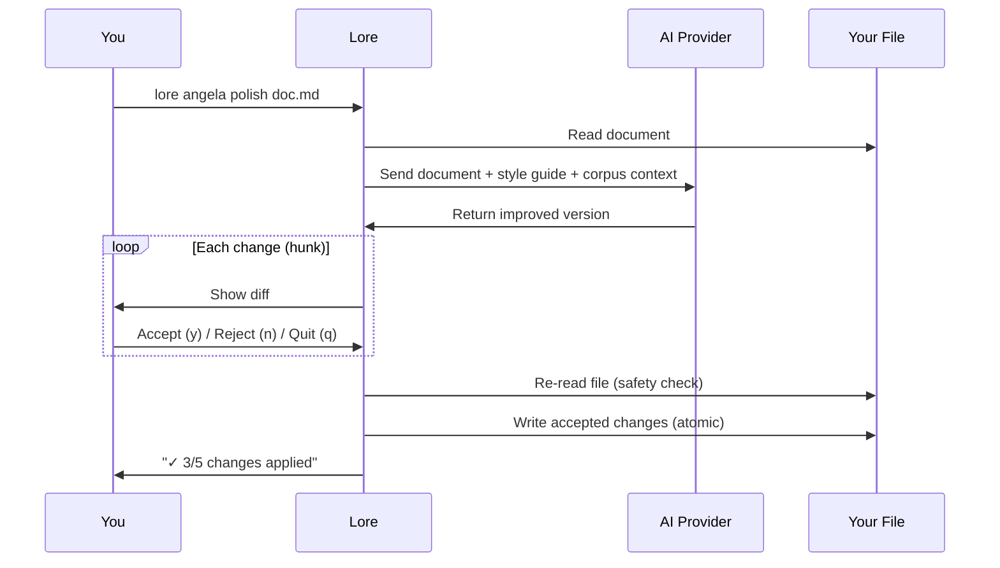

# lore angela polish

AI-assisted document rewrite with interactive diff review.

## Synopsis

```
lore angela polish <filename> [flags]
```

## What Does This Do?

`lore angela polish` sends your document to an AI (Claude, GPT, or a local model) and gets back an improved version. You review each change individually — accept what you like, reject what you don't.

> **Analogy:** It's like sending your essay to a professional editor. They send back tracked changes. You click "Accept" or "Reject" on each one. Your original is never lost.

**Requires:** An AI provider configured (API key needed).

## Real World Scenario

> Your "decision-database" doc is a quick brain dump from 2 weeks ago. Before sharing it with the team, you want it polished:
>
> ```bash
> lore angela polish decision-database-2026-02-10.md
> ```
>
> The AI suggests 5 improvements. You accept 3, reject 2. The doc goes from "draft quality" to "publication quality" in 60 seconds.

## Arguments

| Argument | Required | Description |
|----------|----------|-------------|
| `filename` | Yes | The document to polish |

## Flags

| Flag | Type | Default | Description |
|------|------|---------|-------------|
| `--dry-run` | bool | `false` | Preview changes without applying them |
| `--yes` | bool | `false` | Accept all changes automatically |

## How It Works (Step by Step)

### 1. You run the command

```bash
lore angela polish decision-database-2026-02-10.md
```

### 2. Lore sends your document to the AI

The AI receives:
- Your document content
- Your style guide (if configured)
- Context from related documents in the corpus

### 3. You review each change

```diff
--- original
+++ polished
@@ -5,3 +5,5 @@
 ## Why
-We picked PostgreSQL because it has transactions
+PostgreSQL was chosen for its ACID transaction guarantees.
+The payment flow requires atomic operations across multiple tables,
+and PostgreSQL's pgx driver provides excellent Go integration.

Accept this change? [y/n/q]
```

| Key | Action |
|-----|--------|
| `y` | Accept this change |
| `n` | Reject this change (keep original) |
| `q` | Quit — keep changes accepted so far, discard the rest |

### 4. Lore applies your accepted changes

```
✓ 3/5 changes applied to decision-database-2026-02-10.md
```

## Safety Features

| Protection | How it works |
|------------|-------------|
| **Interactive review** | You see every change before it's applied |
| **Atomic write** | Changes are written to a `.tmp` file first, then renamed. If anything fails, your original is intact |
| **TOCTOU guard** | Lore re-reads the file before writing. If someone (or you) edited it while the AI was working, Lore aborts instead of overwriting |
| **All rejected = no changes** | If you reject every hunk, the file is untouched |

> **What's TOCTOU?** "Time Of Check, Time Of Use" — a safety check that prevents overwriting changes that happened between when Lore read the file and when it tries to write. It's like checking that the document hasn't been modified by someone else while you were reviewing the AI suggestions.

## Process Flow



## Prerequisites

You need an AI provider configured. Three options:

### Option 1: Anthropic (Claude)
```bash
lore config set-key anthropic
# → Enter API key: sk-ant-...
```
```yaml
# .lorerc
ai:
  provider: "anthropic"
  model: "claude-sonnet-4-20250514"
```

### Option 2: OpenAI (GPT)
```bash
lore config set-key openai
# → Enter API key: sk-...
```
```yaml
# .lorerc
ai:
  provider: "openai"
  model: "gpt-4o"
```

### Option 3: Ollama (Local, Free)
```yaml
# .lorerc (no API key needed!)
ai:
  provider: "ollama"
  model: "llama3"
  endpoint: "http://localhost:11434"
```

## Examples

```bash
# Interactive polish (most common)
lore angela polish decision-database-2026-02-10.md
# → Shows diff hunks, you accept/reject each

# Preview what the AI would change (no modifications)
lore angela polish decision-database-2026-02-10.md --dry-run

# Accept everything (trust the AI)
lore angela polish decision-database-2026-02-10.md --yes

# Polish the most recent document
lore angela polish $(lore list --quiet | head -1 | cut -f2)
```

## Common Questions

### "How much does this cost?"

One API call per document. Typical cost:
- **Claude Sonnet:** ~$0.01–0.03 per document
- **GPT-4o:** ~$0.01–0.05 per document
- **Ollama:** Free (runs locally)

### "What if the AI makes bad suggestions?"

That's what the interactive review is for. Reject what you don't like. The AI is a helper, not the boss.

### "Should I run `draft` first?"

**Yes.** `lore angela draft` is free and catches structural issues. Fix those first, then `polish` for style improvements. You'll save API credits and get better results.

### "Can I polish the same document multiple times?"

Yes. You can re-polish as many times as you want. Each call sends the **current** version (including previous polish improvements) to the AI. Common workflow:

1. `lore angela polish doc.md --yes` — first pass, auto-accept
2. Edit the doc manually (add alternatives, impact, new context)
3. `lore angela polish doc.md --yes` — second pass, improves your additions too


<!-- Generate: vhs assets/vhs/angela-repolish.tape -->

Each re-polish is one API call. The AI sees the improved version, not the original.

## Tips & Tricks

- **`draft` then `polish`:** Always run the free analysis first, fix easy issues, then polish.
- **`--dry-run` first time:** Preview the AI's suggestions before committing to the review.
- **Ollama for experimentation:** Use a local model to test without spending credits.
- **One API call per doc:** Budget accordingly. A corpus of 50 docs = 50 calls.
- **Re-polish is safe:** Each call reads the current file. No risk of overwriting your edits.
- **After polishing:** The front matter gets `angela_mode: "polish"` added automatically.

## Exit Codes

| Code | Meaning |
|------|---------|
| `0` | Success (or no changes / all rejected) |
| `1` | Error (no provider configured, file not found, TOCTOU conflict) |

## See Also

- [lore angela draft](angela-draft.md) — Free analysis (run this first)
- [lore angela review](angela-review.md) — Corpus-wide coherence check
- [lore config](config.md) — Set up AI provider
