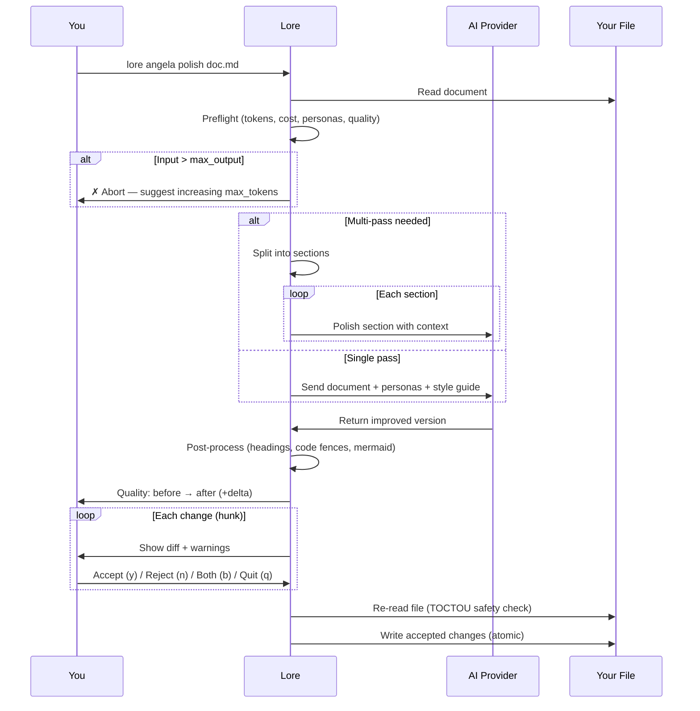

# lore angela polish

AI-assisted document rewrite with interactive diff review.

## Synopsis

```
lore angela polish <filename> [flags]
```

## What Does This Do?

`lore angela polish` sends your document to an AI (Claude, GPT, or a local model) and gets back an improved version. You review each change individually — accept what you like, reject what you don't.

> **Analogy:** It's like sending your essay to a professional editor. They send back tracked changes. You click "Accept" or "Reject" on each one. Your original is never lost.

**Requires:** An AI provider configured (API key needed).

## Real World Scenario

> Your "decision-database" doc is a quick brain dump from 2 weeks ago. Before sharing it with the team, you want it polished:
>
> ```bash
> lore angela polish decision-database-2026-02-10.md
> ```
>
> The AI suggests 5 improvements. You accept 3, reject 2. The doc goes from "draft quality" to "publication quality" in 60 seconds.

## Arguments

| Argument | Required | Description |
|----------|----------|-------------|
| `filename` | Yes | The document to polish |

## Flags

| Flag | Type | Default | Description |
|------|------|---------|-------------|
| `--dry-run` | bool | `false` | Preview changes without applying them |
| `--yes` | bool | `false` | Accept all changes automatically |
| `--for` | string | | Rewrite for a target audience (e.g., `"CTO"`, `"équipe commerciale"`) |
| `--auto` / `-a` | bool | `false` | Auto-accept additions, auto-reject deletions, ask only for modifications |

## How It Works (Step by Step)

### Step 1/3: Preparing

```bash
lore angela polish decision-database-2026-02-10.md
```

```
[1/3] Preparing decision-database-2026-02-10.md…
      ~3012 tokens → | max ←: 8192 tokens | timeout: 60s
      Personas: 📖 Affoue (12), ✏️ Sialou (10), 🏗️ Doumbia (6)
      Quality: 52/100 (C)
      Estimated cost: ~$0.0042
```

Angela runs **preflight checks** before spending any API credits:

- **Token estimate** — how many tokens will be sent vs. max allowed
- **Personas** — which virtual reviewers are activated (based on doc type + content)
- **Quality score** — current document quality (0-100, grades A–F)
- **Cost estimate** — estimated API cost in USD
- **Abort** — if the input is larger than `max_output`, Angela stops and suggests increasing `angela.max_tokens` in `.lorerc`

If the document is large, Angela detects this and uses **multi-pass mode** (section-by-section polish with context summaries).

### Step 2/3: Calling AI

Angela sends your document to the AI with:

- Your document content
- Your style guide (if configured in `.lorerc`)
- Activated persona directives
- Language rules (all new content in the document's language)
- Preservation rules (don't remove existing sections, code, tables)

A spinner with timeout countdown shows progress. After the response:

```
      ✓ AI response received in 8.2s
      Tokens: 3012 → 4521 ← | Model: claude-sonnet-4-20250514
      Speed: 551 tok/s (fast)
      Cost: ~$0.0038
```

### Step 3/3: Review changes

```
[3/3] Computing diff…
      5 changes | Quality: 52/100 (C) → 78/100 (B) (+26)
```

You review each change with its location in the document:

```
--- Change 1/5 ---
  @@ line 12 (4 lines) @@
 ## Why
- We picked PostgreSQL because it has transactions
+ PostgreSQL was chosen for its ACID transaction guarantees.
+ The payment flow requires atomic operations across multiple tables,
+ and PostgreSQL's pgx driver provides excellent Go integration.

Apply? [y]es / [n]o / [b]oth / [q]uit:
```

| Key | Action |
|-----|--------|
| `y` | Accept this change (replace original with AI version) |
| `n` | Reject this change (keep original) |
| `b` | Keep both — original lines stay, new lines are appended below |
| `q` | Quit — keep changes accepted so far, discard the rest |

> **The `[b]oth` option** only appears when the hunk has both deletions and additions. For pure additions, only `y/n/q` is shown.

### Hunk Warnings

Angela warns you before you decide on potentially destructive changes:

```
⚠ Angela removes 24 lines (net -18). Consider [b]oth.
⚠ This change removes section: ## 4. Logique Métier
⚠ This change removes 2 code block(s).
```

Warnings trigger when:
- **Net loss > 15 lines** — significant content removal
- **Section headings** (## or ###) are being deleted
- **Code blocks** are being removed
- **Table rows** (> 3) are being deleted

## Audience Rewrite (`--for`)

Rewrite your document for a specific audience:

```bash
lore angela polish doc.md --for "équipe commerciale"
```

Angela asks whether to create a **new file** (original unchanged) or **overwrite** the original:

```
      Target audience: équipe commerciale
      [n]ew file (keep original) / [o]verwrite original?
```

- **New file** → writes to `doc.équipe-commerciale.md`, original untouched
- **Overwrite** → proceeds to interactive diff on the original

When `--for` is active:
- Personas matching the audience get a +20 boost (e.g., `"commercial"` boosts Business Analyst and Storyteller)
- The AI prompt includes specific rewrite instructions: simplify jargon, adjust depth, reframe for the audience
- Review findings include a `relevance` field (high / medium / low)

## Auto Mode (`--auto`)

```bash
lore angela polish doc.md --auto
```

Auto mode classifies each hunk and decides automatically where possible:

| Hunk Type | Decision | Rationale |
|-----------|----------|-----------|
| **Pure addition** | Auto-accept | New content, nothing lost |
| **Cosmetic** (whitespace only) | Auto-accept | No semantic change |
| **Pure deletion** | Auto-reject | Prevents content loss |
| **Major deletion** (net > 15 lines) | Auto-reject | Prevents significant loss |
| **Modification** | Ask interactively | Needs human judgment |

```
  [auto] ✓ +mermaid diagram (addition)
  [auto] ✓ whitespace fix (cosmetic)
  [auto] ✗ -12 lines including ## Impact (deletion → rejected)

--- Change 3/5 (needs review) ---
  @@ line 42 (8 lines) @@
  ...

  Auto: 2 accepted, 1 rejected, 2 reviewed
```

## Quality Score

Angela scores your document before and after polish on a 0-100 scale:

| Grade | Score | Meaning |
|-------|-------|---------|
| **A** | 85+ | Publication quality |
| **B** | 70–84 | Good, minor improvements possible |
| **C** | 50–69 | Needs work |
| **D** | 30–49 | Major gaps |
| **F** | < 30 | Minimal content |

The score is based on 11 criteria: Why section (15pts), diagrams (15pts), tables (10pts), code blocks (10pts), code tags (5pts), structure (10pts), front matter (10pts), references (5pts), density (10pts), cleanliness (5pts), style (5pts).

## Safety Features

| Protection | How it works |
|------------|-------------|
| **Interactive review** | You see every change before it's applied |
| **Atomic write** | Changes are written to a `.tmp` file first, then renamed. If anything fails, your original is intact |
| **TOCTOU guard** | Lore re-reads the file before writing. If someone (or you) edited it while the AI was working, Lore aborts instead of overwriting |
| **All rejected = no changes** | If you reject every hunk, the file is untouched |

> **What's TOCTOU?** "Time Of Check, Time Of Use" — a safety check that prevents overwriting changes that happened between when Lore read the file and when it tries to write. It's like checking that the document hasn't been modified by someone else while you were reviewing the AI suggestions.

## Process Flow



## Prerequisites

You need an AI provider configured. Three options:

### Option 1: Anthropic (Claude)
```bash
lore config set-key anthropic
# → Enter API key: sk-ant-...
```
```yaml
# .lorerc
ai:
  provider: "anthropic"
  model: "claude-sonnet-4-20250514"
```

### Option 2: OpenAI (GPT)
```bash
lore config set-key openai
# → Enter API key: sk-...
```
```yaml
# .lorerc
ai:
  provider: "openai"
  model: "gpt-4o"
```

### Option 3: Ollama (Local, Free)
```yaml
# .lorerc (no API key needed!)
ai:
  provider: "ollama"
  model: "llama3.1"
  endpoint: "http://localhost:11434"
```

### Option 4: Any OpenAI-compatible API

Groq, Together, Mistral, Azure OpenAI, vLLM, LM Studio — anything with an OpenAI-compatible endpoint works with `provider: "openai"`:

```yaml
# .lorerc
ai:
  provider: "openai"
  model: "mixtral-8x7b-32768"
  endpoint: "https://api.groq.com"
```
```bash
lore config set-key openai
# → Enter API key: gsk_...  (your Groq/Together/Mistral key)
```

## Examples

```bash
# Interactive polish (most common)
lore angela polish decision-database-2026-02-10.md

# Preview what the AI would change (no modifications)
lore angela polish decision-database-2026-02-10.md --dry-run

# Accept everything (trust the AI)
lore angela polish decision-database-2026-02-10.md --yes

# Auto mode: accept additions, reject deletions, ask only for modifications
lore angela polish decision-database-2026-02-10.md --auto

# Rewrite for a target audience (creates a new file)
lore angela polish doc.md --for "CTO"
lore angela polish doc.md --for "équipe commerciale"
lore angela polish doc.md --for "nouveau développeur"

# Combine auto + audience
lore angela polish doc.md --for "CTO" --auto
```

## Common Questions

### "How much does this cost?"

Angela shows the **estimated cost before calling** the API, and the **actual cost after**. One API call per document (or one per section in multi-pass mode). Typical cost:

- **Claude Sonnet:** ~$0.01–0.03 per document
- **Claude Haiku:** ~$0.001–0.005 per document
- **GPT-4o:** ~$0.01–0.05 per document
- **Ollama:** Free (runs locally)

You can control the max tokens (and therefore cost) with `angela.max_tokens` in `.lorerc`.

### "The AI output is low quality / hallucinated content"

The quality of `polish` depends on **two things**:

1. **The AI model you use.** Small local models (llama3.2, phi3) may hallucinate content, invent sections unrelated to your document, or ignore instructions. Larger models (Claude Sonnet, GPT-4o, llama3.1:70b) follow the polish prompt much better.
2. **What you wrote in the first place.** A one-line "just testing" document gives the AI nothing to work with — it will fill the void with invented content. The more context you provide (a real "Why", concrete details, actual trade-offs), the better the polish result.

> **Rule of thumb:** garbage in, garbage out. Write a solid first draft (even rough), then polish. Don't expect the AI to create content from nothing.

### "What if the AI makes bad suggestions?"

That's what the interactive review is for. Reject what you don't like. The AI is a helper, not the boss.

### "Should I run `draft` first?"

**Yes.** `lore angela draft` is free and catches structural issues. Fix those first, then `polish` for style improvements. You'll save API credits and get better results.

### "Can I polish the same document multiple times?"

Yes. You can re-polish as many times as you want. Each call sends the **current** version (including previous polish improvements) to the AI. Common workflow:

1. `lore angela polish doc.md --yes` — first pass, auto-accept
2. Edit the doc manually (add alternatives, impact, new context)
3. `lore angela polish doc.md --yes` — second pass, improves your additions too


<!-- Generate: vhs assets/vhs/angela-repolish.tape -->

Each re-polish is one API call. The AI sees the improved version, not the original.

## Personas

Angela uses 6 virtual reviewers. The top 3 are activated based on document type, content, and audience:

| Persona | Icon | Focus | Activated by |
|---------|------|-------|--------------|
| **Affoue** (Storyteller) | 📖 | Narrative clarity, "Why" sections | Decisions, notes; `--for commercial/sales` |
| **Sialou** (Tech Writer) | ✏️ | Technical precision, structure | Features, refactors; `--for développeur` |
| **Kouame** (QA Reviewer) | 🔍 | Validation criteria, edge cases | Bugfixes; `--for qa/audit` |
| **Doumbia** (Architect) | 🏗️ | Trade-offs, system design | Decisions, refactors; `--for CTO` |
| **Gougou** (UX Designer) | 🎨 | User empathy, accessibility | Features; `--for design/ux` |
| **Beda** (Business Analyst) | 📊 | Business value, requirements | Features, releases; `--for commercial/CEO` |

With `--for`, matching personas get a +20 boost. For example, `--for "CTO"` boosts Architect and Business Analyst.

## Post-Processing

After the AI responds, Angela applies local transforms (no API call):

1. **Heading numbers** — restores `## 4. Title` numbers if the AI stripped them
2. **Code fence languages** — detects language from content and adds tags to bare `` ``` `` fences (supports 25+ languages)
3. **Mermaid indent** — normalizes indentation in mermaid diagram blocks

## Tips & Tricks

- **`draft` then `polish`:** Always run the free analysis first, fix easy issues, then polish.
- **`--dry-run` first time:** Preview the AI's suggestions before committing to the review.
- **`--auto` for large diffs:** Let Angela handle the obvious ones, review only modifications.
- **`--for` for team sharing:** Generate audience-specific versions without modifying the original.
- **Ollama for experimentation:** Use a local model to test without spending credits.
- **Re-polish is safe:** Each call reads the current file. No risk of overwriting your edits.
- **After polishing:** The front matter gets `angela_mode: "polish"` added automatically.
- **Multi-pass is automatic:** For large documents, Angela splits into sections to stay within token limits.

## Exit Codes

| Code | Meaning |
|------|---------|
| `0` | Success (or no changes / all rejected) |
| `1` | Error (no provider configured, file not found, TOCTOU conflict) |

## See Also

- [lore angela draft](angela-draft.md) — Free analysis (run this first)
- [lore angela review](angela-review.md) — Corpus-wide coherence check
- [lore config](config.md) — Set up AI provider
