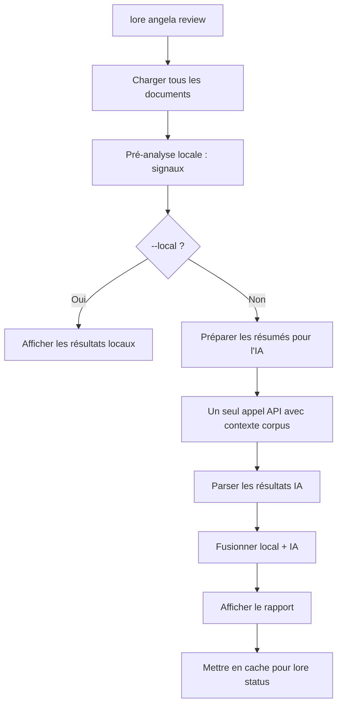

# lore angela review

Analyse de cohérence du corpus complet via IA.

## Synopsis

```
lore angela review [flags]
```

## Qu'est-ce que ça fait ?

`lore angela review` est l'analyse "vue d'ensemble". Tandis que `angela draft` vérifie un document, `review` vérifie la **cohérence de tout votre corpus** — contradictions entre documents, docs isolés sans connexions, contenu obsolète, et lacunes de couverture.

> **Analogie :** Si `angela draft` est un prof qui corrige un devoir, `angela review` est le doyen qui passe en revue tout le programme pour vérifier la cohérence.

## Scénario concret

> L'équipe documente depuis 2 semaines. 15 documents dans le corpus. Avant la revue de sprint :
>
> ```bash
> lore angela review
> # 1 contradiction trouvée : auth-jwt.md vs auth-session.md
> # 2 documents isolés sans références croisées
> ```
>
> Vous attrapez la contradiction avant qu'elle ne confonde un nouveau membre de l'équipe.


<!-- Generate: vhs assets/vhs/angela-review.tape -->

**Nécessite** un fournisseur IA configuré (sauf avec `--local`).

## Flags

| Flag | Type | Défaut | Description |
|------|------|--------|-------------|
| `--local` | bool | `false` | Signaux locaux uniquement (gratuit, aucun appel IA) |
| `--quiet` | bool | `false` | Supprimer l'en-tête et le résumé sur stderr |

## Sortie

```
Corpus Review — 12 documents analysés

SEVERITY  TITLE                            DOCUMENTS                    DESCRIPTION
error     Approche auth contradictoire     auth-jwt.md, auth-session.md JWT choisi dans l'un, sessions dans l'autre
warning   Document isolé                   note-meeting-2026-03-01.md   Aucune référence vers/depuis d'autres docs
info      Lacune de couverture             —                            Aucune décision documentée pour la couche DB

3 findings (1 error, 1 warning, 1 info)
```

## Flux



## Signaux locaux (toujours calculés)

Pré-analyse sans appel API :
- **Contradictions** — Documents sur le même sujet avec du contenu contradictoire
- **Documents isolés** — Aucune référence croisée vers ou depuis d'autres documents
- **Contenu obsolète** — Documents datant de plus de N jours sans mise à jour

## Exemples

```bash
# Revue complète (locale + IA)
lore angela review

# Signaux locaux uniquement (gratuit, sans API)
lore angela review --local

# Silencieux (pour intégration avec lore status)
lore angela review --quiet
```

## Questions fréquentes

### "Quelle différence avec angela draft ?"

| | `angela draft` | `angela review` |
|---|---|---|
| **Portée** | Un document | Corpus entier |
| **Coût** | Gratuit (zéro-API) | 1 appel API (ou gratuit avec `--local`) |
| **Trouve** | Sections manquantes, style | Contradictions, docs isolés, lacunes |

### "À quelle fréquence lancer ?"

Avant chaque release, ou toutes les 1-2 semaines pendant le développement actif. Les résultats sont mis en cache — `lore status` affiche les derniers résultats sans relancer.

### "Mon corpus a 200+ documents. C'est cher ?"

Un seul appel API quelle que soit la taille du corpus. Lore compresse les résumés avant envoi. Pour les très gros corpus (50+ docs), Lore avertit de la consommation de tokens avant de continuer.

## Tips & Tricks

- **Avant chaque release :** `lore angela review` attrape les contradictions qui dérouteraient les lecteurs.
- **`--local` est gratuit et rapide** — utilisez-le comme vérification quotidienne.
- **Résultats en cache :** `lore status` affiche les findings sans relancer l'analyse.
- **Gros corpus (> 50 docs) :** Lore avertit de la consommation de tokens avant l'appel.

## Codes de sortie

| Code | Signification |
|------|---------------|
| `0` | Succès |
| `1` | Erreur (aucun fournisseur configuré, corpus trop petit) |

## Voir aussi

- [lore angela draft](angela-draft.md) — Analyse d'un document individuel
- [lore status](status.md) — Affiche les résultats de revue en cache
