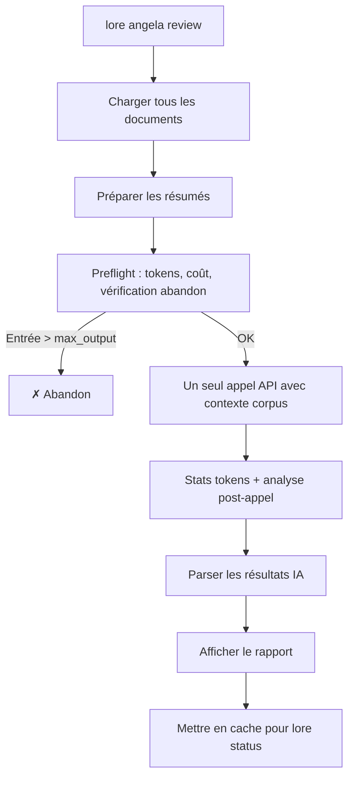

# lore angela review

Analyse de cohérence du corpus complet via IA.

## Synopsis

```
lore angela review [flags]
```

## Qu'est-ce que ça fait ?

`lore angela review` est l'analyse "vue d'ensemble". Tandis que `angela draft` vérifie un document, `review` vérifie la **cohérence de tout votre corpus** — contradictions entre documents, docs isolés sans connexions, contenu obsolète, et lacunes de couverture.

> **Analogie :** Si `angela draft` est un prof qui corrige un devoir, `angela review` est le doyen qui passe en revue tout le programme pour vérifier la cohérence.

## Scénario concret

> L'équipe documente depuis 2 semaines. 15 documents dans le corpus. Avant la revue de sprint :
>
> ```bash
> lore angela review
> # 1 contradiction trouvée : auth-jwt.md vs auth-session.md
> # 2 documents isolés sans références croisées
> ```
>
> Vous attrapez la contradiction avant qu'elle ne confonde un nouveau membre de l'équipe.


<!-- Generate: vhs assets/vhs/angela-review.tape -->

**Nécessite** un fournisseur IA configuré (`ai.provider` dans `.lorerc`). Pour une analyse locale du corpus sans API, utilisez `lore angela draft --all` à la place.

## Flags

| Flag | Type | Défaut | Description |
|------|------|--------|-------------|
| `--quiet` | bool | `false` | Supprimer l'en-tête et le résumé sur stderr |
| `--for` | string | | Adapter les résultats pour une audience cible (ex : `"CTO"`, `"nouveau développeur"`) |
| `--path` | string | `.lore/docs` | Chemin vers un répertoire markdown (mode autonome — pas de `lore init` requis) |
| `--filter` | string | | Regex pour filtrer les documents par nom de fichier (ex : `"commands/.*"`, `".*\.fr\.md$"`) |
| `--all` | bool | `false` | Analyser tous les documents (désactive l'échantillonnage 25+25 sur les gros corpus) |

## Mode autonome

Comme `angela draft`, la commande review supporte `--path` pour une utilisation autonome :

```bash
lore angela review --path ./docs
```

En mode autonome, le cache de revue n'est pas sauvegardé (pas de répertoire `.lore/`). Voir le guide [Angela en CI](../guides/angela-ci.md) pour les détails d'intégration.

## Comment ça marche (étape par étape)

### Étape 1/2 : Préparation

```
[1/2] Préparation des résumés pour 12 documents…
      12 docs | ~2450 tokens d'entrée | max sortie : 1500 tokens | timeout : 60s
      Coût estimé : ~$0.0018
```

Angela effectue les mêmes **vérifications préalables** que polish :

- **Estimation de tokens** — taille du corpus vs. sortie max autorisée
- **Estimation du coût** — coût API estimé en USD
- **Abandon** — si l'entrée dépasse max_output, s'arrête et suggère d'augmenter `angela.max_tokens`
- **Avertissements** — fenêtre de contexte, timeout, alertes de coût

### Étape 2/2 : Appel IA

Un seul appel API analyse tout le corpus. Un spinner affiche la progression :

```
      ✓ Réponse IA reçue en 4.3s
      Tokens : 2450 → 890 ← | Modèle : claude-sonnet-4-20250514
      Vitesse : 207 tok/s (rapide)
      Coût : ~$0.0015
```

## Sortie

```
Corpus Review — 12 documents analysés

SEVERITY               TITLE                            DOCUMENTS                    DESCRIPTION
contradiction          Approche auth contradictoire     auth-jwt.md, auth-session.md JWT choisi dans l'un, sessions dans l'autre
gap                    Document isolé                   note-meeting-2026-03-01.md   Aucune référence vers/depuis d'autres docs
style                  Lacune de couverture             —                            Aucune décision documentée pour la couche DB

3 findings (1 contradiction, 1 gap, 1 style)
```

Avec `--for`, les résultats incluent un champ **pertinence** :

```
contradiction [high]   Approche auth contradictoire     auth-jwt.md, auth-session.md  ...
```

## Flux



## Signaux locaux (toujours calculés)

Pré-analyse sans appel API :
- **Contradictions** — Documents sur le même sujet avec du contenu contradictoire
- **Documents isolés** — Aucune référence croisée vers ou depuis d'autres documents
- **Contenu obsolète** — Documents datant de plus de N jours sans mise à jour

## Exemples

```bash
# Revue complète (signaux locaux + analyse IA)
lore angela review

# Tous les docs (pas d'échantillonnage 25+25 — pour les gros corpus)
lore angela review --all

# Filtrer : seulement les docs de commandes
lore angela review --filter "commands/.*"

# Filtrer : seulement les docs FR
lore angela review --filter "\.fr\.md$"

# Combiner : tous les docs Angela, adapté pour le CTO
lore angela review --filter "angela" --all --for "CTO"

# Mode autonome : analyser n'importe quel répertoire markdown
lore angela review --path ./docs --all

# Silencieux (pour intégration avec lore status)
lore angela review --quiet

# Alternative hors ligne : analyser tous les docs localement (pas d'API)
lore angela draft --all
```

## Réglages

Contrôlez le timeout et la limite de tokens via `.lorerc` ou variables d'environnement :

```yaml
# .lorerc
ai:
  timeout: 120s             # défaut : 60s — augmenter pour les gros corpus

angela:
  max_tokens: 8192          # défaut : auto-calculé — augmenter si le preflight abandonne
```

Ou via env vars (utile en CI) :

```bash
LORE_AI_TIMEOUT=120s LORE_ANGELA_MAX_TOKENS=8192 lore angela review --path ./docs --all
```

Tous les flags se combinent librement :

```bash
lore angela review --path ./docs --filter "guides/.*" --all --for "CTO" --quiet
```

| Flag | Étape du pipeline | Effet |
|------|-------------------|-------|
| `--path` | Source | Quel répertoire scanner |
| `--filter` | Sélection | Quels fichiers garder (regex sur le nom) |
| `--all` | Échantillonnage | Envoyer tous les docs, pas de 25+25 |
| `--for` | Prompt IA | Adapter les résultats pour une audience |
| `--quiet` | Sortie | Supprimer les messages stderr |

## Questions fréquentes

### "Quelle différence avec angela draft ?"

| | `angela draft` | `angela review` |
|---|---|---|
| **Portée** | Un document | Corpus entier |
| **Coût** | Gratuit (zéro-API) | 1 appel API |
| **Trouve** | Sections manquantes, style | Contradictions, docs isolés, lacunes |

### "À quelle fréquence lancer ?"

Avant chaque release, ou toutes les 1-2 semaines pendant le développement actif. Les résultats sont mis en cache — `lore status` affiche les derniers résultats sans relancer.

### "Mon corpus a 200+ documents. C'est cher ?"

Un seul appel API quelle que soit la taille du corpus. Lore compresse les résumés avant envoi. Pour les très gros corpus (50+ docs), Lore avertit de la consommation de tokens avant de continuer.

## Tips & Tricks

- **Avant chaque release :** `lore angela review` attrape les contradictions qui dérouteraient les lecteurs.
- **Pas d'API ?** Utilisez `lore angela draft --all` pour une analyse locale gratuite de chaque document.
- **`--filter` pour des reviews ciblées :** Ne reviewez que les docs modifiés (`--filter "commands/angela"`).
- **`--all` pour être exhaustif :** Par défaut, les corpus > 50 docs utilisent l'échantillonnage 25+25. Utilisez `--all` pour tout analyser.
- **Résultats en cache :** `lore status` affiche les findings sans relancer l'analyse.
- **Gros corpus (> 50 docs) :** Lore avertit de la consommation de tokens avant l'appel.
- **Utilisez Haiku pour les reviews :** `LORE_AI_MODEL=claude-haiku-4-5-20251001` est 10x moins cher que Sonnet et suffisant pour les vérifications de cohérence.

## Codes de sortie

| Code | Signification |
|------|---------------|
| `0` | Succès |
| `1` | Erreur (aucun fournisseur configuré, corpus trop petit) |

## Voir aussi

- [lore angela draft](angela-draft.md) — Analyse d'un document individuel
- [lore status](status.md) — Affiche les résultats de revue en cache
