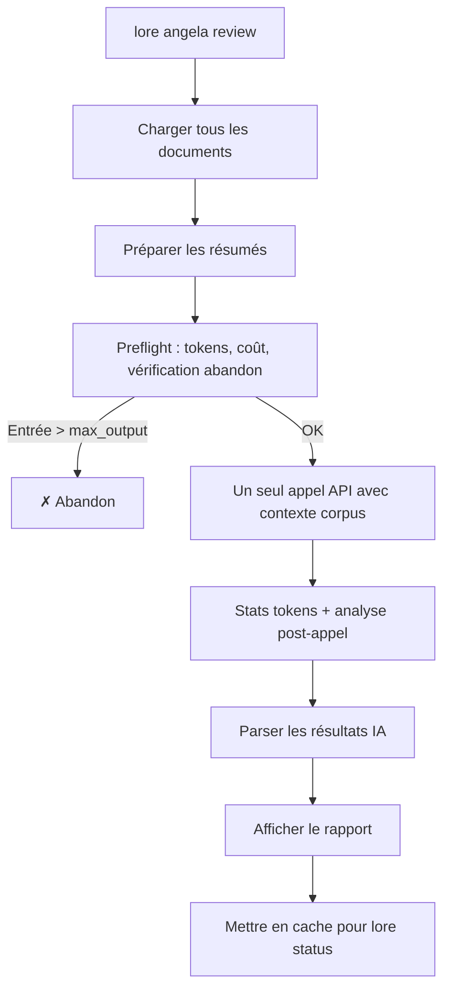

# lore angela review

Analyse de cohérence du corpus complet via IA.

## Synopsis

```text
lore angela review [flags]
```

## Qu'est-ce que ça fait ?

`lore angela review` est l'analyse "vue d'ensemble". Tandis que `angela draft` vérifie un document, `review` vérifie la **cohérence de tout votre corpus** — contradictions entre documents, docs isolés sans connexions, contenu obsolète, et lacunes de couverture.

## Description

Analyse le corpus de documentation complet pour la cohérence : contradictions entre documents, documents isolés, contenu obsolète, et lacunes de couverture. Combine une pré-analyse locale (signaux) avec un seul appel API IA.

**Nécessite** un fournisseur IA configuré.

## Scénario concret

> L'équipe documente depuis 2 semaines. 15 documents dans le corpus. Avant la revue de sprint :
>
> ```bash
> lore angela review
> # 1 contradiction trouvée : auth-jwt.md vs auth-session.md
> # 2 documents isolés sans références croisées
> ```
>
> Vous attrapez la contradiction avant qu'elle ne confonde un nouveau membre de l'équipe.


<!-- Generate: vhs assets/vhs/angela-review.tape -->

**Nécessite** un fournisseur IA configuré (`ai.provider` dans `.lorerc`). Pour une analyse locale du corpus sans API, utilisez `lore angela draft --all` à la place.

## Flags

| Flag | Type | Défaut | Description |
|------|------|--------|-------------|
| `--quiet` | bool | `false` | Supprimer l'en-tête et le résumé sur stderr |
| `--for` | string | | Adapter les résultats pour une audience cible (ex : `"CTO"`, `"nouveau développeur"`) |
| `--path` | string | `.lore/docs` | Chemin vers un répertoire markdown (mode autonome — pas de `lore init` requis) |
| `--filter` | string | | Regex pour filtrer les documents par nom de fichier (ex : `"commands/.*"`, `".*\.fr\.md$"`) |
| `--all` | bool | `false` | Analyser tous les documents (désactive l'échantillonnage 25+25 sur les gros corpus) |
| `--interactive`, `-i` | bool | `false` | Lancer le TUI interactif pour naviguer et trier les findings |
| `--diff-only` | bool | `false` | Afficher uniquement les findings NEW + REGRESSED (masquer PERSISTING). Idéal pour les gates CI |
| `--synthesizers` | strings | | Surcharger les synthesizers activés |
| `--no-synthesizers` | bool | `false` | Désactiver tous les Example Synthesizers |
| `--persona` | strings (répétable) | | Activer une ou plusieurs lentilles persona pour cette review (`--persona architect --persona qa-reviewer`). Multi-persona reste à **1 seul appel API** — les personas sont injectées dans le prompt, pas dispatchées en fan-out. |
| `--no-personas` | bool | `false` | Forcer une review baseline sans persona, même si `.lorerc` en configure. Mutuellement exclusif avec `--persona` et `--use-configured-personas`. |
| `--use-configured-personas` | bool | `false` | Activer les personas de `.lorerc` sans le prompt de confirmation interactif. Mutuellement exclusif avec `--persona` et `--no-personas`. |
| `--preview` | bool | `false` | Afficher l'estimation de coût + les personas prévues, puis sortir **sans appeler l'IA**. Zéro appel API, zéro écriture de state. Dry-run sûr pour la gouvernance budget/CI. Mutuellement exclusif avec `--interactive`. |
| `--format` | `text`\|`json` | `text` | Format de sortie pour `--preview`. Nécessite `--preview` ; erreur sinon. |

## Mode autonome

Comme `angela draft`, la commande review supporte `--path` pour une utilisation autonome :

```bash
lore angela review --path ./docs
```

En mode autonome, le cache de revue n'est pas sauvegardé (pas de répertoire `.lore/`). Voir le guide [Angela en CI](../guides/angela-ci.md) pour les détails d'intégration.

## Comment ça marche (étape par étape)

### Étape 1/2 : Préparation

```text
[1/2] Préparation des résumés pour 12 documents…
      12 docs | ~2450 tokens d'entrée | max sortie : 1500 tokens | timeout : 60s
      Coût estimé : ~$0.0018
```

Angela effectue les mêmes **vérifications préalables** que `angela polish` :

- **Estimation de tokens** — taille du corpus vs. sortie max autorisée
- **Estimation du coût** — coût API estimé en USD
- **Abandon** — si l'entrée dépasse `max_output`, s'arrête et suggère d'augmenter `angela.max_tokens`
- **Avertissements** — fenêtre de contexte, timeout, alertes de coût

### Étape 2/2 : Appel IA

Un seul appel API analyse tout le corpus. Un spinner affiche la progression :

```text
      ✓ Réponse IA reçue en 4.3s
      Tokens : 2450 → 890 ← | Modèle : claude-sonnet-4-20250514
      Vitesse : 207 tok/s (rapide)
      Coût : ~$0.0015
```

## Sortie

```text
Corpus Review — 12 documents analysés

SEVERITY               TITLE                            DOCUMENTS                    DESCRIPTION
contradiction          Approche auth contradictoire     auth-jwt.md, auth-session.md JWT choisi dans l'un, sessions dans l'autre
gap                    Document isolé                   note-meeting-2026-03-01.md   Aucune référence vers/depuis d'autres docs
style                  Lacune de couverture             —                            Aucune décision documentée pour la couche DB

3 findings (1 contradiction, 1 gap, 1 style)
```

### Types de sévérité

| Sévérité | Signification |
|----------|---------------|
| `contradiction` | Informations contradictoires entre documents |
| `gap` | Couverture manquante ou documents isolés |
| `obsolete` | Contenu obsolète qui peut nécessiter une mise à jour |
| `style` | Incohérences de style dans le corpus |

Avec `--for`, les résultats incluent un champ **pertinence** :

```text
contradiction [high]   Approche auth contradictoire     auth-jwt.md, auth-session.md  ...
```

## Validation des preuves

Chaque finding IA **doit** inclure des citations verbatim des documents sources. Angela valide ces citations :

| Mode | Comportement | Configuration |
|------|-------------|---------------|
| **strict** (défaut) | Supprime les findings sans preuve vérifiable | `angela.review.evidence.validation: strict` |
| **lenient** | Conserve les findings mais les marque comme non vérifiés | `angela.review.evidence.validation: lenient` |
| **off** | Affiche tous les findings tels quels | `angela.review.evidence.validation: "off"` |

```yaml
# .lorerc
angela:
  review:
    evidence:
      required: true         # l'IA doit fournir des preuves pour chaque finding
      min_confidence: 0.4    # rejeter les findings sous ce seuil
      validation: strict     # strict | lenient | off
```

Quand la validation de la preuve échoue :
```text
Rejeté : "Conflit de migration base de données" — citation introuvable dans la source
```

## Flux



## Signaux locaux (toujours calculés)

Pré-analyse sans appel API :
- **Contradictions** — Documents sur le même sujet avec du contenu contradictoire
- **Documents isolés** — Aucune référence croisée vers ou depuis d'autres documents
- **Contenu obsolète** — Documents datant de plus de N jours sans mise à jour

## Exemples

```bash
# Revue complète (signaux locaux + analyse IA)
lore angela review

# Tous les docs (pas d'échantillonnage 25+25 — pour les gros corpus)
lore angela review --all

# Filtrer : seulement les docs de commandes
lore angela review --filter "commands/.*"

# Filtrer : seulement les docs FR
lore angela review --filter "\.fr\.md$"

# Combiner : tous les docs Angela, adapté pour le CTO
lore angela review --filter "angela" --all --for "CTO"

# Mode autonome : analyser n'importe quel répertoire markdown
lore angela review --path ./docs --all

# Silencieux (pour intégration avec lore status)
lore angela review --quiet

# Estimer le coût avant d'engager le run (zéro appel API)
lore angela review --preview
lore angela review --preview --format=json

# Findings multi-angles en un seul appel API (personas opt-in)
lore angela review --persona architect --persona qa-reviewer

# Alternative hors ligne : analyser tous les docs localement (pas d'API)
lore angela draft --all
```

## Réglages

Contrôlez le timeout et la limite de tokens via `.lorerc` ou variables d'environnement :

```yaml
# .lorerc
ai:
  timeout: 120s             # défaut : 60s — augmenter pour les gros corpus

angela:
  max_tokens: 8192          # défaut : auto-calculé — augmenter si le preflight abandonne
```

Ou via variables d'env (utile en CI) :

```bash
LORE_AI_TIMEOUT=120s LORE_ANGELA_MAX_TOKENS=8192 lore angela review --path ./docs --all
```

Tous les flags se combinent librement :

```bash
lore angela review --path ./docs --filter "guides/.*" --all --for "CTO" --quiet
```

| Flag | Étape du pipeline | Effet |
|------|-------------------|-------|
| `--path` | Source | Quel répertoire scanner |
| `--filter` | Sélection | Quels fichiers garder (regex sur le nom) |
| `--all` | Échantillonnage | Envoyer tous les docs, pas de 25+25 |
| `--for` | Prompt IA | Adapter les résultats pour une audience |
| `--quiet` | Sortie | Supprimer les messages stderr |

## État différentiel (`--diff-only`)

Angela suit le cycle de vie des findings entre les runs de revue pour éviter la fatigue d'alertes :

| Statut | Signification |
|--------|---------------|
| `NEW` | Finding apparu pour la première fois dans ce run |
| `PERSISTING` | Finding existait au run précédent et existe toujours |
| `REGRESSED` | Finding était résolu/ignoré mais est revenu |
| `RESOLVED` | Finding existait avant mais a disparu |

Avec `--diff-only`, seuls les findings `NEW` et `REGRESSED` sont affichés — les findings `PERSISTING` sont masqués (leur nombre apparaît quand même dans le résumé). Idéal pour les gates CI qui ne doivent échouer que sur les régressions :

```bash
# CI : échouer uniquement sur les findings nouveaux ou régressés
lore angela review --diff-only
```

```text
Corpus Review — 12 documents analysés

[NEW]        contradiction   auth-jwt.md ↔ auth-session.md   JWT choisi dans l'un, sessions dans l'autre
[REGRESSED]  gap             deployment.md                   Était résolu, mais réapparu après la dernière modification

2 findings affichés (1 NEW, 1 REGRESSED) | 3 PERSISTING masqués | 1 RESOLVED
```

L'état est stocké dans `.lore/angela/review-state.json`.

## Lentilles persona (opt-in)

Activer une ou plusieurs lentilles persona pour cette review. Chaque finding peut être flagué par une ou plusieurs personas ; plusieurs personas concordant sur un même finding font monter son signal `agreement_count`.

```bash
# Activation par flag (non-interactif, CI-safe)
lore angela review --persona architect --persona qa-reviewer

# Utiliser les personas listées dans .lorerc sans la confirmation TTY
lore angela review --use-configured-personas

# Forcer baseline même si .lorerc configure des personas
lore angela review --no-personas
```

Les personas **ne s'activent jamais silencieusement**. Quand `.lorerc` configure des personas et qu'aucun flag n'est passé :

- **TTY** : Angela affiche un y/N avec le delta coût baseline vs avec-personas.
- **Non-TTY / CI** : Angela émet un log informatif et lance la review baseline. Passez `--use-configured-personas` pour opt-in explicite en CI.

Le rapport texte ajoute un en-tête `Review angle: N persona(s) active` et une ligne `Flagged by: …` par finding (Icône + Nom). La validation des preuves est forcée à `strict` dès qu'au moins une persona est active — les findings persona-attribués ne peuvent pas contourner l'invariant I4 (zero-hallucination).

## Mode preview (sans appel API)

`--preview` exécute l'estimation tokens/coût localement puis sort. Zéro appel HTTP, zéro écriture de state.

```bash
lore angela review --preview
```

```text
Review preview
──────────────
Corpus:           68 documents (245 KB)
Model:            claude-sonnet-4-6
Personas:         baseline (no personas)
Audience:         (none)
Estimated tokens: 1,240 input → 4,000 output max
Context window:   ~2.5% used
Estimated cost:   $0.0037
Expected time:    ~15s
```

Format machine pour les gates CI :

```bash
lore angela review --preview --format=json
```

```json
{
  "schema_version": "1",
  "mode": "preview",
  "corpus_documents": 68,
  "corpus_bytes": 245000,
  "model": "claude-sonnet-4-6",
  "personas": [],
  "audience": "",
  "estimated_input_tokens": 1240,
  "max_output_tokens": 4000,
  "context_window_used_pct": 2.5,
  "estimated_cost_usd": 0.0037,
  "expected_seconds": 15,
  "warnings": [],
  "should_abort": false
}
```

- `estimated_cost_usd` et `expected_seconds` valent `null` quand le modèle n'est pas dans la table de pricing — **pas** `-1` ni `0`. Les scripts doivent vérifier `null` avant agrégation.
- `schema_version` est incrémenté uniquement sur les changements breaking (renommage / suppression / changement de sémantique). Ajouter un champ optionnel n'incrémente pas.
- Combiner avec `--persona` reflète la taille de prompt augmentée dans l'estimation : `lore angela review --preview --persona architect`.

## TUI interactif (`--interactive`)

```bash
lore angela review --interactive
```

Le TUI vous permet de naviguer dans les findings, d'approfondir n'importe quel finding, et de les trier — sans quitter le terminal :

```text
Angela Review — 12 documents
────────────────────────────────────────────────────────
  1/3  contradiction  auth-jwt.md ↔ auth-session.md
  2/3  gap            note-meeting-2026-03-01.md  (isolé)
  3/3  style          Aucune décision couche base de données

[↑/↓] naviguer  [entrée] approfondir  [i] ignorer  [q] quitter
```

**Approfondir** ouvre une analyse IA asynchrone du finding sélectionné : le conflit exact, quel document devrait faire référence, et quoi corriger. Le résultat apparaît en ligne dans le TUI.

| Touche | Action |
|--------|--------|
| `↑` / `↓` | Naviguer dans les findings |
| `Entrée` | Approfondir : contexte IA asynchrone pour ce finding |
| `i` | Ignorer le finding (persisté dans l'état) |
| `q` | Quitter et sauvegarder l'état de triage |

Si aucun TTY n'est disponible, le TUI bascule vers la sortie texte brut.

## Tips & Tricks

- **Avant chaque release :** `lore angela review` attrape les contradictions avant qu'elles ne déroutent les lecteurs.
- **Pas d'API ?** Utilisez `lore angela draft --all` pour une analyse locale gratuite de chaque document.
- **`--filter` pour des revues ciblées :** Ne reviewez que les docs modifiés (`--filter "commands/angela"`).
- **`--all` pour être exhaustif :** Par défaut, les corpus > 50 docs utilisent l'échantillonnage 25+25. Utilisez `--all` pour tout analyser.
- **`--interactive` pour les sessions de triage :** Naviguez, approfondissez et ignorez les findings sans quitter le terminal.
- **Résultats en cache :** `lore status` affiche les findings sans relancer l'analyse.
- **Gros corpus (> 50 docs) :** Lore avertit de la consommation de tokens avant l'appel.
- **Utilisez Haiku pour les revues :** `LORE_AI_MODEL=claude-haiku-4-5-20251001` est 10x moins cher que Sonnet et suffisant pour les vérifications de cohérence.

## Codes de sortie

| Code | Signification |
|------|---------------|
| `0` | Succès |
| `1` | Erreur (aucun fournisseur configuré, corpus trop petit) |

## Questions fréquentes

### "Quelle différence avec angela draft ?"

| | `angela draft` | `angela review` |
|---|---|---|
| **Portée** | Un document | Corpus entier |
| **Coût** | Gratuit (zéro-API) | 1 appel API |
| **Trouve** | Sections manquantes, style | Contradictions, docs isolés, lacunes |

### "À quelle fréquence lancer ?"

Avant chaque release, ou toutes les 1-2 semaines pendant le développement actif. Les résultats sont mis en cache — `lore status` affiche les derniers résultats sans relancer.

### "Mon corpus a 200+ documents. C'est cher ?"

Un seul appel API quelle que soit la taille du corpus. Lore compresse les résumés avant envoi. Pour les corpus de plus de 50 docs, Lore avertit de la consommation de tokens avant de continuer.

## Voir aussi

- [lore angela draft](angela-draft.md) — Analyse d'un document individuel
- [lore status](status.md) — Affiche les résultats de revue en cache
