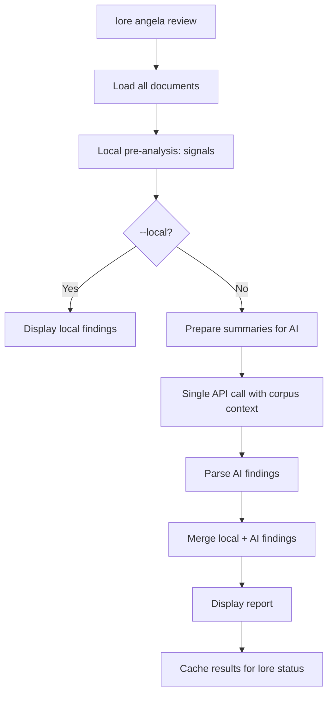

# lore angela review

Analyse de cohérence du corpus par IA.

## Synopsis

```
lore angela review [flags]
```

## Description

Analyse l'ensemble du corpus de documentation pour en vérifier la cohérence : contradictions entre documents, documents isolés, contenu obsolète, lacunes de couverture. Combine une pré-analyse locale (signaux) avec un unique appel API IA.

**Nécessite** un fournisseur IA configuré.

## Flags

| Flag | Type | Défaut | Description |
|------|------|--------|-------------|
| `--local` | bool | `false` | Signaux locaux uniquement (aucun appel IA) |
| `--quiet` | bool | `false` | Supprimer l'en-tête et le résumé sur stderr |

## Sortie

```
Corpus Review — 12 documents analyzed

SEVERITY  TITLE                            DOCUMENTS                    DESCRIPTION
error     Contradictory auth approach       auth-jwt.md, auth-session.md  JWT chosen in one, sessions in another
warning   Isolated document                 note-meeting-2026-03-01.md    No references to/from other docs
info      Coverage gap                      —                            No décisions documented for database layer

3 findings (1 error, 1 warning, 1 info)
```

## Flux de processus



## Signaux locaux (toujours calculés)

Pré-analyse sans appel API :
- **Contradictions** — Documents sur le même sujet avec du contenu contradictoire
- **Documents isolés** — Aucune référence croisée vers ou depuis d'autres documents
- **Contenu obsolète** — Documents datant de plus de N jours sans mise à jour

## Exemples

```bash
# Revue complète (locale + IA)
lore angela review

# Signaux locaux uniquement (gratuit, sans API)
lore angela review --local

# Silencieux (pour intégration avec lore status)
lore angela review --quiet
```

## Tips & Tricks

- Lancez avant chaque release : `lore angela review` détecte les contradictions qui dérouteraient les lecteurs.
- `--local` est gratuit et rapide — utilisez-le comme vérification quotidienne.
- Les résultats sont mis en cache : `lore status` affiche les résultats de revue sans relancer l'analyse.
- Corpus volumineux (> 50 docs) : Lore vous avertit de la consommation de tokens avant l'appel API.

## Codes de sortie

| Code | Signification |
|------|---------------|
| `0` | Succès |
| `1` | Erreur (aucun fournisseur configuré, corpus trop petit) |

## Voir aussi

- [lore angela draft](angela-draft.fr.md) — Analyse d'un document individuel
- [lore status](status.fr.md) — Affiche les résultats de revue en cache
