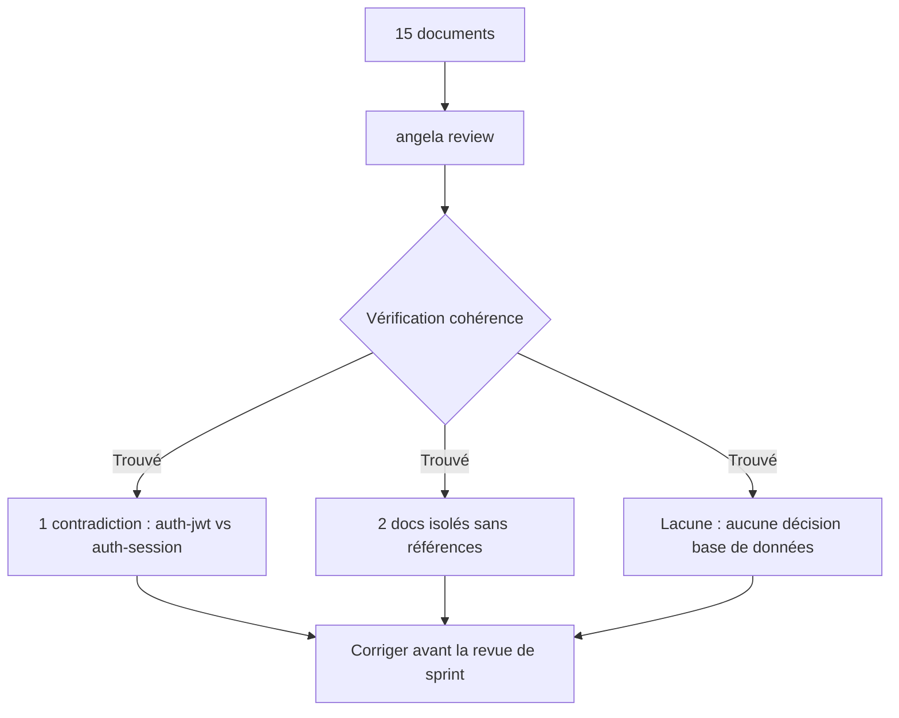
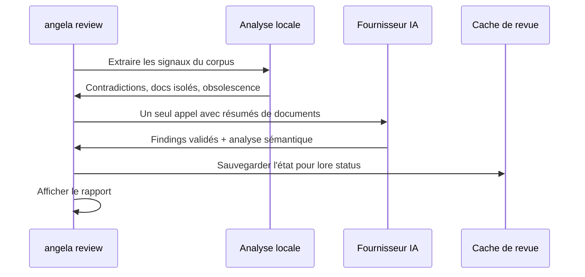

# lore angela review

Analyse de cohérence du corpus complet via IA.

## Synopsis

```bash
lore angela review [flags]
```

## Pourquoi

`lore angela review` attrape les contradictions qui échappent aux revues document-par-document. Après 2 semaines de documentation, votre équipe a 15 docs. Avant la revue de sprint, vous découvrez que `auth-jwt.md` dit « JWT pour l'auth stateless » tandis que `auth-session.md` dit « sessions pour la gestion d'état ». Un nouveau développeur lit les deux et se perd sur votre vraie stratégie d'auth.

Cette commande analyse votre **corpus entier** pour détecter les problèmes de cohérence qui n'apparaissent que quand les documents sont vus ensemble : contradictions, docs isolés sans références croisées, contenu obsolète, et lacunes de couverture.



## Comment ça marche

Processus en deux étapes : pré-analyse locale + un seul appel IA.

### Étape 1 : signaux locaux

Angela calcule ces signaux sans aucun appel API :
- **Contradictions** — Documents sur le même sujet avec des mots-clés contradictoires
- **Docs isolés** — Aucune référence croisée vers/depuis d'autres documents
- **Contenu obsolète** — Documents de plus de N jours sans mise à jour

### Étape 2 : analyse IA

Un seul appel API avec des résumés de documents compressés. L'IA valide les signaux locaux et trouve des contradictions sémantiques que la correspondance par mots-clés manque.



**Nécessite** un fournisseur IA configuré (`ai.provider` dans `.lorerc`). Pour une analyse hors ligne, utilisez `lore angela draft --all` à la place.

## Scénario concret

```bash
# Avant la revue de sprint — vérifier la cohérence sur 15 docs
lore angela review

# Sortie :
# 1 contradiction trouvée : auth-jwt.md vs auth-session.md
# 2 documents isolés sans références croisées
# Lacune de couverture : aucune décision de couche base de données documentée
```

Vous attrapez la contradiction d'auth avant qu'elle ne perturbe les stakeholders. Les docs isolés sont liés. Vous ajoutez un doc de décision base de données pour combler la lacune.

## Flags

| Flag | Type | Défaut | Description |
|------|------|--------|-------------|
| `--quiet` | bool | `false` | Supprimer l'en-tête et le résumé sur stderr |
| `--for` | string | | Adapter les résultats pour une audience cible (« CTO », « nouveau développeur ») |
| `--path` | string | `.lore/docs` | Chemin vers un répertoire markdown (mode autonome) |
| `--filter` | string | | Regex pour filtrer par nom de fichier (`"commands/.*"`, `".*\.fr\.md$"`) |
| `--all` | bool | `false` | Analyser tous les documents (désactive l'échantillonnage 25+25 sur les gros corpus) |
| `--interactive`, `-i` | bool | `false` | Lancer le TUI pour naviguer et trier les findings |
| `--diff-only` | bool | `false` | Afficher uniquement les findings NEW + REGRESSED (idéal pour la CI) |
| `--synthesizers` | strings | | Surcharger les synthesizers activés |
| `--no-synthesizers` | bool | `false` | Désactiver tous les Example Synthesizers |
| `--persona` | strings (répétable) | | Activer une ou plusieurs lentilles persona pour cette review (`--persona architect --persona qa-reviewer`). Multi-persona reste à **1 seul appel API** — les personas sont injectées dans le prompt, pas dispatchées en fan-out. |
| `--no-personas` | bool | `false` | Forcer une review baseline sans persona, même si `.lorerc` en configure. Mutuellement exclusif avec `--persona` et `--use-configured-personas`. |
| `--use-configured-personas` | bool | `false` | Activer les personas de `.lorerc` sans le prompt de confirmation interactif. Mutuellement exclusif avec `--persona` et `--no-personas`. |
| `--preview` | bool | `false` | Afficher l'estimation de coût + les personas prévues, puis sortir **sans appeler l'IA**. Zéro appel API, zéro écriture de state. Dry-run sûr pour la gouvernance budget/CI. Mutuellement exclusif avec `--interactive`. |
| `--format` | `text`\|`json` | `text` | Format de sortie pour `--preview`. Nécessite `--preview` ; erreur sinon. |

## Mode autonome

Fonctionne sans `lore init` :

```bash
lore angela review --path ./docs
```

Le cache de revue n'est pas sauvegardé en mode autonome. Voir [Angela en CI](../guides/angela-ci.md) pour les patterns d'intégration.

## Flux du processus

```text
[1/2] Préparation des résumés pour 12 documents…
      12 docs | ~2450 tokens d'entrée | max sortie : 1500 tokens | timeout : 60s
      Coût estimé : ~$0.0018

[2/2] Appel du fournisseur IA…
      ✓ Réponse IA reçue en 4.3s
      Tokens : 2450 → 890 | Modèle : claude-sonnet-4-20250514
      Vitesse : 207 tok/s | Coût : ~$0.0015
```

Angela effectue des **vérifications préalables** avant l'appel API :
- **Estimation de tokens** — taille du corpus vs. sortie max autorisée
- **Estimation de coût** — projection de coût en USD
- **Protection d'abandon** — s'arrête si l'entrée dépasse `max_output`

## Format de sortie

```text
Corpus Review — 12 documents analysés

SEVERITY               TITLE                            DOCUMENTS                    DESCRIPTION
contradiction          Approche auth contradictoire     auth-jwt.md, auth-session.md JWT choisi dans l'un, sessions dans l'autre
gap                    Document isolé                   note-meeting-2026-03-01.md   Aucune référence vers/depuis d'autres docs
style                  Lacune de couverture             —                            Aucune décision documentée pour la couche DB

3 findings (1 contradiction, 1 gap, 1 style)
```

### Types de sévérité

| Sévérité | Impact |
|----------|--------|
| `contradiction` | Informations contradictoires entre documents |
| `gap` | Couverture manquante ou documents isolés |
| `obsolete` | Contenu obsolète pouvant nécessiter une mise à jour |
| `style` | Incohérences de style dans le corpus |

Avec `--for`, les findings incluent une notation de pertinence :

```text
contradiction [high]   Approche auth contradictoire      auth-jwt.md, auth-session.md
gap [medium]           Document isolé                    note-meeting-2026-03-01.md
```

## Validation des preuves

Chaque finding IA **doit** inclure des citations verbatim des documents sources. Angela valide ces citations :

| Mode | Comportement | Config |
|------|-------------|--------|
| **strict** (défaut) | Supprime les findings sans preuve vérifiable | `angela.review.evidence.validation: strict` |
| **lenient** | Conserve les findings mais les marque comme non vérifiés | `angela.review.evidence.validation: lenient` |
| **off** | Affiche tous les findings tels quels | `angela.review.evidence.validation: "off"` |

```yaml
# .lorerc
angela:
  review:
    evidence:
      required: true         # l'IA doit fournir des preuves pour chaque finding
      min_confidence: 0.4    # rejeter les findings sous ce seuil
      validation: strict     # strict | lenient | off
```

Quand la validation de la preuve échoue :
```text
Rejeté : « Conflit de migration base de données » — citation introuvable dans la source
```

## État différentiel

Angela suit le cycle de vie des findings entre les runs pour éviter la fatigue d'alertes :

| Statut | Signification |
|--------|---------------|
| `NEW` | Première apparition dans ce run |
| `PERSISTING` | Existait avant et existe toujours |
| `RESOLVED` | Existait avant mais a disparu |
| `REGRESSED` | Était résolu mais est revenu |

Utilisez `--diff-only` pour les gates CI qui ne doivent échouer que sur les nouveaux problèmes :

```bash
lore angela review --diff-only   # seulement NEW + REGRESSED
```

```text
[NEW]        contradiction   auth-jwt.md ↔ auth-session.md   Conflit JWT vs sessions
[REGRESSED]  gap             deployment.md                   Réapparu après édition

2 findings affichés (1 NEW, 1 REGRESSED) | 3 PERSISTING masqués | 1 RESOLVED
```

L'état est persisté dans `.lore/angela/review-state.json`.

## Lentilles persona (opt-in)

Activer une ou plusieurs lentilles persona pour cette review. Chaque finding peut être flagué par une ou plusieurs personas ; plusieurs personas concordantes font monter le signal `agreement_count` du finding.

```bash
# Activation par flag (non-interactif, CI-safe)
lore angela review --persona architect --persona qa-reviewer

# Utiliser les personas listées dans .lorerc sans la confirmation TTY
lore angela review --use-configured-personas

# Forcer baseline même si .lorerc configure des personas
lore angela review --no-personas
```

Les personas **ne s'activent jamais silencieusement**. Quand `.lorerc` liste des personas et qu'aucun flag n'est passé :

- **TTY** : Angela affiche un y/N avec le delta coût baseline vs avec-personas.
- **Non-TTY / CI** : Angela émet une note informative et lance la review baseline. Passez `--use-configured-personas` pour opt-in explicite en CI.

Le rapport texte ajoute un en-tête `Review angle: N persona(s) active` et une ligne `Flagged by: …` par finding (Icône + Nom). La validation des preuves est forcée à `strict` dès qu'au moins une persona est active — les findings persona-attribués ne peuvent pas contourner l'invariant I4 (zéro-hallucination).

## Mode preview (sans appel API)

`--preview` exécute l'estimation tokens/coût localement puis sort. Zéro appel HTTP, zéro écriture de state.

```bash
lore angela review --preview
```

```text
Review preview
──────────────
Corpus:           68 documents (245 KB)
Model:            claude-sonnet-4-6
Personas:         baseline (no personas)
Audience:         (none)
Estimated tokens: 1,240 input → 4,000 output max
Context window:   ~2.5% used
Estimated cost:   $0.0037
Expected time:    ~15s
```

Format machine pour les gates CI :

```bash
lore angela review --preview --format=json
```

```json
{
  "schema_version": "1",
  "mode": "preview",
  "corpus_documents": 68,
  "corpus_bytes": 245000,
  "model": "claude-sonnet-4-6",
  "personas": [],
  "audience": "",
  "estimated_input_tokens": 1240,
  "max_output_tokens": 4000,
  "context_window_used_pct": 2.5,
  "estimated_cost_usd": 0.0037,
  "expected_seconds": 15,
  "warnings": [],
  "should_abort": false
}
```

- `estimated_cost_usd` et `expected_seconds` valent `null` quand le modèle n'est pas dans la table de pricing — **pas** `-1` ni `0`. Les scripts doivent vérifier `null` avant agrégation.
- `schema_version` est incrémenté uniquement sur les changements breaking (renommage / suppression / changement de sémantique). Ajouter un champ optionnel n'incrémente pas.
- Combiner avec `--persona` reflète la taille de prompt augmentée dans l'estimation : `lore angela review --preview --persona architect`.

## TUI interactif

```bash
lore angela review --interactive
```

Naviguez dans les findings et triez-les sans quitter le terminal :

```text
Angela Review — 12 documents
────────────────────────────────────────────────────────
  1/3  contradiction  auth-jwt.md ↔ auth-session.md
  2/3  gap            note-meeting-2026-03-01.md  (isolé)
  3/3  style          Aucune décision couche base de données

[↑/↓] naviguer  [entrée] approfondir  [i] ignorer  [q] quitter
```

| Touche | Action |
|--------|--------|
| `↑` / `↓` | Naviguer dans les findings |
| `Entrée` | Approfondir : analyse IA asynchrone du finding sélectionné |
| `i` | Ignorer le finding (persisté dans l'état) |
| `q` | Quitter et sauvegarder l'état de triage |

**Approfondir** ouvre une analyse IA asynchrone : détails exacts du conflit, quel document devrait faire source de vérité, corrections spécifiques nécessaires.

## Exemples

```bash
# Revue complète avec analyse IA
lore angela review

# Analyser tous les docs (pas d'échantillonnage 25+25 pour les gros corpus)
lore angela review --all

# Filtrer : seulement les docs de commandes
lore angela review --filter "commands/.*"

# Filtrer : seulement les docs FR
lore angela review --filter "\.fr\.md$"

# Adapter les findings pour une audience CTO
lore angela review --for "CTO"

# Autonome : n'importe quel répertoire markdown
lore angela review --path ./docs --all

# Mode CI : seulement les problèmes nouveaux/régressés
lore angela review --diff-only --quiet

# Session de triage interactive
lore angela review --interactive

# Estimer le coût avant d'engager un run (zéro appel API)
lore angela review --preview
lore angela review --preview --format=json

# Findings multi-angles en un seul appel API (personas opt-in)
lore angela review --persona architect --persona qa-reviewer

# Alternative hors ligne (aucun appel API)
lore angela draft --all
```

## Réglages

Contrôler le timeout et les limites de tokens :

```yaml
# .lorerc
ai:
  timeout: 120s             # défaut : 60s

angela:
  max_tokens: 8192          # défaut : auto-calculé
```

Variables d'environnement (utiles en CI) :
```bash
LORE_AI_TIMEOUT=120s LORE_ANGELA_MAX_TOKENS=8192 lore angela review
```

## Combinaisons de flags

| Flag | Étape | Effet |
|------|-------|-------|
| `--path` | Source | Quel répertoire scanner |
| `--filter` | Sélection | Quels fichiers inclure (regex) |
| `--all` | Échantillonnage | Envoyer tous les docs, pas d'échantillonnage |
| `--for` | Prompt IA | Adapter les findings pour une audience |
| `--quiet` | Sortie | Supprimer stderr |
| `--diff-only` | Affichage | Afficher seulement NEW + REGRESSED |

Tous les flags se combinent librement :
```bash
lore angela review --path ./docs --filter "guides/.*" --all --for "CTO" --quiet
```

## Tips

- **Avant les releases :** Lancez une review pour attraper les contradictions avant qu'elles ne perturbent les utilisateurs
- **Pas de budget API ?** Utilisez `lore angela draft --all` pour une analyse locale gratuite
- **Revues ciblées :** Utilisez `--filter` pour ne reviewer que les zones modifiées
- **Gros corpus :** Utilisez `--all` pour bypasser l'échantillonnage 25+25 (défaut au-delà de 50 docs)
- **Intégration CI :** Utilisez `--diff-only` pour n'échouer que sur les problèmes nouveaux/régressés
- **Optimisation coût :** Utilisez `LORE_AI_MODEL=claude-haiku-4-5-20251001` pour des reviews 10x moins chères
- **Résultats en cache :** `lore status` affiche les derniers findings sans relancer

## Codes de sortie

| Code | Signification |
|------|---------------|
| `0` | Succès |
| `1` | Erreur (aucun fournisseur IA, corpus trop petit) |

## angela draft vs angela review

| | `angela draft` | `angela review` |
|---|---|---|
| **Portée** | Un document | Corpus entier |
| **Coût** | Gratuit (zéro appel API) | 1 appel API |
| **Trouve** | Sections manquantes, problèmes de style | Contradictions, docs isolés, lacunes |
| **Cas d'usage** | Amélioration de document | Cohérence du corpus |

## Voir aussi

- [lore angela draft](angela-draft.md) — Analyse d'un document individuel
- [lore status](status.md) — Affiche les findings de revue en cache
- [Angela en CI](../guides/angela-ci.md) — Patterns d'intégration
