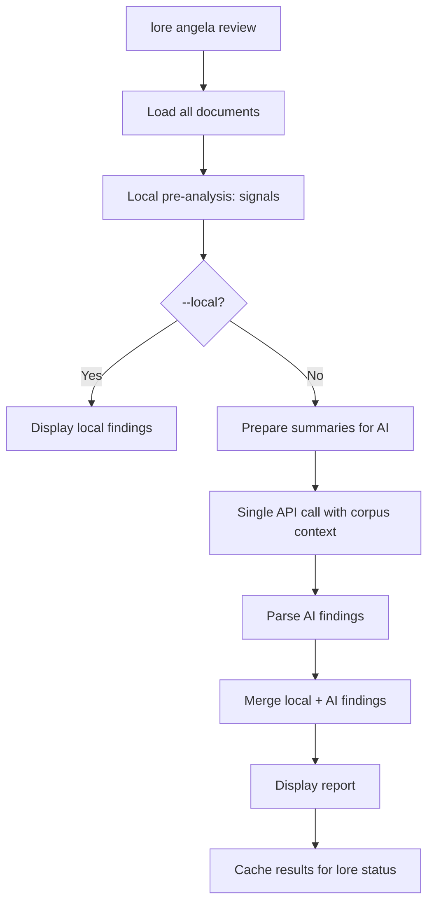

# lore angela review

Corpus-wide coherence analysis via AI.

## Synopsis

```
lore angela review [flags]
```

## Description

Analyzes the entire documentation corpus for coherence: contradictions between documents, isolated documents, stale content, coverage gaps. Combines local pre-analysis (signals) with a single AI API call.

**Requires** an AI provider configured.

## Flags

| Flag | Type | Default | Description |
|------|------|---------|-------------|
| `--local` | bool | `false` | Local signals only (no AI call) |
| `--quiet` | bool | `false` | Suppress header and summary on stderr |

## Output

```
Corpus Review — 12 documents analyzed

SEVERITY  TITLE                            DOCUMENTS                    DESCRIPTION
error     Contradictory auth approach       auth-jwt.md, auth-session.md  JWT chosen in one, sessions in another
warning   Isolated document                 note-meeting-2026-03-01.md    No references to/from other docs
info      Coverage gap                      —                            No decisions documented for database layer

3 findings (1 error, 1 warning, 1 info)
```

## Process Flow



## Local Signals (always computed)

Pre-analysis without API calls:
- **Contradictions** — Documents about the same topic with conflicting content
- **Isolated docs** — No cross-references to/from other documents
- **Stale content** — Documents older than N days without updates

## Examples

```bash
# Full review (local + AI)
lore angela review

# Local signals only (free, no API)
lore angela review --local

# Quiet (for integration with lore status)
lore angela review --quiet
```

## Tips & Tricks

- Run before every release: `lore angela review` catches contradictions that would confuse readers.
- `--local` is free and fast — use it as a daily check.
- Results are cached: `lore status` shows review findings without re-running.
- Large corpus (> 50 docs): Lore warns about token usage before the API call.

## Exit Codes

| Code | Meaning |
|------|---------|
| `0` | Success |
| `1` | Error (no provider configured, corpus too small) |

## See Also

- [lore angela draft](angela-draft.md) — Single document analysis
- [lore status](status.md) — Shows cached review findings
