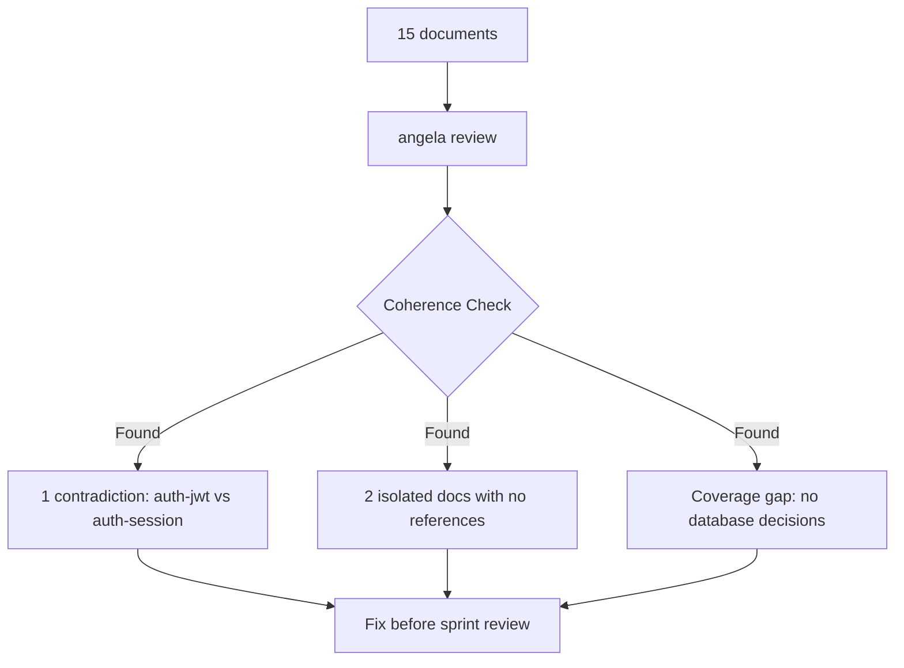
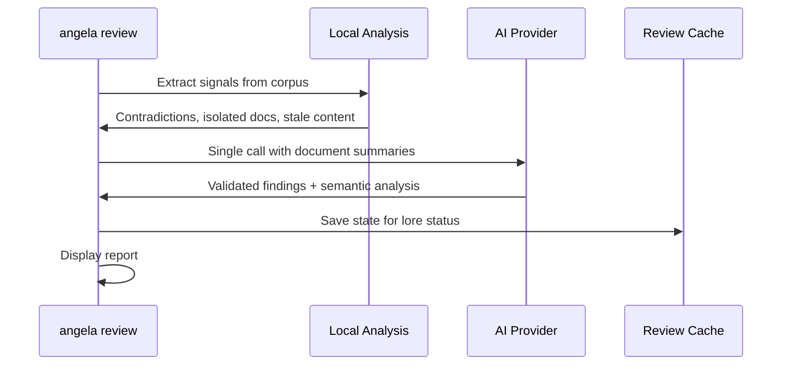

# lore angela review

Corpus-wide coherence analysis via AI.

## Synopsis

```bash
lore angela review [flags]
```

## Why

`lore angela review` catches contradictions that slip through document-by-document reviews. After 2 weeks of documenting, your team has 15 docs. Before the sprint review, you discover `auth-jwt.md` says "JWT for stateless auth" while `auth-session.md` says "sessions for state management." A new developer reads both and gets confused about your actual auth strategy.

This command analyzes your **entire corpus** for coherence issues that only surface when documents are viewed together: contradictions, isolated docs with no cross-references, stale content, and coverage gaps.



## How It Works

Two-step process: local pre-analysis + single AI call.

### Step 1: Local Signals

Angela computes these without any API calls:
- **Contradictions** — Documents about the same topic with conflicting keywords
- **Isolated docs** — No cross-references to/from other documents  
- **Stale content** — Documents older than N days without updates

### Step 2: AI Analysis

Single API call with compressed document summaries. The AI validates local signals and finds semantic contradictions that keyword matching misses.



**Requires** an AI provider configured (`ai.provider` in `.lorerc`). For offline analysis, use `lore angela draft --all` instead.

## Real World Scenario

```bash
# Before sprint review - check consistency across 15 docs
lore angela review

# Output:
# 1 contradiction found: auth-jwt.md vs auth-session.md
# 2 isolated documents with no cross-references
# Coverage gap: no database layer decisions documented
```

You catch the auth contradiction before it confuses stakeholders. The isolated docs get linked. You add a database decision doc to fill the gap.

## Flags

| Flag | Type | Default | Description |
|------|------|---------|-------------|
| `--quiet` | bool | `false` | Suppress header and summary on stderr |
| `--for` | string | | Adapt findings for target audience ("CTO", "new developer") |
| `--path` | string | `.lore/docs` | Path to markdown directory (standalone mode) |
| `--filter` | string | | Regex filter by filename (`"commands/.*"`, `".*\.fr\.md$"`) |
| `--all` | bool | `false` | Review all docs (disables 25+25 sampling on large corpora) |
| `--interactive`, `-i` | bool | `false` | Launch TUI to navigate and triage findings |
| `--diff-only` | bool | `false` | Show only NEW + REGRESSED findings (ideal for CI) |
| `--synthesizers` | strings | | Override enabled synthesizers |
| `--no-synthesizers` | bool | `false` | Disable all Example Synthesizers |
| `--persona` | strings (repeatable) | | Activate persona lenses for this review (`--persona architect --persona qa-reviewer`). Multi-persona stays at **1 API call** — personas are injected into the prompt, not fanned out. |
| `--no-personas` | bool | `false` | Force baseline review without personas, even if `.lorerc` configures them. Mutually exclusive with `--persona` and `--use-configured-personas`. |
| `--use-configured-personas` | bool | `false` | Activate personas from `.lorerc` without the interactive confirmation prompt. Mutually exclusive with `--persona` and `--no-personas`. |
| `--preview` | bool | `false` | Print cost estimate + planned personas, then exit **without calling the AI**. Zero API call, zero state write. Safe dry-run for CI/budget governance. Mutually exclusive with `--interactive`. |
| `--format` | `text`\|`json` | `text` | Output format for `--preview`. Requires `--preview`; errors out otherwise. |

## Standalone Mode

Works without `lore init`:

```bash
lore angela review --path ./docs
```

Review cache is not saved in standalone mode. See [Angela in CI](../guides/angela-ci.md) for integration patterns.

## Process Flow

```text
[1/2] Preparing summaries for 12 documents…
      12 docs | ~2450 input tokens | max output: 1500 tokens | timeout: 60s
      Estimated cost: ~$0.0018

[2/2] Calling AI provider…
      ✓ AI response received in 4.3s
      Tokens: 2450 → 890 | Model: claude-sonnet-4-20250514
      Speed: 207 tok/s | Cost: ~$0.0015
```

Angela runs **preflight checks** before the API call:
- **Token estimate** — corpus size vs max allowed output
- **Cost estimate** — USD cost projection
- **Abort protection** — stops if input exceeds `max_output`

## Output Format

```text
Corpus Review — 12 documents analyzed

SEVERITY               TITLE                                DOCUMENTS                       DESCRIPTION
contradiction          Contradictory auth approach           auth-jwt.md, auth-session.md    JWT chosen in one, sessions in another
gap                    Isolated document                     note-meeting-2026-03-01.md      No references to/from other docs
style                  Coverage gap                          —                               No decisions documented for database layer

3 findings (1 contradiction, 1 gap, 1 style)
```

### Severity Types

| Severity | Impact |
|----------|--------|
| `contradiction` | Conflicting information between documents |
| `gap` | Missing coverage or isolated documents |
| `obsolete` | Stale content that may need updating |
| `style` | Style inconsistencies across corpus |

With `--for`, findings include relevance scoring:

```text
contradiction [high]   Contradictory auth approach       auth-jwt.md, auth-session.md
gap [medium]           Isolated document                 note-meeting-2026-03-01.md
```

## Evidence Validation

Every AI finding **must** include verbatim quotes from source documents. Angela validates these quotes:

| Mode | Behavior | Config |
|------|----------|--------|
| **strict** (default) | Drop findings without verifiable evidence | `angela.review.evidence.validation: strict` |
| **lenient** | Keep findings but flag as unverified | `angela.review.evidence.validation: lenient` |
| **off** | Show all findings as-is | `angela.review.evidence.validation: "off"` |

```yaml
# .lorerc
angela:
  review:
    evidence:
      required: true         # AI must provide evidence for every finding
      min_confidence: 0.4    # reject findings below this threshold
      validation: strict     # strict | lenient | off
```

When evidence fails validation:
```text
Rejected: "Database migration conflict" — quote not found in source
```

## Differential State

Angela tracks finding lifecycle across runs to prevent alert fatigue:

| Status | Meaning |
|--------|---------|
| `NEW` | First appearance in this run |
| `PERSISTING` | Existed before and still exists |
| `RESOLVED` | Existed before but now gone |
| `REGRESSED` | Was resolved but reappeared |

Use `--diff-only` for CI gates that only fail on new issues:

```bash
lore angela review --diff-only   # only NEW + REGRESSED
```

```text
[NEW]        contradiction   auth-jwt.md ↔ auth-session.md   JWT vs sessions conflict
[REGRESSED]  gap             deployment.md                   Reappeared after edit

2 findings shown (1 NEW, 1 REGRESSED) | 3 PERSISTING hidden | 1 RESOLVED
```

State persists in `.lore/angela/review-state.json`.

## Persona Lenses (opt-in)

Activate one or more persona lenses for this review. Each finding may be flagged by one or more personas; concurrent personas raise the finding's `agreement_count` signal.

```bash
# Flag-driven activation (non-interactive, CI-safe)
lore angela review --persona architect --persona qa-reviewer

# Use the personas listed in .lorerc without the TTY confirmation prompt
lore angela review --use-configured-personas

# Force baseline regardless of .lorerc
lore angela review --no-personas
```

Personas **never activate silently**. When `.lorerc` lists personas and no flag is set:

- **TTY**: Angela shows a y/N confirmation with a baseline vs with-personas cost delta.
- **Non-TTY / CI**: Angela emits an informational note and runs the baseline review. Pass `--use-configured-personas` to opt in explicitly in CI.

The text report adds a `Review angle: N persona(s) active` header and a per-finding `Flagged by: …` line (Icon + DisplayName). Evidence validation is forced to `strict` when at least one persona is active — persona-attributed findings cannot bypass I4 (zero-hallucination).

## Preview Mode (no API call)

`--preview` runs the token/cost estimate locally then exits. Zero HTTP call, zero state write.

```bash
lore angela review --preview
```

```text
Review preview
──────────────
Corpus:           68 documents (245 KB)
Model:            claude-sonnet-4-6
Personas:         baseline (no personas)
Audience:         (none)
Estimated tokens: 1,240 input → 4,000 output max
Context window:   ~2.5% used
Estimated cost:   $0.0037
Expected time:    ~15s
```

Machine-readable mode for CI budget gates:

```bash
lore angela review --preview --format=json
```

```json
{
  "schema_version": "1",
  "mode": "preview",
  "corpus_documents": 68,
  "corpus_bytes": 245000,
  "model": "claude-sonnet-4-6",
  "personas": [],
  "audience": "",
  "estimated_input_tokens": 1240,
  "max_output_tokens": 4000,
  "context_window_used_pct": 2.5,
  "estimated_cost_usd": 0.0037,
  "expected_seconds": 15,
  "warnings": [],
  "should_abort": false
}
```

- `estimated_cost_usd` and `expected_seconds` are `null` when the model pricing or speed is not registered — **not** `-1` or `0` sentinels. Scripts should check for `null` before aggregating.
- `schema_version` is bumped only on breaking changes (rename/remove/semantic change). Adding an optional field does not bump it.
- Combining with `--persona` reflects the persona-augmented prompt size in the estimate: `lore angela review --preview --persona architect`.

## Interactive TUI

```bash
lore angela review --interactive
```

Navigate findings and triage without leaving the terminal:

```text
Angela Review — 12 documents
────────────────────────────────────────────────────────
  1/3  contradiction  auth-jwt.md ↔ auth-session.md
  2/3  gap            note-meeting-2026-03-01.md  (isolated)
  3/3  style          No database layer decisions

[↑/↓] navigate  [enter] deep dive  [i] ignore  [q] quit
```

| Key | Action |
|-----|--------|
| `↑` / `↓` | Navigate findings |
| `Enter` | Deep dive: async AI analysis of selected finding |
| `i` | Ignore finding (persisted to state) |
| `q` | Quit and save triage state |

**Deep dive** opens async AI analysis: exact conflict details, which document should be source of truth, specific fixes needed.

## Examples

```bash
# Full review with AI analysis
lore angela review

# Review all docs (skip 25+25 sampling for large corpora)
lore angela review --all

# Filter: only command documentation
lore angela review --filter "commands/.*"

# Filter: only French documentation
lore angela review --filter "\.fr\.md$"

# Adapt findings for CTO audience
lore angela review --for "CTO"

# Standalone: any markdown directory
lore angela review --path ./docs --all

# CI mode: only new/regressed issues
lore angela review --diff-only --quiet

# Interactive triage session
lore angela review --interactive

# Estimate cost before committing to a run (zero API call)
lore angela review --preview
lore angela review --preview --format=json

# Multi-angle findings in one API call (personas are opt-in)
lore angela review --persona architect --persona qa-reviewer

# Offline alternative (no API calls)
lore angela draft --all
```

## Tuning

Control timeout and token limits:

```yaml
# .lorerc
ai:
  timeout: 120s             # default: 60s

angela:
  max_tokens: 8192          # default: auto-computed
```

Environment variables (useful in CI):
```bash
LORE_AI_TIMEOUT=120s LORE_ANGELA_MAX_TOKENS=8192 lore angela review
```

## Flag Combinations

| Flag | Stage | Effect |
|------|-------|--------|
| `--path` | Source | Which directory to scan |
| `--filter` | Selection | Which files to include (regex) |
| `--all` | Sampling | Send all docs, skip sampling |
| `--for` | AI prompt | Adapt findings for audience |
| `--quiet` | Output | Suppress stderr |
| `--diff-only` | Display | Show only NEW + REGRESSED |

All flags combine freely:
```bash
lore angela review --path ./docs --filter "guides/.*" --all --for "CTO" --quiet
```

## Tips

- **Before releases:** Run review to catch contradictions before they confuse users
- **No API budget?** Use `lore angela draft --all` for free local analysis
- **Focus reviews:** Use `--filter` to review only changed areas
- **Large corpora:** Use `--all` to bypass 25+25 sampling (default for >50 docs)
- **CI integration:** Use `--diff-only` to only fail on new/regressed issues
- **Cost optimization:** Use `LORE_AI_MODEL=claude-haiku-4-5-20251001` for 10x cheaper reviews
- **Results cached:** `lore status` shows latest findings without re-running

## Exit Codes

| Code | Meaning |
|------|---------|
| `0` | Success |
| `1` | Error (no AI provider, corpus too small) |

## angela draft vs angela review

| | `angela draft` | `angela review` |
|---|---|---|
| **Scope** | Single document | Entire corpus |
| **Cost** | Free (zero API calls) | 1 API call |
| **Finds** | Missing sections, style issues | Contradictions, isolated docs, gaps |
| **Use case** | Document improvement | Corpus coherence |

## See Also

- [lore angela draft](angela-draft.md) — Single document analysis
- [lore status](status.md) — Shows cached review findings
- [Angela in CI](../guides/angela-ci.md) — Integration patterns
