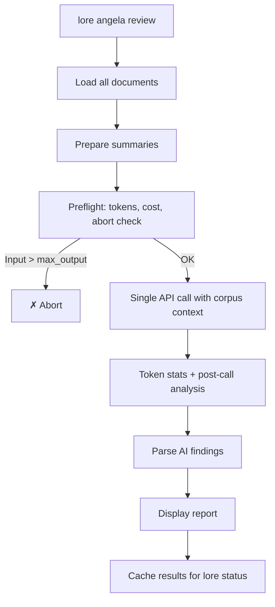

# lore angela review

Corpus-wide coherence analysis via AI.

## Synopsis

## What Does This Do?

`lore angela review` is the "big picture" analysis. While `angela draft` checks one document, `review` checks your **entire corpus** for coherence — contradictions between documents, isolated docs with no connections, stale content, and coverage gaps.

> **Analogy:** If `angela draft` is a teacher grading one essay, `angela review` is the dean reviewing the entire curriculum for consistency.


```
lore angela review [flags]
```

## Description

Analyzes the entire documentation corpus for coherence: contradictions between documents, isolated documents, stale content, coverage gaps. Combines local pre-analysis (signals) with a single AI API call.

**Requires** an AI provider configured.

## Real World Scenario

> The team has been documenting for 2 weeks. 15 documents in the corpus. Before the sprint review, you want to check consistency:
>
> ```bash
> lore angela review
> # 1 contradiction found: auth-jwt.md vs auth-session.md
> # 2 isolated documents with no cross-references
> ```
>
> You catch the contradiction before it confuses a new team member.


<!-- Generate: vhs assets/vhs/angela-review.tape -->

**Requires** an AI provider configured (`ai.provider` in `.lorerc`). For offline corpus analysis without an API, use `lore angela draft --all` instead.

## Flags

| Flag | Type | Default | Description |
|------|------|---------|-------------|
| `--quiet` | bool | `false` | Suppress header and summary on stderr |
| `--for` | string | | Adapt findings for a target audience (e.g., "CTO", "new developer") |
| `--path` | string | `.lore/docs` | Path to a markdown directory (standalone mode — no `lore init` required) |
| `--filter` | string | | Regex to filter documents by filename (e.g., `"commands/.*"`, `".*\.fr\.md$"`) |
| `--all` | bool | `false` | Review all documents (disables 25+25 sampling on large corpora) |

## Standalone Mode

Like `angela draft`, the review command supports `--path` for standalone usage:

```bash
lore angela review --path ./docs
```

In standalone mode, the review cache is not saved (no `.lore/` directory). See the [Angela in CI](../guides/angela-ci.md) guide for integration details.

## How It Works (Step by Step)

### Step 1/2: Preparing

```
[1/2] Preparing summaries for 12 documents…
      12 docs | ~2450 input tokens | max output: 1500 tokens | timeout: 60s
      Estimated cost: ~$0.0018
```

Angela runs the same **preflight checks** as polish:

- **Token estimate** — corpus size vs. max allowed output
- **Cost estimate** — estimated API cost in USD
- **Abort** — if input exceeds max_output, stops and suggests increasing `angela.max_tokens`
- **Warnings** — context window, timeout, cost alerts

### Step 2/2: Calling AI

A single API call reviews the entire corpus. A spinner shows progress:

```
      ✓ AI response received in 4.3s
      Tokens: 2450 → 890 ← | Model: claude-sonnet-4-20250514
      Speed: 207 tok/s (fast)
      Cost: ~$0.0015
```

## Output

```
Corpus Review — 12 documents analyzed

SEVERITY               TITLE                                DOCUMENTS                       DESCRIPTION
contradiction          Contradictory auth approach           auth-jwt.md, auth-session.md    JWT chosen in one, sessions in another
gap                    Isolated document                     note-meeting-2026-03-01.md      No references to/from other docs
style                  Coverage gap                          —                               No decisions documented for database layer

3 findings (1 contradiction, 1 gap, 1 style)
```

### Severity Types

| Severity | Meaning |
|----------|---------|
| `contradiction` | Conflicting information between documents |
| `gap` | Missing coverage or isolated documents |
| `obsolete` | Stale content that may need updating |
| `style` | Style inconsistencies across the corpus |

With `--for`, findings include a **relevance** field:

```
contradiction [high]   Contradictory auth approach       auth-jwt.md, auth-session.md  ...
```

## Process Flow



## Local Signals (always computed)

Pre-analysis without API calls:
- **Contradictions** — Documents about the same topic with conflicting content
- **Isolated docs** — No cross-references to/from other documents
- **Stale content** — Documents older than N days without updates

## Examples

```bash
# Full review (local signals + AI analysis)
lore angela review

# Review all docs (no 25+25 sampling — for large corpora)
lore angela review --all

# Filter: only review command docs
lore angela review --filter "commands/.*"

# Filter: only French docs
lore angela review --filter "\.fr\.md$"

# Combine: all Angela docs, adapted for CTO
lore angela review --filter "angela" --all --for "CTO"

# Standalone: review any markdown directory
lore angela review --path ./docs --all

# Quiet (for integration with lore status)
lore angela review --quiet

# Offline alternative: analyze all docs locally (no API needed)
lore angela draft --all
```

## Tuning

Control timeout and token limits via `.lorerc` or environment variables:

```yaml
# .lorerc
ai:
  timeout: 120s             # default: 60s — increase for large corpora

angela:
  max_tokens: 8192          # default: auto-computed — increase if preflight aborts
```

Or via env vars (useful in CI):

```bash
LORE_AI_TIMEOUT=120s LORE_ANGELA_MAX_TOKENS=8192 lore angela review --path ./docs --all
```

All flags combine freely:

```bash
lore angela review --path ./docs --filter "guides/.*" --all --for "CTO" --quiet
```

| Flag | Pipeline stage | Effect |
|------|----------------|--------|
| `--path` | Source | Which directory to scan |
| `--filter` | Selection | Which files to keep (regex on filename) |
| `--all` | Sampling | Send all docs, skip 25+25 sampling |
| `--for` | AI prompt | Adapt findings for a target audience |
| `--quiet` | Output | Suppress stderr messages |

## Tips & Tricks

- Run before every release: `lore angela review` catches contradictions that would confuse readers.
- **No API?** Use `lore angela draft --all` for free local analysis of every document.
- **`--filter` for focused reviews:** Review only the docs you changed (`--filter "commands/angela"`).
- **`--all` for thoroughness:** By default, corpora > 50 docs use 25+25 sampling. Use `--all` to review everything.
- Results are cached: `lore status` shows review findings without re-running.
- Large corpus (> 50 docs): Lore warns about token usage before the API call.
- **Use Haiku for reviews:** `LORE_AI_MODEL=claude-haiku-4-5-20251001` is 10x cheaper than Sonnet and fast enough for coherence checks.

## Exit Codes

| Code | Meaning |
|------|---------|
| `0` | Success |
| `1` | Error (no provider configured, corpus too small) |

## Common Questions

### "How is this different from angela draft?"

| | `angela draft` | `angela review` |
|---|---|---|
| **Scope** | One document | Entire corpus |
| **Cost** | Free (zero-API) | 1 API call |
| **Finds** | Missing sections, style issues | Contradictions, isolated docs, coverage gaps |

### "How often should I run this?"

Before every release, or every 1-2 weeks during active development. Results are cached — `lore status` shows the latest findings without re-running.

### "My corpus has 200+ documents. Will this be expensive?"

One API call regardless of corpus size. Lore compresses document summaries before sending. For very large corpora (50+ docs), Lore warns you about token usage before proceeding.

## See Also

- [lore angela draft](angela-draft.md) — Single document analysis
- [lore status](status.md) — Shows cached review findings
