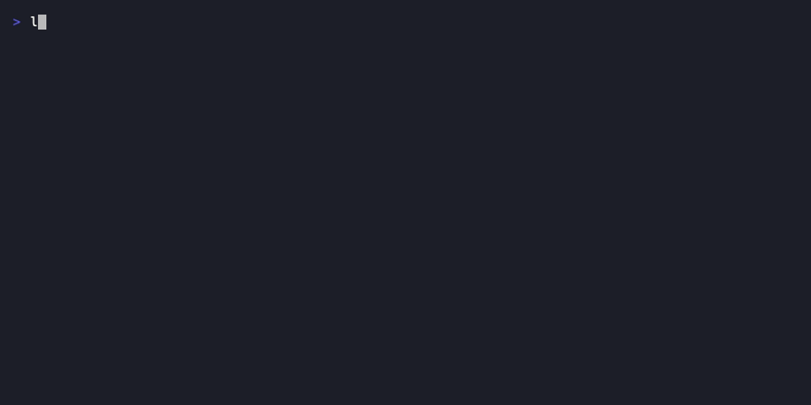

# lore completion

Generate shell completion scripts for tab-completion of all commands and flags.

## Synopsis

```
lore completion <bash|zsh|fish|powershell>
```

## What Does This Do?

After setup, pressing Tab after `lore ` shows all available commands. `lore an<TAB>` completes to `lore angela`, and `lore angela <TAB>` shows `draft`, `polish`, `review`. Tab completion saves keystrokes and surfaces commands you didn't know existed.

> **Analogy:** It's like autocomplete on your phone keyboard — but for Lore commands in your terminal.

## Real World Scenario

> You're tired of typing `lore angela polish` every time. Tab completion makes it `lore an<TAB> po<TAB>` — 6 keystrokes instead of 20.
>
> ```bash
> eval "$(lore completion zsh)"
> ```
>
> 15 seconds of setup, hours of saved keystrokes.


<!-- Generate: vhs assets/vhs/completion.tape -->

## Supported Shells

### Bash

```bash
# Temporary (current session only)
eval "$(lore completion bash)"

# Permanent
echo 'eval "$(lore completion bash)"' >> ~/.bashrc
source ~/.bashrc
```

### Zsh

```bash
# Temporary
eval "$(lore completion zsh)"

# Permanent (option 1 — eval in .zshrc)
echo 'eval "$(lore completion zsh)"' >> ~/.zshrc

# Permanent (option 2 — generate to fpath)
lore completion zsh > "${fpath[1]}/_lore"
```

### Fish

```bash
# Temporary
lore completion fish | source

# Permanent
lore completion fish > ~/.config/fish/completions/lore.fish
```

### PowerShell

```powershell
# Temporary
lore completion powershell | Out-String | Invoke-Expression

# Permanent — add to your profile
Add-Content $PROFILE 'lore completion powershell | Out-String | Invoke-Expression'
```

## Verify It Works

After reloading your shell, type `lore ` and press Tab:

```
$ lore <TAB>
angela      check-update  completion  config      decision    delete
demo        doctor        hook        init        list        new
pending     release       show        status      upgrade
```

Type `lore show --<TAB>` to see flags:

```
$ lore show --<TAB>
--all       --after     --bugfix    --decision  --feature
--note      --quiet     --refactor  --type
```

## Pro Tips

- **Aliases:** Combine with shell aliases for maximum speed:
  ```bash
  alias ls='lore show'
  alias ll='lore list'
  alias ld='lore doctor'
  alias la='lore angela'
  ```
- **Fish is the easiest:** Fish loads completions from `~/.config/fish/completions/` automatically — no `source` needed.
- **Zsh fpath method** is faster than `eval` — the completion is compiled once, not interpreted every shell startup.

## Flags

This command takes no flags. The shell name is a required positional argument.

**Valid arguments:** `bash`, `zsh`, `fish`, `powershell`

## Examples

```bash
# Generate for your shell and eval immediately
eval "$(lore completion zsh)"

# Save to a file for permanent setup
lore completion bash > /etc/bash_completion.d/lore
lore completion fish > ~/.config/fish/completions/lore.fish

# Check which shell you're using
echo $SHELL
# → /bin/zsh → use: lore completion zsh
```

## Common Questions

### "Which shell am I using?"

```bash
echo $SHELL
# → /bin/zsh    → lore completion zsh
# → /bin/bash   → lore completion bash
# → /usr/bin/fish → lore completion fish
```

On macOS, the default shell is Zsh since Catalina. On most Linux distros, it's Bash.

### "Do I need to re-run this after upgrading lore?"

Only if new commands were added. The completion script reflects lore's command list at generation time. After `lore upgrade`, regenerate:

```bash
eval "$(lore completion zsh)"
```

### "It says 'command not found: compinit'"

This is a Zsh-specific issue. Add this to your `~/.zshrc` before the completion eval:

```bash
autoload -Uz compinit && compinit
eval "$(lore completion zsh)"
```

## Exit Codes

| Code | Meaning |
|------|---------|
| `0` | Completion script generated |
| `1` | Error (invalid shell name) |

## See Also

- [Shell Completions guide](../getting-started/completions.md) — Detailed setup with troubleshooting
- [Commands Overview](index.md) — All available commands

