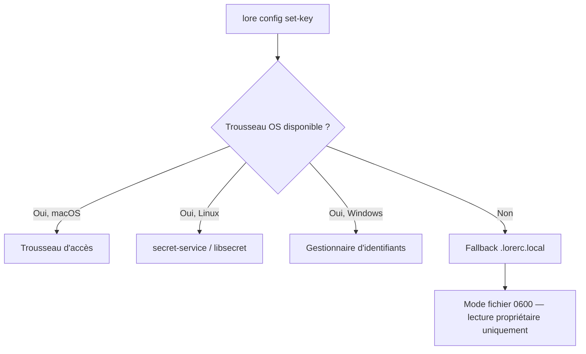

# lore config

Gérer les identifiants API et consulter la configuration.

## Synopsis

```
lore config <set-key|delete-key|list-keys>
```

## Qu'est-ce que ça fait ?

`lore config` gère les clés API qui alimentent les fonctions IA d'Angela. Les clés sont stockées de façon sécurisée dans le trousseau de votre OS — elles ne finissent jamais dans un fichier qu'on pourrait committer par accident.

## Scénario concret

> Vous venez de recevoir votre clé API Anthropic. Il est temps de débloquer Angela :
>
> ```bash
> lore config set-key anthropic
> # Enter API key: [masqué]
> # ✓ Clé stockée de façon sécurisée
> ```
>
> `lore angela polish` fonctionne maintenant. Votre clé est dans le trousseau OS — jamais dans un fichier en clair.


<!-- Generate: vhs assets/vhs/config.tape -->

## Sous-commandes

| Sous-commande | Description |
|---------------|-------------|
| `set-key <fournisseur>` | Stocker une clé API de façon sécurisée |
| `delete-key <fournisseur>` | Supprimer une clé stockée |
| `list-keys` | Afficher le statut de tous les fournisseurs |

**Fournisseurs connus :** `anthropic`, `openai`, `ollama`

## Flags

Cette commande n'a pas de flags. Le fournisseur est spécifié en argument.

## Comment le stockage des clés fonctionne

Lore essaie l'option la plus sécurisée d'abord, puis utilise un fallback :



- **macOS :** Trousseau d'accès (le même système qui stocke vos mots de passe WiFi)
- **Linux :** secret-service via D-Bus (GNOME Keyring, KDE Wallet)
- **Windows :** Gestionnaire d'identifiants Windows
- **Fallback :** `.lorerc.local` avec `chmod 600` (lisible uniquement par vous)

## Exemples

### Configurer Anthropic (Claude)

```bash
lore config set-key anthropic
# → Enter API key: [masqué — pas d'écho]
# → ✓ Clé stockée pour anthropic

# Vérifier
lore config list-keys
# anthropic     stored
# openai        not set
# ollama        stored
```

### Configurer OpenAI (GPT)

```bash
lore config set-key openai
# → Enter API key: [masqué]
# → ✓ Clé stockée pour openai
```

### Configurer Ollama (Local — Pas de clé nécessaire)

```bash
# Ollama tourne localement, pas de clé API requise
# Configurez simplement l'endpoint dans .lorerc :
```

```yaml
# .lorerc
ai:
  provider: "ollama"
  model: "llama3"
  endpoint: "http://localhost:11434"
```

### Supprimer une clé

```bash
lore config delete-key anthropic
# → ✓ Clé supprimée pour anthropic
```

### Vérifier tous les fournisseurs

```bash
lore config list-keys
# anthropic     stored
# openai        not set
# ollama        not set
```

### CI/CD (Pas de trousseau)

En CI, utilisez les variables d'environnement :

```bash
export LORE_AI_API_KEY="sk-ant-..."
export LORE_AI_PROVIDER="anthropic"
# Les commandes Angela les utilisent automatiquement
```

## Questions fréquentes

### "Où exactement est stockée ma clé ?"

Lancez `lore config list-keys`. Si le statut affiche "stored", la clé est dans votre trousseau OS. En cas de fallback, elle est dans `.lorerc.local` (gitignored, chmod 600).

Backend keychain par plateforme :

| Plateforme | Backend | Outil utilisé |
|------------|---------|---------------|
| **macOS** | Trousseau système | `security add-generic-password` / `find-generic-password` |
| **Linux** | GNOME Keyring / KWallet | `secret-tool store` / `secret-tool lookup` |
| **Windows** | Credential Manager | Fallback sur `.lorerc.local` (keychain natif prévu) |

### "J'ai mis la clé mais Angela dit 'pas de fournisseur configuré'"

Deux choses sont nécessaires :
1. La **clé** (via `lore config set-key`)
2. Le **nom du fournisseur** dans `.lorerc` :

```yaml
ai:
  provider: "anthropic"   # dit à Angela quel fournisseur utiliser
  model: "claude-sonnet-4-20250514"
```

La clé seule ne suffit pas — lore doit aussi savoir vers quel fournisseur la router.

### "Puis-je avoir des clés différentes par projet ?"

Oui. `.lorerc.local` est par projet (il vit dans la racine de votre projet, pas globalement). Différents projets peuvent utiliser différents fournisseurs et clés.

### "C'est sécurisé ?"

- Trousseau OS : même sécurité que vos mots de passe sauvegardés
- Fallback `.lorerc.local` : mode fichier `0600` (vous seul pouvez lire)
- `.lorerc.local` est dans `.gitignore` — jamais committé
- Les clés sont nettoyées des messages d'erreur (Angela ne divulgue jamais votre clé dans les sorties)

## Tips & Tricks

- **Préférez `lore config set-key`** plutôt qu'éditer `.lorerc.local` manuellement — le trousseau est plus sécurisé.
- **CI/CD :** Utilisez la variable `LORE_AI_API_KEY` — pas de trousseau nécessaire en CI.
- **Ollama = gratuit :** Pas de clé API, pas de coût. Idéal pour expérimenter avant de s'engager avec un fournisseur payant.
- **Rotation des clés :** `delete-key` puis `set-key` pour remplacer une clé expirée ou compromise.
- **Valider après setup :** Lancez `lore angela draft` sur un document pour confirmer que le fournisseur fonctionne.

## Codes de sortie

| Code | Signification |
|------|---------------|
| `0` | Succès |
| `1` | Erreur (fournisseur invalide, trousseau indisponible) |
| `3` | Arguments invalides (nom de fournisseur inconnu) |

## Voir aussi

- [Guide configuration](../guides/configuration.md) — Référence complète avec exemples `.lorerc`
- [lore angela draft](angela-draft.md) — Tester votre setup (zéro-API, pas de clé)
- [lore angela polish](angela-polish.md) — Utilise la clé configurée
- [lore doctor --config](doctor.md) — Valider votre configuration
