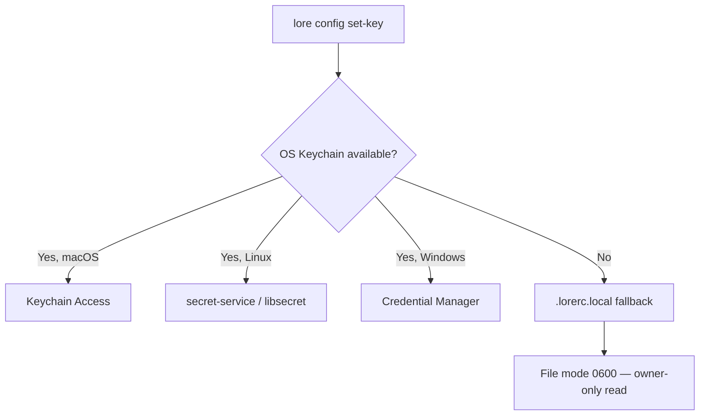

# lore config

Manage API credentials and view configuration.

## Synopsis

```
lore config <set-key|delete-key|list-keys>
```

## What Does This Do?

`lore config` manages the API keys that power Angela's AI features. Think of it like a password manager specifically for your AI providers — it stores keys securely in your OS keychain so they never end up in a file someone could accidentally commit.

> **Analogy:** It's like the settings page of an app. You don't use it every day, but when you need to connect a new service, this is where you go.

## Real World Scenario

> You just got your Anthropic API key. Time to unlock Angela:
>
> ```bash
> lore config set-key anthropic
> # Enter API key: [hidden]
> # ✓ Key stored securely
> ```
>
> Now `lore angela polish` works. Your key is in the OS keychain — never in a plaintext file.

## Subcommands

| Subcommand | Description |
|------------|-------------|
| `set-key <provider>` | Store an API key securely |
| `delete-key <provider>` | Remove a stored API key |
| `list-keys` | Show status of all providers |

**Known providers:** `anthropic`, `openai`, `ollama`

## Flags

This command has no flags. Provider is specified as an argument.

## How Key Storage Works

Lore tries the most secure option first, then falls back:



- **macOS:** Keychain Access (the same system that stores your WiFi passwords)
- **Linux:** secret-service via D-Bus (GNOME Keyring, KDE Wallet)
- **Windows:** Windows Credential Manager
- **Fallback:** `.lorerc.local` with `chmod 600` (readable only by you)

## Examples

### Set up Anthropic (Claude)

```bash
lore config set-key anthropic
# → Enter API key: [hidden — no echo]
# → ✓ Key stored for anthropic

# Verify
lore config list-keys
# anthropic     stored
# openai        not set
# ollama        stored
```

### Set up OpenAI (GPT)

```bash
lore config set-key openai
# → Enter API key: [hidden]
# → ✓ Key stored for openai
```

### Set up Ollama (Local — No Key Needed)

```bash
# Ollama runs locally, no API key required
# Just configure the endpoint in .lorerc:
```

```yaml
# .lorerc
ai:
  provider: "ollama"
  model: "llama3"
  endpoint: "http://localhost:11434"
```

### Remove a key

```bash
lore config delete-key anthropic
# → ✓ Key removed for anthropic
```

### Check all providers

```bash
lore config list-keys
# anthropic     stored
# openai        not set
# ollama        not set
```

### CI/CD (No Keychain)

In CI, use environment variables instead:

```bash
export LORE_AI_API_KEY="sk-ant-..."
export LORE_AI_PROVIDER="anthropic"
# Angela commands will use these automatically
```

## Common Questions

### "Where exactly is my key stored?"

Run `lore config list-keys`. If it says "stored," the key is in your OS keychain. If you're using the fallback, it's in `.lorerc.local` (which is gitignored and chmod 600).

### "I set the key but Angela still says 'no provider configured'"

Two things are needed:
1. The **key** (via `lore config set-key`)
2. The **provider name** in `.lorerc`:

```yaml
ai:
  provider: "anthropic"   # This tells Angela WHICH provider to use
  model: "claude-sonnet-4-20250514"
```

The key alone isn't enough — Lore needs to know which provider to send it to.

### "Can I have different keys per project?"

Yes. `.lorerc.local` is per-project (it lives in your project root, not globally). Different projects can use different providers and keys.

### "Is it safe?"

- OS keychain: same security as your saved passwords
- `.lorerc.local` fallback: file mode `0600` (only you can read)
- `.lorerc.local` is in `.gitignore` — never committed
- Keys are scrubbed from error messages (Angela never leaks your key in output)

## Tips & Tricks

- **Always use `lore config set-key`** rather than editing `.lorerc.local` manually — the keychain is more secure.
- **CI/CD:** Use `LORE_AI_API_KEY` env var — no keychain needed in CI.
- **Ollama = free:** No API key, no cost. Great for experimenting before committing to a paid provider.
- **Rotate keys:** `delete-key` then `set-key` to replace an expired or compromised key.
- **Validate after setup:** Run `lore angela draft` on any document to confirm the provider works.

## Exit Codes

| Code | Meaning |
|------|---------|
| `0` | Success |
| `1` | Error (invalid provider, keychain unavailable) |
| `3` | Invalid arguments (unknown provider name) |

## See Also

- [Configuration guide](../guides/configuration.md) — Full config reference with `.lorerc` examples
- [lore angela draft](angela-draft.md) — Test your setup (zero-API, no key needed)
- [lore angela polish](angela-polish.md) — Uses the configured key
- [lore doctor --config](doctor.md) — Validate your configuration
