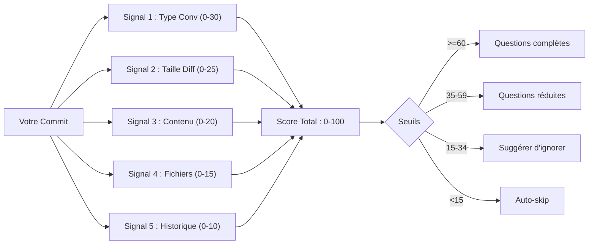

# lore decision

Comprendre comment Lore décide quels commits ont besoin de documentation.

## Synopsis

```
lore decision [flags]
```

## Qu'est-ce que ça fait ?

Lore ne vous demande pas de documenter chaque commit. Un fix de typo dans le README n'a pas besoin d'un "pourquoi." Mais ajouter un nouveau système d'authentification, si. Le **Decision Engine** détermine lequel est lequel.

`lore decision` vous montre le scoring du moteur pour n'importe quel commit.

> **Analogie :** Pensez au Decision Engine comme un filtre email intelligent. Comme Gmail décide "important" vs "spam", le moteur de Lore décide "ce commit a besoin de documentation" vs "celui-ci peut être ignoré."

## Scénario concret

> Vous avez commité un fix de typo dans le README. Lore vous a posé les 5 questions. C'était excessif. Pourquoi ?
>
> ```bash
> lore decision --explain HEAD
> # Score : 72/100 — feat détecté dans le type de commit
> ```
>
> Votre message commençait par `feat:` au lieu de `docs:`. Le Decision Engine l'a scoré haut. Corrigez le préfixe et Lore auto-skip la prochaine fois.

## Flags

| Flag | Type | Défaut | Description |
|------|------|--------|-------------|
| `--explain <ref>` | string | HEAD | Quel commit analyser |
| `--calibration` | bool | `false` | Afficher les métriques de qualité du moteur |

## Comment le scoring fonctionne

Le moteur combine **5 signaux** pour un score de 0 à 100 :



### Les 5 signaux expliqués

| # | Signal | Ce qu'il regarde | Score haut = | Score bas = |
|---|--------|------------------|--------------|-------------|
| 1 | **Type Conv** | `feat:`, `fix:`, `docs:`... | `feat` ou `fix` = important | `docs`, `style`, `ci` = trivial |
| 2 | **Taille Diff** | Lignes ajoutées + supprimées | 10-500 lignes = optimal | Trop petit (1 ligne) ou trop gros (2000+) |
| 3 | **Contenu** | Mots-clés dans le diff | Auth, database, security = critique | Seulement des commentaires changés |
| 4 | **Fichiers** | Quels fichiers ont changé | Fichiers source `.go` = valeur haute | Tests, configs = plus bas |
| 5 | **Historique** | Taux de documentation passé | Ce scope est souvent documenté | Ce scope est rarement documenté |

### Score → Action

| Score | Action | Ce que vous voyez |
|-------|--------|-------------------|
| **>= 60** | `ask-full` | Les 5 questions (Type, What, Why, Alternatives, Impact) |
| **35–59** | `ask-reduced` | 2 questions (Type, What) |
| **15–34** | `suggest-skip` | "Ignorer la documentation ? [O/n]" |
| **< 15** | `auto-skip` | Rien ne se passe (silencieux) |

## Sortie

```bash
lore decision --explain HEAD
```

```
Commit      e4f5a6b
Subject     feat(auth): add JWT middleware
Score       72/100
Action      ask-full
Confidence  95.0%

SIGNAL       SCORE  RAISON
conv-type    +15    feat → always_ask override
diff-size    +22    changement modéré (180 lignes)
content      +18    mots-clés critiques : auth, middleware, token
files        +12    3 fichiers .go dans internal/ (haute valeur)
lks-history  +5     scope "auth" — 60% taux de documentation
```

## Overrides (contourner le scoring)

```yaml
# .lorerc
decision:
  always_ask: [feat, breaking]          # Toujours poser toutes les questions
  always_skip: [docs, style, ci, build] # Toujours ignorer
  critical_scopes: [security, payments] # Toujours documenter ces zones
```

## Questions fréquentes

### "Le score semble faux pour mon commit"

Lancez `lore decision --explain HEAD` pour voir quel signal a le plus contribué. Cause courante : le message commence par `feat:` au lieu de `docs:`.

### "Puis-je forcer la documentation pour un commit ?"

Oui — `always_ask` dans `.lorerc` pour des types permanents, ou retirez le `[doc-skip]` du message.

### "Combien de temps avant que le moteur apprenne ?"

Le Signal 5 (Historique LKS) s'active après 20 commits. Après 50+, la précision s'améliore notablement.

## Tips & Tricks

- **"Pourquoi ignoré ?"** → `lore decision --explain <hash>` montre le détail.
- **Forcer la doc :** `always_ask: [feat]` dans `.lorerc`.
- **Skip ponctuel :** `[doc-skip]` dans le message de commit.
- **Ajuster :** Commencez par les défauts, ajustez après 50+ commits via `--calibration`.
- **Le moteur apprend :** Après 20 commits, le Signal 5 s'adapte à vos patterns.

## Codes de sortie

| Code | Signification |
|------|---------------|
| `0` | Succès |
| `1` | Erreur |

## Voir aussi

- [Détection contextuelle](../guides/contextual-detection.md) — Règles qui s'exécutent *avant* le Decision Engine
- [Configuration](../guides/configuration.md) — Ajuster les seuils et overrides
- [lore status](status.md) — Santé documentaire globale
