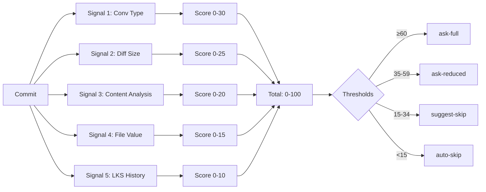

# lore decision

Statut du moteur de décision, analyse de scoring et calibration.

## Synopsis

```
lore decision [flags]
```

## Description

Analyse le score de documentation d'un commit à l'aide du moteur de décision. Montre quels signaux ont contribué au score et quelle action serait entreprise (questions complètes, réduites, suggestion de skip ou auto-skip).

## Flags

| Flag | Type | Défaut | Description |
|------|------|--------|-------------|
| `--explain` | string | HEAD | Commit à analyser (hash ou référence) |
| `--calibration` | bool | `false` | Afficher les métriques de qualité du moteur |

## Sortie du scoring

```
Commit      e4f5a6b
Subject     feat(auth): add JWT middleware
Score       72/100
Action      ask-full
Confidence  95.0%

SIGNAL       SCORE  REASON
conv-type    +15    feat → always_ask override
diff-size    +22    moderate change (180 lines)
content      +18    critical area: auth, middleware
files        +12    3 .go files changed (high value)
lks-history  +5     scope "auth" — 60% documented rate

Prefill:
  What: "Add JWT middleware" (from subject)
  Why:  — (no body, confidence 0.0)
```

## Signaux du moteur de décision



## Seuils de score

| Seuil | Défaut | Action |
|-------|--------|--------|
| `threshold_full` | 60 | Poser toutes les questions (Type, What, Why, Alternatives, Impact) |
| `threshold_reduced` | 35 | Poser les questions minimales (Type, What) |
| `threshold_suggest` | 15 | Confirmer le skip avec l'utilisateur |
| En dessous de suggest | — | Auto-skip silencieux |

**Surcharges** (dans `.lorerc`) :
- `decision.always_ask: [feat, breaking]` → Force `ask-full`
- `decision.always_skip: [docs, style, ci, build]` → Force `auto-skip`
- `decision.critical_scopes: [security, payments]` → Force `ask-full`

## Mode calibration

```bash
lore decision --calibration
# → Affiche les métriques de précision à partir des commits enregistrés
# → Hit rate, faux positifs, faux négatifs
```

## Exemples

```bash
# Analyser le commit HEAD
lore decision

# Analyser un commit spécifique
lore decision --explain abc1234

# Vérifier la qualité du moteur
lore decision --calibration
```

## Tips & Tricks

- Utilisez `lore decision --explain` pour comprendre pourquoi un commit a été ignoré ou a reçu le questionnaire complet.
- Ajustez les seuils dans `.lorerc` si le moteur ignore des commits que vous souhaitez documenter (abaissez `threshold_full`).
- `always_ask` et `always_skip` sont vos contrôles les plus puissants — ils contournent entièrement le scoring.
- Le signal LKS History s'améliore avec le temps : après 20+ commits, le moteur apprend vos habitudes.

## Voir aussi

- [lore status](status.fr.md) — Santé globale
- [Détection contextuelle](../guides/contextual-detection.md) — Règles de détection pré-moteur
- [Configuration](../guides/configuration.md) — Ajuster les seuils
