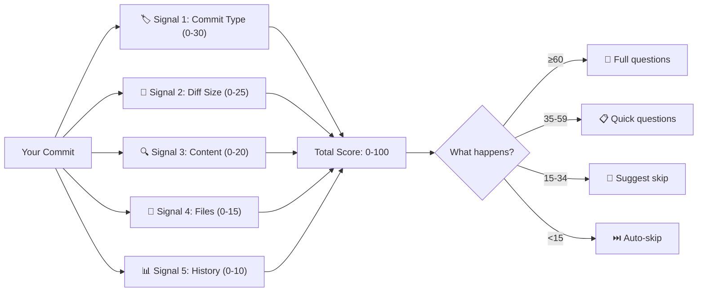

# lore decision

Understand how Lore decides which commits need documentation.

## Synopsis

```
lore decision [flags]
```

## What Does This Do?

Lore doesn't ask you to document every single commit. A `README.md` typo fix doesn't need a "why." But adding a new authentication system definitely does. The **Decision Engine** figures out which is which.

`lore decision` shows you the engine's scoring for any commit — so you can understand and tune its behavior.

> **Analogy:** Think of the Decision Engine like a smart email filter. Just like Gmail decides "this is important" vs "this is spam," Lore's engine decides "this commit needs documentation" vs "this one can be skipped."

## Flags

| Flag | Type | Default | Description |
|------|------|---------|-------------|
| `--explain <ref>` | string | HEAD | Which commit to analyze |
| `--calibration` | bool | `false` | Show engine accuracy metrics |

## How Scoring Works

The engine combines **5 signals** to produce a score from 0 to 100:



### The 5 Signals Explained

| # | Signal | What it looks at | High score means | Low score means |
|---|--------|------------------|------------------|-----------------|
| 1 | **Commit Type** | `feat:`, `fix:`, `docs:`, etc. | `feat` or `fix` = important | `docs`, `style`, `ci` = trivial |
| 2 | **Diff Size** | Lines added + deleted | 10-500 lines = sweet spot | Too tiny (1 line) or too huge (2000+) |
| 3 | **Content** | Keywords in the diff | Auth, database, security = critical | Only comments/docs changed |
| 4 | **Files** | Which files changed | `.go` source files = valuable | Test files, configs = lower |
| 5 | **History** | Past documentation rate | This scope is often documented | This scope is rarely documented |

### Score → Action

| Score | Action | What you experience |
|-------|--------|---------------------|
| **≥ 60** | `ask-full` | All 5 questions (Type, What, Why, Alternatives, Impact) |
| **35–59** | `ask-reduced` | Only 2 questions (Type, What) |
| **15–34** | `suggest-skip` | "Skip documentation for this commit? [Y/n]" |
| **< 15** | `auto-skip` | Nothing happens (silent) |

## Output

```bash
lore decision --explain HEAD
```

```
Commit      e4f5a6b
Subject     feat(auth): add JWT middleware
Score       72/100
Action      ask-full
Confidence  95.0%

SIGNAL       SCORE  REASON
conv-type    +15    feat → always_ask override
diff-size    +22    moderate change (180 lines added)
content      +18    critical keywords: auth, middleware, token
files        +12    3 .go files in internal/ (high value)
lks-history  +5     scope "auth" — 60% documentation rate

Prefill:
  What: "Add JWT middleware" (extracted from subject)
  Why:  — (no commit body, confidence 0.0)
```

### What "Confidence" Means

- **95-100%:** All 5 signals computed, store.db available. Very reliable.
- **80%:** Store unavailable (Signal 5 missing). Still good.
- **< 80%:** Some signals couldn't be computed. Score may be inaccurate.

### What "Prefill" Means

Lore tries to **pre-fill** the "What" and "Why" fields from your commit message:

- **What:** Extracted from the commit subject (first line)
- **Why:** Extracted from the commit body (if you write one)
- **Why Confidence:** 0.0 = no body found, 1.0 = clear rationale in body

> **Tip:** Write descriptive commit messages and Lore pre-fills answers for you!

## Overrides (Bypass Scoring)

You can force certain behaviors in `.lorerc`:

```yaml
decision:
  always_ask: [feat, breaking]          # Always ask full questions for these types
  always_skip: [docs, style, ci, build] # Always skip these types
  critical_scopes: [security, payments] # Always ask for these code areas
```

| Override | Effect | Example |
|----------|--------|---------|
| `always_ask` | Score ignored → full questions | Every `feat:` commit gets documented |
| `always_skip` | Score ignored → silent skip | `ci:` changes never trigger questions |
| `critical_scopes` | Score boosted → full questions | Changes in `payments/` always documented |

## Calibration Mode

After 20+ commits, the engine learns your patterns. Check how well it's doing:

```bash
lore decision --calibration
```

Shows accuracy metrics: hit rate, false positives (asked when shouldn't have), false negatives (skipped when shouldn't have).

## Tuning Thresholds

If the engine skips too many commits you care about, lower the thresholds:

```yaml
# .lorerc
decision:
  threshold_full: 50      # Default: 60. Lower = more full questions
  threshold_reduced: 25    # Default: 35. Lower = more reduced questions
  threshold_suggest: 10    # Default: 15. Lower = fewer auto-skips
```

If the engine asks too often, raise them.

## Tips & Tricks

- **"Why was my commit skipped?"** → Run `lore decision --explain <hash>` to see the score breakdown.
- **Force documentation:** Add `always_ask: [feat]` in `.lorerc` to always document features.
- **Force skip:** Use `[doc-skip]` in your commit message for a one-time skip.
- **Tune over time:** Start with defaults, then adjust after 50+ commits based on `--calibration`.
- **The engine learns:** After 20 commits, Signal 5 (History) kicks in and adapts to your patterns.

## Exit Codes

| Code | Meaning |
|------|---------|
| `0` | Success |
| `1` | Error |

## See Also

- [Contextual Detection](../guides/contextual-detection.md) — Rules that run *before* the Decision Engine
- [Configuration](../guides/configuration.md) — Tune thresholds and overrides
- [lore status](status.md) — Overall documentation health
