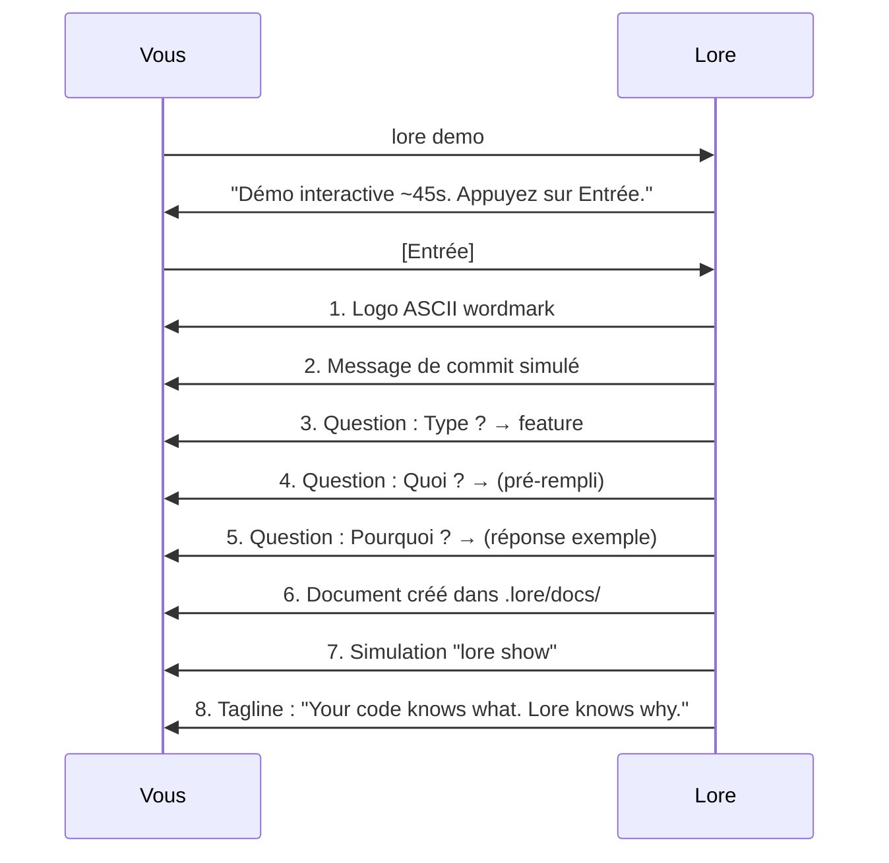

# lore demo

Démonstration interactive du flux lore — sans risque, sans configuration.

## Synopsis

```
lore demo
```

## Qu'est-ce que ça fait ?

Lance une simulation guidée de ~45 secondes du flux complet de documentation : commit → questions → document → consultation. Un vrai fichier est créé et marqué "demo" pour un nettoyage facile.

## Scénario concret

> Votre tech lead est sceptique à propos d'un "énième outil." Vous avez 45 secondes pour le convaincre :
>
> ```bash
> lore demo
> ```
>
> Il voit le flux complet — commit, questions, document, consultation. Pas de setup, pas de risque, aucun fichier modifié (sauf un doc démo dans `.lore/docs/`).

## Flags

Cette commande ne prend pas de flags. Elle s'exécute de manière interactive et nécessite que `.lore/` soit initialisé.

## Ce qui se passe étape par étape



### Détails

1. **Consentement** — Affiche "~45 secondes" et attend Entrée. Pas de surprise.
2. **Logo** — Wordmark ASCII (Unicode ou fallback ASCII selon le terminal)
3. **Commit simulé** — Un exemple de message de commit apparaît
4. **Flux de questions** — Type, Quoi, Pourquoi — avec des pauses réalistes entre chaque
5. **Document créé** — Un vrai fichier dans `.lore/docs/` avec `status: "demo"` dans le front matter
6. **lore show** — Simule la consultation du document créé
7. **Tagline** — EN : "Your code knows what. Lore knows why." / FR : "Votre code sait quoi. Lore sait pourquoi."
8. **Prochaine étape** — Suggère `lore init` si vous souhaitez continuer

Chaque étape pause ~800ms (respecte Ctrl+C — vous pouvez sortir à tout moment).

## Après la démo

Le document créé a `status: "demo"`. Il est exclu des métriques de couverture et peut être supprimé sans confirmation :

```bash
# Voir le document démo
lore list
# → demo  example-demo-2026-03-16.md  2026-03-16

# Le supprimer (pas de confirmation pour les docs démo)
lore delete example-demo-2026-03-16.md

# Ou le laisser — il n'affecte pas vos métriques
```

## Bilingue

La démo s'adapte à votre paramètre `language` :

| Langue | Tagline |
|--------|---------|
| EN | "Your code knows what. Lore knows why." |
| FR | "Votre code sait quoi. Lore sait pourquoi." + "L'or de vos décisions techniques." (dim) |

La version française ajoute le jeu de mots "L'or" en seconde ligne subtile — un easter egg de marque que les francophones découvrent naturellement.

## Questions fréquentes

### "Ça modifie mon repo ?"

Seulement `.lore/docs/` — un document démo est créé. Votre code, historique git et configuration sont intacts. Le document a `status: "demo"` et est exclu des métriques.

### "Dois-je lancer `lore init` d'abord ?"

Oui — `.lore/` doit exister. Sinon, la démo vous l'indiquera.

### "Je peux montrer ça en screen share ?"

C'est exactement à ça que ça sert. 45 secondes, visuel, auto-explicatif. Pas de slides nécessaires.

## Codes de sortie

| Code | Signification |
|------|---------------|
| `0` | Démo terminée |
| `1` | Erreur (`.lore/` non initialisé) |

## Exemples

```bash
# Lancer la démo (nécessite lore init d'abord)
lore demo
# → Démo interactive ~45s. Appuyez sur Entrée.
# → [Entrée]
# → ... (logo, questions, document, show) ...
# → Your code knows what. Lore knows why.

# Nettoyer le document démo après
lore list --type demo
lore delete example-demo-2026-03-16.md
# → Pas de confirmation pour les docs démo
```

## Tips & Tricks

- **Convaincre votre équipe :** `lore demo` est le moyen le plus rapide de montrer lore à vos collègues — 45 secondes, pas de slides.
- **Adapté au screen sharing :** Les pauses entre étapes sont conçues pour les démonstrations en direct.
- **Sûr de relancer :** Chaque démo crée un nouveau document. Les anciens se suppriment sans confirmation.
- **Les docs démo ne comptent pas :** Les documents avec `status: "demo"` sont exclus des métriques de couverture dans `lore status`.

## Voir aussi

- [lore init](init.md) — Initialiser lore pour de vrai (prochaine étape après la démo)
- [Quickstart](../getting-started/quickstart.md) — Guide pratique 5 minutes
- [Philosophie](../guides/philosophy.md) — Pourquoi lore existe
