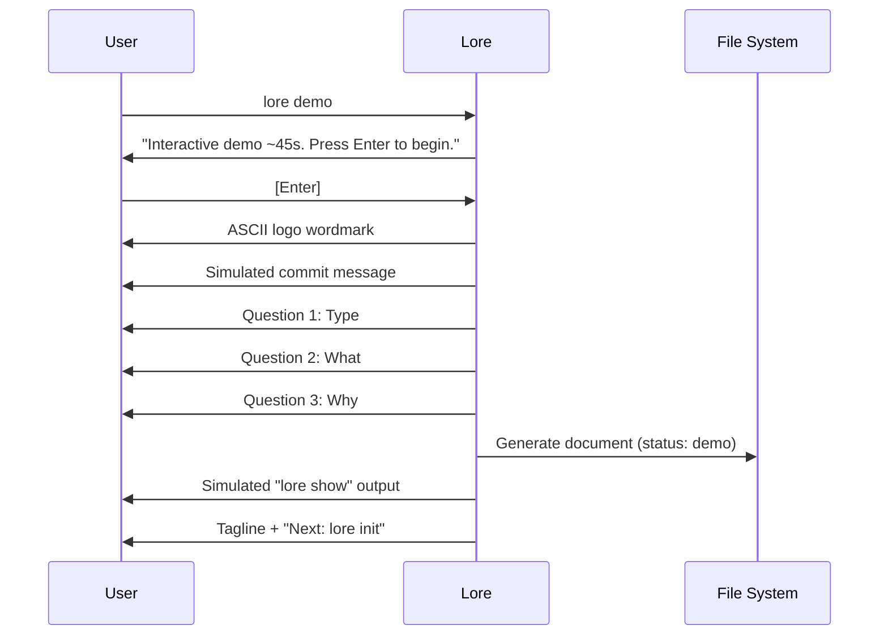

# lore demo

Démonstration interactive du flux de travail Lore.

## Synopsis

```
lore demo
```

## Description

Lance une simulation guidée d'environ 45 secondes du flux de documentation complet. Crée un vrai document de démo (marqué `status: "demo"`). Sans risque — les documents de démo sont clairement identifiés et faciles à supprimer.

## Séquence de la démo



## Details de comportement

1. **Consentement temporel** — Affiche la durée estimée et attend la touche Entrée (pas de surprise)
2. **Affichage du logo** — Wordmark ASCII (Unicode ou fallback ASCII selon le terminal)
3. **Flux simulé** — Faux commit → 3 questions avec pauses → document généré
4. **Vrai document** — Le document de démo est réellement créé dans `.lore/docs/` avec `status: "demo"`
5. **Accroche** — EN : "Your code knows what. Lore knows why." / FR : "Votre code sait quoi. Lore sait pourquoi."
6. **Chaque étape** — Pause de 800ms (respecte Ctrl+C)

## Exemples

```bash
# Lancer la démo
lore demo
# → ~45 secondes, interactif

# Nettoyer les documents de démo ensuite
lore delete demo-example-2026-03-16.md
# → Aucune confirmation requise pour les documents de démo
```

## Tips & Tricks

- Lancez `lore demo` pour présenter Lore à vos collègues sans toucher au vrai corpus.
- Les documents de démo ont `status: "demo"` dans leur front matter et sont exclus des métriques de couverture.
- Après la démo, `lore init` est l'étape suivante naturelle.

## Voir aussi

- [lore init](init.fr.md) — Initialiser Lore pour de vrai
- [Quickstart](../getting-started/quickstart.md) — Guide pratique en 5 minutes
