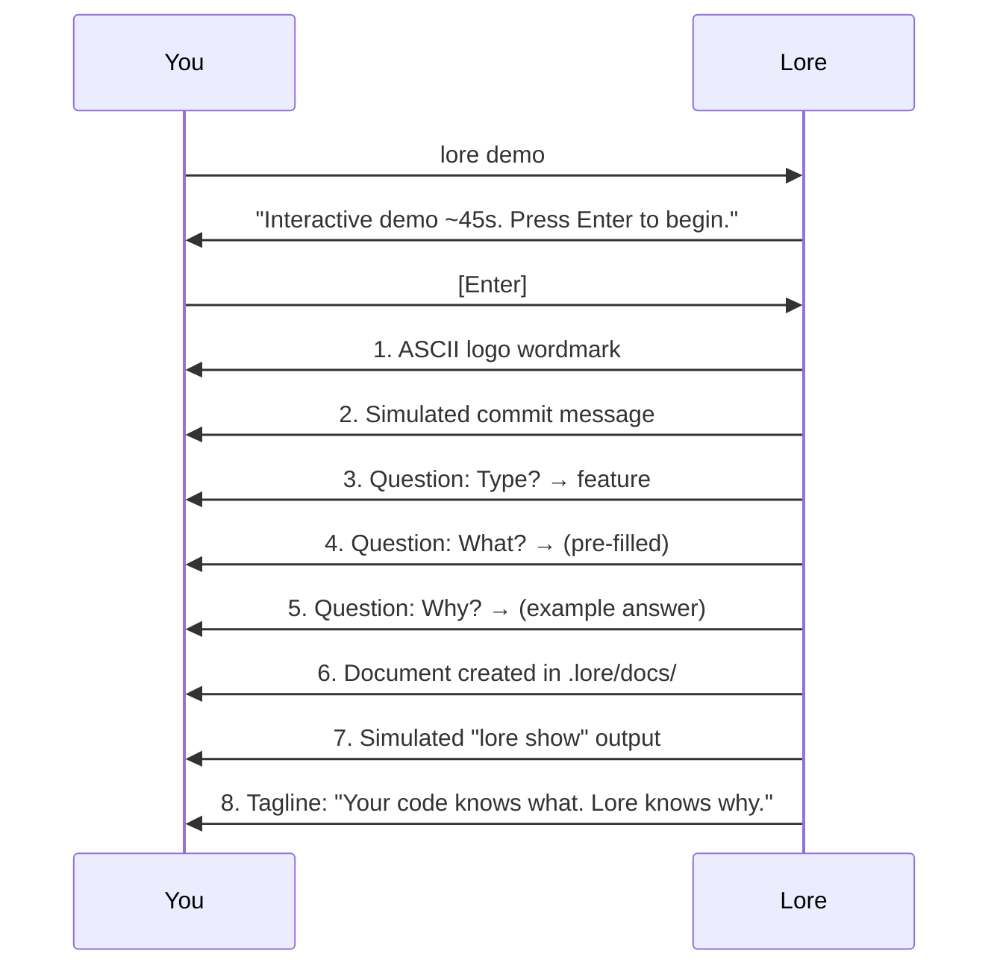

# lore demo

Interactive demonstration of the Lore workflow — safe, no setup required.

## Synopsis

```
lore demo
```

## What Does This Do?

Runs a guided ~45-second simulation of the complete documentation flow: commit → questions → document → retrieval. A real file is created and marked as "demo" for easy cleanup.

> **Analogy:** Like a test drive — you experience the full thing without buying. `lore demo` shows Lore's complete workflow with no commitment.

## Real World Scenario

> Your tech lead is skeptical about "yet another tool." You have 45 seconds to convince them:
>
> ```bash
> lore demo
> ```
>
> They see the full flow — commit, questions, document, retrieval. No setup, no risk, no files modified (except one demo doc in `.lore/docs/`).

## Flags

This command takes no flags. It runs interactively and requires `.lore/` to be initialized.

## What Happens Step by Step



### Details

1. **Consent** — Displays "~45 seconds" and waits for Enter. No surprises.
2. **Logo** — ASCII wordmark (Unicode or ASCII fallback based on terminal)
3. **Simulated commit** — A sample commit message appears
4. **Question flow** — Type, What, Why — with realistic pauses between each
5. **Document created** — A real file in `.lore/docs/` with `status: "demo"` in front matter
6. **lore show** — Simulates retrieving the document you just created
7. **Tagline** — EN: "Your code knows what. Lore knows why." / FR: "Votre code sait quoi. Lore sait pourquoi."
8. **Next step** — Suggests `lore init` if you want to continue

Each step pauses for ~800ms (respects Ctrl+C — you can exit anytime).

## After the Demo

The demo creates a real document with `status: "demo"`. It's excluded from coverage metrics and can be deleted without confirmation:

```bash
# See the demo document
lore list
# → demo  example-demo-2026-03-16.md  2026-03-16

# Delete it (no confirmation needed for demo docs)
lore delete example-demo-2026-03-16.md

# Or just leave it — it doesn't affect your metrics
```

## Bilingual

The demo adapts to your `language` setting:

| Language | Tagline |
|----------|---------|
| EN | "Your code knows what. Lore knows why." |
| FR | "Votre code sait quoi. Lore sait pourquoi." + "L'or de vos décisions techniques." (dim) |

The French version adds the "L'or" wordplay as a subtle second line — a brand easter egg that francophones naturally discover.

## Common Questions

### "Does it modify my repo?"

Only `.lore/docs/` — one demo document is created. Your code, git history, and configuration are untouched. The document has `status: "demo"` and is excluded from metrics.

### "Do I need to run `lore init` first?"

Yes — `.lore/` must exist. If not initialized, the demo will tell you.

### "Can I show this to someone over a screen share?"

That's exactly what it's for. 45 seconds, visual, self-explanatory. No slides needed.

## Exit Codes

| Code | Meaning |
|------|---------|
| `0` | Demo completed |
| `1` | Error (`.lore/` not initialized) |

## Examples

```bash
# Run the demo (requires lore init first)
lore demo
# → Interactive demo ~45s. Press Enter to begin.
# → [Enter]
# → ... (logo, questions, document, show) ...
# → Your code knows what. Lore knows why.

# Clean up the demo document after
lore list --type demo
lore delete example-demo-2026-03-16.md
# → No confirmation needed for demo docs
```

## Tips & Tricks

- **Convince your team:** `lore demo` is the fastest way to show Lore to colleagues — 45 seconds, no slides.
- **Screen-sharing friendly:** The pauses between steps are designed for live demonstrations.
- **Safe to re-run:** Each run creates a new document. Old demo docs can be deleted without confirmation.
- **Demo docs do not count:** Documents with `status: "demo"` are excluded from coverage metrics in `lore status`.

## See Also

- [lore init](init.md) — Initialize Lore for real (next step after demo)
- [Quickstart](../getting-started/quickstart.md) — Hands-on 5-minute guide
- [Philosophy](../guides/philosophy.md) — Why Lore exists
