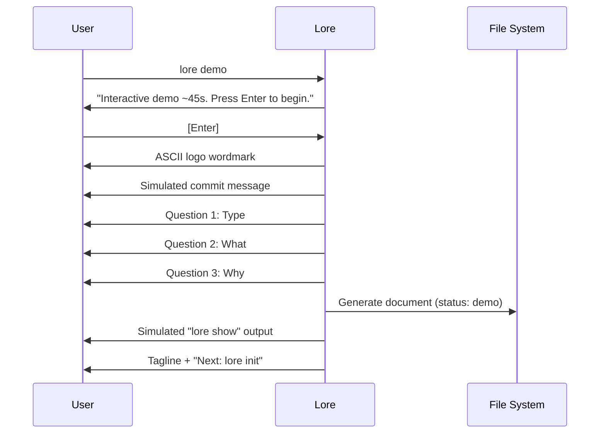

# lore demo

Interactive demonstration of the Lore workflow.

## Synopsis

```
lore demo
```

## Description

Runs a guided ~45-second simulation of the complete documentation flow. Creates a real demo document (marked with `status: "demo"`). Safe to run — demo docs are clearly tagged and easy to delete.

## Demo Sequence



## Behavior Details

1. **Temporal consent** — Shows estimated duration and waits for Enter (no surprise)
2. **Logo display** — ASCII wordmark (Unicode or ASCII fallback based on terminal)
3. **Simulated flow** — Fake commit → 3 questions with pauses → document generated
4. **Real document** — The demo doc is actually created in `.lore/docs/` with `status: "demo"`
5. **Tagline** — EN: "Your code knows what. Lore knows why." / FR: "Votre code sait quoi. Lore sait pourquoi."
6. **Each step** — 800ms pause (respects Ctrl+C)

## Examples

```bash
# Run the demo
lore demo
# → ~45 seconds, interactive

# Clean up demo documents after
lore delete demo-example-2026-03-16.md
# → No confirmation needed for demo docs
```

## Tips & Tricks

- Run `lore demo` to show Lore to colleagues without modifying your real corpus.
- Demo documents have `status: "demo"` in their front matter and are excluded from coverage metrics.
- After the demo, `lore init` is the natural next step.

## See Also

- [lore init](init.md) — Initialize Lore for real
- [Quickstart](../getting-started/quickstart.md) — Hands-on 5-minute guide
