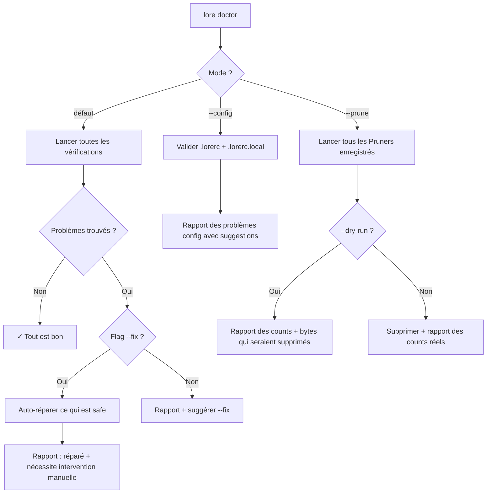

# lore doctor

Diagnostiquer et réparer votre corpus de documentation.

## Synopsis

```
lore doctor [flags]
```

## Qu'est-ce que ça fait ?

`lore doctor` effectue un bilan de santé de votre corpus de documentation. Il scanne les problèmes — fichiers corrompus, références manquantes, caches obsolètes — et en répare la plupart automatiquement.

## Scénario concret

> Après avoir mergé 3 branches de feature, quelque chose cloche — `lore show` retourne des résultats obsolètes. Temps pour un check-up :
>
> ```bash
> lore doctor
> # ✗ stale-index (désynchronisé)
> lore doctor --fix
> # ✓ Corrigé : index reconstruit
> ```
>
> Comme lancer `npm audit` ou `go vet` — une habitude qui prévient les surprises.


<!-- Generate: vhs assets/vhs/doctor-fix.tape -->

## Flags

| Flag | Type | Défaut | Description |
|------|------|--------|-------------|
| `--fix` | bool | `false` | Réparer automatiquement les problèmes corrigeables |
| `--config` | bool | `false` | Valider `.lorerc` uniquement (sauter le corpus) |
| `--rebuild-store` | bool | `false` | Reconstruire `store.db` depuis zéro |
| `--prune` | bool | `false` | Lancer le garbage collection sur les artefacts générés (backups polish, polish.log, quarantaine de state corrompu). Mutuellement exclusif avec `--fix`, `--rebuild-store`, `--config`. |
| `--dry-run` | bool | `false` | Avec `--prune` : rapporter ce qui serait supprimé sans toucher au disque |
| `--quiet` | bool | `false` | Afficher uniquement le nombre de problèmes (ou format tab-séparé `feature\tremoved\tkept\tbytes` avec `--prune`) |

## Vérifications diagnostiques

| Vérification | Ce que ça détecte | Auto-réparable ? |
|--------------|-------------------|-----------------|
| **orphan-tmp** | Fichiers `.tmp` restants d'écritures interrompues | ✅ Oui — les supprime |
| **stale-index** | Fichier index désynchronisé avec les documents | ✅ Oui — reconstruit l'index |
| **stale-cache** | Cache review Angela obsolète | ✅ Oui — vide le cache |
| **broken-ref** | Un document référence un autre qui n'existe pas | ❌ Non — correction manuelle |
| **invalid-frontmatter** | Les métadonnées YAML ne peuvent pas être parsées | ⚠ Dépend du sous-type — voir ci-dessous |
| **config** | Fautes de frappe ou valeurs invalides dans `.lorerc` | ❌ Non — correction manuelle |

### Invalid-frontmatter — sous-types

Pour les problèmes `invalid-frontmatter`, doctor distingue deux sous-cas et les traite différemment :

| Sous-type | Ce que ça détecte | Auto-réparable ? |
|-----------|-------------------|------------------|
| `missing` | Aucun délimiteur `---` du tout | ✅ Oui — synthétise un bloc frontmatter safe (`type` inféré du filename, `status: draft`, date du jour) |
| `malformed` | Délimiteur `---` présent mais YAML non-parsable (quote non fermée, indentation cassée, clés en doublon, BOM + cassé, CRLF + cassé, etc.) | ❌ Non — le contenu authentique peut encore être récupérable, l'auto-fix le détruirait |

Sur `malformed`, doctor affiche un bloc de suggestions :

```text
✗  invalid-frontmatter    decision-auth.md (malformed: YAML parse error: ...)
      Suggested actions:
        - Restore from a polish backup:
            lore angela polish --restore 'decision-auth.md'
        - Edit the file manually to repair the YAML block.
```

Le hint `--restore` n'apparaît que quand un backup polish existe pour le filename ; les filenames contenant des métacaractères shell (espaces, `;`, backticks) sont single-quotés pour qu'une copie-colle dans un shell soit safe.

Cette protection est l'invariant **I31** — *doctor ne réécrit jamais un bloc frontmatter quand un délimiteur `---` est présent*. Elle protège contre une typo YAML manuelle qui détruirait du contenu authentique.

## Sortie

```bash
lore doctor
```

```
Docs Check:
  ✓ orphan-tmp         (aucun trouvé)
  ✗ stale-index        .lore/docs/index.md (last updated 2026-01-01)
  ✓ broken-ref         (aucun trouvé)
  ✓ stale-cache        (aucun trouvé)
  ✓ invalid-frontmatter (aucun trouvé)

Config Check:
  ✓ .lorerc            (valide)
  ✓ .lorerc.local      (valide, mode 0600)

1 problème trouvé. Lancez : lore doctor --fix
```

```bash
lore doctor --fix
```

```
  ✓ Corrigé : stale-index (reconstruit depuis 12 documents)

Tous les problèmes résolus.
```

## Validation config (`--config`)

Détecte les erreurs courantes dans `.lorerc` :

```bash
lore doctor --config
```

```
Config Check:
  ✗ .lorerc ligne 3 : clé inconnue "ai.providr"
    → Vouliez-vous dire "ai.provider" ? (distance de Levenshtein : 1)
  ✗ .lorerc ligne 7 : "hooks.post_commit" attend un booléen, reçu "yes"
    → Utilisez true/false (booléen YAML), pas "yes"/"no"

2 problèmes trouvés.
```

> **Comment les corrections sont suggérées :** Lore utilise la [distance de Levenshtein](https://fr.wikipedia.org/wiki/Distance_de_Levenshtein) — une mesure de similarité entre deux mots. Si vous tapez `providr`, il sait que vous vouliez probablement dire `provider` (1 caractère de différence).

## Élaguer les artefacts générés { #elaguer-les-artefacts-generes }

`lore doctor --prune` lance le garbage collection sur toutes les familles d'artefacts croissants produits par Lore — une commande unique pour borner l'empreinte disque.

| Famille | Pattern | Policy |
|---------|---------|--------|
| `polish-backups` | `polish-backups/*.bak` | Supprime les backups plus vieux que `angela.polish.backup.retention_days` (défaut 30) |
| `polish-log` | `polish.log` | Deux passes : drop des entrées plus vieilles que `angela.polish.log.retention_days` (défaut 30), puis trim des plus anciennes jusqu'à passer sous `angela.polish.log.max_size_mb` (défaut 10 MB) |
| `corrupt-quarantine` | `*.corrupt-<stamp>` | Supprime les fichiers de state quarantinés plus vieux que `angela.gc.corrupt_quarantine.retention_days` (défaut 14). Symlinks et fichiers non-réguliers sont ignorés. |

```bash
# Prévisualiser ce qui serait supprimé — pas de modif disque
lore doctor --prune --dry-run

Pruning generated artifacts:
  ✓  polish-backups         removed 12 / kept 3  (14.2 KB)
  ✓  polish-log             removed 87 / kept 412  (68.1 KB)
  ✓  corrupt-quarantine     removed 2 / kept 0  (2.4 KB)
                            84.7 KB total
  (dry-run: no files changed)

# Pruner pour de vrai
lore doctor --prune

# Sortie machine pour CI
lore doctor --prune --quiet
# polish-backups<TAB>12<TAB>3<TAB>14540
# polish-log<TAB>87<TAB>412<TAB>69734
# corrupt-quarantine<TAB>2<TAB>0<TAB>2457
```

L'invariant **I32** garantit que chaque famille de fichiers que Lore peut produire a un `Pruner` enregistré. Un futur artefact croissant ajouté sans pruner dédié échoue le test de régression I32 — donc `--prune` est future-proof par construction.

### Concurrency-safe

Le pruner polish-log acquiert le même `flock` consultatif que le writer (`AppendLogEntry`), et re-stat size + mtime juste avant la réécriture. Si un writer bypasse le lock et append pendant le prune, la dérive est détectée et le prune avorte sans perte de données.

## Rebuild Store (`--rebuild-store`)

Le fichier `store.db` est une base SQLite qui indexe vos documents pour une recherche rapide. Il est **toujours reconstructible** depuis vos fichiers Markdown — ils sont la source de vérité.

```bash
# Si store.db est corrompu ou pour repartir de zéro
lore doctor --rebuild-store
# → store.db reconstruit depuis 12 documents et 47 commits
```

> **Sûr de lancer à tout moment.** Le store est un cache, pas une source de vérité. Reconstruire ne perd rien.

## Flux



## Exemples

```bash
# Bilan complet
lore doctor

# Tout réparer
lore doctor --fix

# Juste la config
lore doctor --config

# Prévisualiser un prune (aucune modif disque)
lore doctor --prune --dry-run

# Prune les artefacts croissants pour de vrai
lore doctor --prune

# Option nucléaire : tout reconstruire
lore doctor --fix --rebuild-store

# Gate CI : échouer si problèmes
[ $(lore doctor --quiet) -eq 0 ] || exit 1
```

## Quand lancer doctor

| Situation | Commande |
|-----------|----------|
| Après un pull depuis le remote | `lore doctor` — les changements des autres peuvent causer des incohérences |
| Après suppression de documents | `lore doctor` — vérifier les références cassées |
| Après édition de `.lorerc` | `lore doctor --config` — attraper les fautes de frappe |
| Après migration/upgrade | `lore doctor --fix --rebuild-store` — reset complet |
| Quelque chose semble bizarre | `lore doctor --fix` — laissez Lore comprendre |
| L'empreinte disque de `.lore/` grandit | `lore doctor --prune` — garbage-collect backups, logs, quarantaine |
| Avant un gros batch polish | `lore doctor --prune --dry-run` — prévisualiser le nettoyage |

## Tips & Tricks

- **Habitude hebdomadaire :** Lancez `lore doctor` chaque semaine, comme `npm audit` ou `go vet`.
- **Intégration CI :** `lore doctor --quiet` retourne le nombre de problèmes — parfait pour les gates CI.
- **Après merges d'équipe :** Pull → `lore doctor --fix` → terminé. Garde tout le monde en sync.
- **Fautes de frappe config :** Les suggestions Levenshtein attrapent 90% des typos. Faites-leur confiance.

## Codes de sortie

| Code | Signification |
|------|---------------|
| `0` | Aucun problème (ou tout réparé avec `--fix`) |
| `1` | Problèmes trouvés (nécessitent `--fix` ou intervention manuelle) |
| `4` | Erreur de configuration |

## Questions fréquentes

### "Est-ce que `--rebuild-store` est sûr ?"

Oui. `store.db` est un cache reconstruit depuis vos fichiers Markdown. Reconstruire ne perd rien — ça ré-indexe tout depuis la source de vérité.

### "Doctor dit 'correction manuelle requise'"

Les références cassées et le frontmatter malformé ne peuvent pas être auto-réparés car Lore ne peut pas inférer la valeur correcte sans risquer de perdre du contenu authentique (invariant I31). Ouvrez le fichier signalé, corrigez-le manuellement — ou lancez `lore angela polish --restore <file>` si un backup existe — puis relancez `lore doctor`.

### « Qu'est-ce que `--prune` supprime exactement ? »

Uniquement trois familles : `polish-backups/*.bak` (backups atomiques de polish), les entrées `polish.log` plus vieilles que la rétention (ou au-dessus du cap de taille), et les fichiers de state quarantinés `*.corrupt-<ts>`. Les symlinks et fichiers non-réguliers sont ignorés. Votre markdown source, `.lorerc` et `store.db` ne sont jamais touchés par `--prune`.

### "Faut-il lancer doctor après chaque merge ?"

Bonne habitude. `lore doctor --fix` prend moins d'une seconde et attrape les index obsolètes causés par les changements des coéquipiers.

## Voir aussi

- [lore status](status.md) — Aperçu rapide de la santé
- [Configuration](../guides/configuration.md) — Corriger les problèmes de configuration
