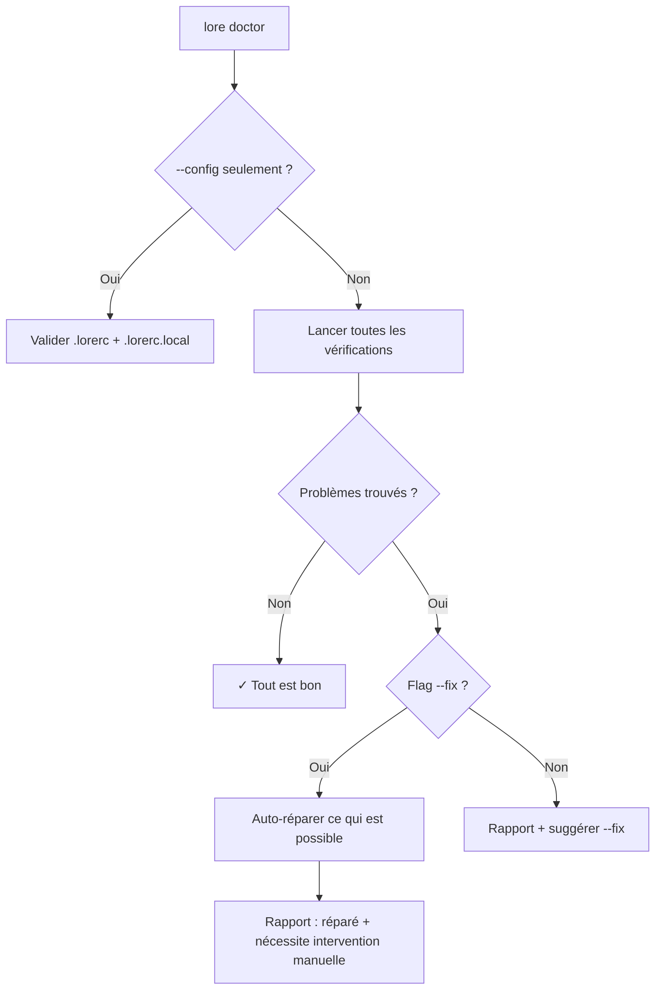

# lore doctor

Diagnostiquer et réparer votre corpus de documentation.

## Synopsis

```
lore doctor [flags]
```

## Qu'est-ce que ça fait ?

`lore doctor` est comme un bilan de santé pour votre documentation. Il scanne les problèmes — fichiers corrompus, références manquantes, caches obsolètes — et peut réparer la plupart automatiquement.

> **Analogie :** Comme un vrai médecin vérifie vos constantes et prescrit un traitement, `lore doctor` vérifie la santé de votre corpus et prescrit `--fix`.

## Scénario concret

> Après avoir mergé 3 branches de feature, quelque chose cloche — `lore show` retourne des résultats obsolètes. Temps pour un check-up :
>
> ```bash
> lore doctor
> # ✗ stale-index (désynchronisé)
> lore doctor --fix
> # ✓ Corrigé : index reconstruit
> ```
>
> Comme lancer `npm audit` ou `go vet` — une habitude qui prévient les surprises.

## Flags

| Flag | Type | Défaut | Description |
|------|------|--------|-------------|
| `--fix` | bool | `false` | Réparer automatiquement les problèmes corrigeables |
| `--config` | bool | `false` | Valider `.lorerc` uniquement (sauter le corpus) |
| `--rebuild-store` | bool | `false` | Reconstruire `store.db` depuis zéro |
| `--quiet` | bool | `false` | Afficher uniquement le nombre de problèmes |

## Vérifications diagnostiques

| Vérification | Auto-réparable ? | Description |
|--------------|-----------------|-------------|
| **orphan-tmp** | ✅ Oui — les supprime | Fichiers `.tmp` restants d'écritures interrompues |
| **stale-index** | ✅ Oui — reconstruit | Fichier index désynchronisé avec les documents |
| **stale-cache** | ✅ Oui — vide le cache | Cache review Angela obsolète |
| **broken-ref** | ❌ Non — correction manuelle | Référence vers un document inexistant |
| **invalid-frontmatter** | ❌ Non — correction manuelle | Erreurs d'analyse du YAML |
| **config** | ❌ Non — correction manuelle | Fautes de frappe ou valeurs invalides dans `.lorerc` |

## Sortie

```bash
lore doctor
```

```
Docs Check:
  ✓ orphan-tmp         (aucun trouvé)
  ✗ stale-index        .lore/docs/index.md (désynchronisé)
  ✓ broken-ref         (aucun trouvé)
  ✓ stale-cache        (aucun trouvé)
  ✓ invalid-frontmatter (aucun trouvé)

Config Check:
  ✓ .lorerc            (valide)
  ✓ .lorerc.local      (valide, mode 0600)

1 problème trouvé. Lancez : lore doctor --fix
```

## Validation Config (`--config`)

Détecte les erreurs courantes dans `.lorerc` :

```bash
lore doctor --config
# ✗ clé inconnue "ai.providr"
#   → Vouliez-vous dire "ai.provider" ? (distance de Levenshtein : 1)
```

> Lore utilise la [distance de Levenshtein](https://fr.wikipedia.org/wiki/Distance_de_Levenshtein) — une mesure de similarité entre deux mots — pour suggérer des corrections.

## Rebuild Store (`--rebuild-store`)

Le fichier `store.db` est une base SQLite qui indexe vos documents. Il est **toujours reconstructible** depuis vos fichiers Markdown — ils sont la source de vérité.

```bash
lore doctor --rebuild-store
# → store.db reconstruit depuis 12 documents et 47 commits
```

> **Sûr de lancer à tout moment.** Le store est un cache, pas une source de vérité.

## Flux



## Exemples

```bash
# Bilan complet
lore doctor

# Tout réparer
lore doctor --fix

# Juste la config
lore doctor --config

# Option nucléaire : tout reconstruire
lore doctor --fix --rebuild-store

# Gate CI : échouer si problèmes
[ $(lore doctor --quiet) -eq 0 ] || exit 1
```

## Quand lancer doctor

| Situation | Commande |
|-----------|----------|
| Après un pull depuis le remote | `lore doctor` — les changements des autres peuvent causer des incohérences |
| Après suppression de documents | `lore doctor` — vérifier les références cassées |
| Après édition de `.lorerc` | `lore doctor --config` — attraper les fautes de frappe |
| Après migration/upgrade | `lore doctor --fix --rebuild-store` — reset complet |
| Quelque chose semble bizarre | `lore doctor --fix` — laissez Lore comprendre |

## Questions fréquentes

### "Est-ce que `--rebuild-store` est sûr ?"

Oui. `store.db` est un cache reconstruit depuis vos fichiers Markdown. Reconstruire ne perd rien — ça ré-indexe tout depuis la source de vérité.

### "Doctor dit 'correction manuelle requise'"

Les références cassées et le front matter invalide ne peuvent pas être auto-réparés car Lore ne sait pas quelle devrait être la valeur correcte. Ouvrez le fichier signalé, corrigez, puis relancez `lore doctor`.

### "Faut-il lancer doctor après chaque merge ?"

Bonne habitude. `lore doctor --fix` prend 1 seconde et attrape les index obsolètes créés par les changements des autres.

## Tips & Tricks

- **Habitude hebdomadaire :** Lancez `lore doctor` chaque semaine, comme `npm audit` ou `go vet`.
- **Intégration CI :** `lore doctor --quiet` retourne le nombre de problèmes — parfait pour les gates CI.
- **Après merges d'équipe :** Pull → `lore doctor --fix` → terminé.
- **Fautes de frappe config :** Les suggestions Levenshtein attrapent 90% des typos. Faites-leur confiance.

## Codes de sortie

| Code | Signification |
|------|---------------|
| `0` | Aucun problème (ou tout réparé) |
| `1` | Problèmes trouvés (nécessitent `--fix` ou intervention manuelle) |
| `4` | Erreur de configuration |

## Voir aussi

- [lore status](status.md) — Aperçu rapide de la santé
- [Configuration](../guides/configuration.md) — Corriger les problèmes config
