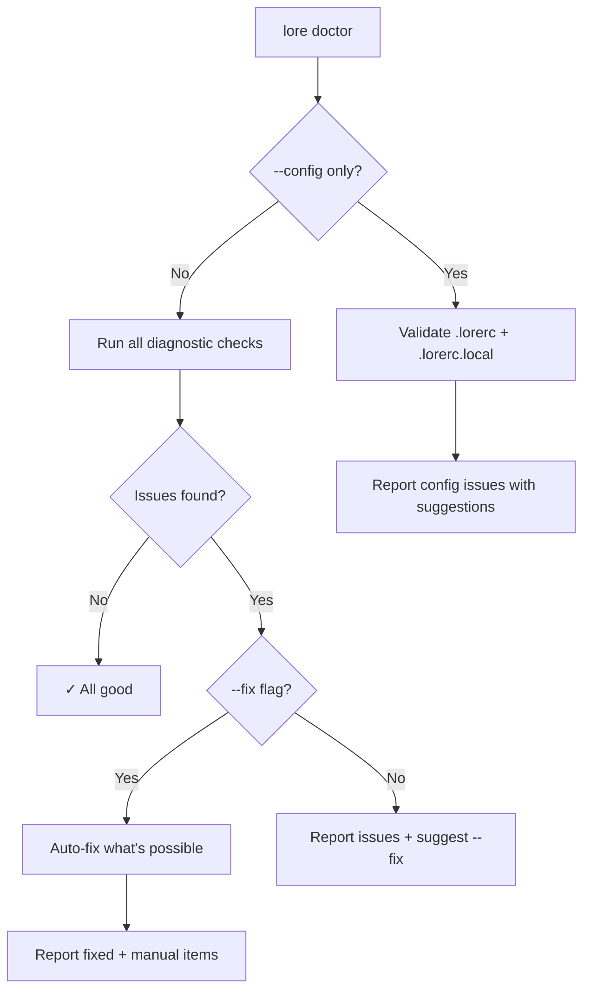

# lore doctor

Diagnose and repair your documentation corpus.

## Synopsis

```
lore doctor [flags]
```

## What Does This Do?

`lore doctor` runs a health checkup on your documentation corpus. It scans for problems — corrupted files, broken references, outdated caches — and fixes most of them automatically.

> **Analogy:** Just as a doctor checks your vitals and prescribes treatment, `lore doctor` assesses corpus health and prescribes `--fix`.

## Real World Scenario

> After merging 3 feature branches, something feels off — `lore show` returns stale results. Time for a checkup:
>
> ```bash
> lore doctor
> # ✗ stale-index (out of sync)
> lore doctor --fix
> # ✓ Fixed: rebuilt index
> ```
>
> Like running `npm audit` or `go vet` — a habit that prevents surprises.


<!-- Generate: vhs assets/vhs/doctor-fix.tape -->

## Flags

| Flag | Type | Default | Description |
|------|------|---------|-------------|
| `--fix` | bool | `false` | Automatically repair fixable issues |
| `--config` | bool | `false` | Only check `.lorerc` configuration (skip corpus) |
| `--rebuild-store` | bool | `false` | Reconstruct `store.db` from scratch |
| `--quiet` | bool | `false` | Output only the issue count |

## Diagnostic Checks

| Check | What it detects | Auto-fixable? |
|-------|----------------|--------------|
| **orphan-tmp** | Leftover `.tmp` files from interrupted writes | ✅ Yes — deletes them |
| **stale-index** | Index file doesn't match actual documents | ✅ Yes — rebuilds index |
| **stale-cache** | Angela review cache is outdated | ✅ Yes — clears cache |
| **broken-ref** | A document references another that doesn't exist | ❌ No — manual fix |
| **invalid-frontmatter** | YAML metadata can't be parsed | ❌ No — manual fix |
| **config** | Typos or invalid values in `.lorerc` | ❌ No — manual fix |

## Output

```bash
lore doctor
```

```
Docs Check:
  ✓ orphan-tmp         (none found)
  ✗ stale-index        .lore/docs/index.md (last updated 2026-01-01)
  ✓ broken-ref         (none found)
  ✓ stale-cache        (none found)
  ✓ invalid-frontmatter (none found)

Config Check:
  ✓ .lorerc            (valid)
  ✓ .lorerc.local      (valid, mode 0600)

1 issue found. Run: lore doctor --fix
```

```bash
lore doctor --fix
```

```
  ✓ Fixed: stale-index (rebuilt from 12 documents)

All issues resolved.
```

## Config Validation (`--config`)

Catches common `.lorerc` mistakes:

```bash
lore doctor --config
```

```
Config Check:
  ✗ .lorerc line 3: unknown key "ai.providr"
    → Did you mean "ai.provider"? (Levenshtein distance: 1)
  ✗ .lorerc line 7: "hooks.post_commit" expects boolean, got "yes"
    → Use true/false (YAML boolean), not "yes"/"no"

2 issues found.
```

> **How it suggests corrections:** Lore uses [Levenshtein distance](https://en.wikipedia.org/wiki/Levenshtein_distance) — a measure of how similar two words are. If you type `providr`, it knows you probably meant `provider` (1 character away).

## Rebuild Store (`--rebuild-store`)

The `store.db` file is a SQLite database that indexes your documents for fast search. It is **always reconstructible** from your Markdown files — they are the source of truth.

```bash
# If store.db gets corrupted or you want a fresh start
lore doctor --rebuild-store
# → Rebuilt store.db from 12 documents and 47 commits
```

> **Safe to run anytime.** The store is a cache, not a source of truth. Rebuilding it loses nothing.

## Process Flow



## Examples

```bash
# Full checkup
lore doctor

# Fix everything fixable
lore doctor --fix

# Just check config
lore doctor --config

# Nuclear option: rebuild everything
lore doctor --fix --rebuild-store

# CI gate: fail if unhealthy
[ $(lore doctor --quiet) -eq 0 ] || exit 1
```

## When to Run

| Situation | Run |
|-----------|-----|
| After pulling from remote | `lore doctor` — other people's changes may cause inconsistencies |
| After deleting documents | `lore doctor` — check for broken references |
| After editing `.lorerc` | `lore doctor --config` — catch typos |
| After migration/upgrade | `lore doctor --fix --rebuild-store` — full reset |
| Something feels wrong | `lore doctor --fix` — let Lore figure it out |

## Tips & Tricks

- **Make it a habit:** Run `lore doctor` weekly, like you'd run `npm audit` or `go vet`.
- **CI integration:** `lore doctor --quiet` returns the issue count — perfect for CI gates.
- **After team merges:** Pull → `lore doctor --fix` → done. Keeps everyone in sync.
- **Config typos:** The Levenshtein suggestions catch 90% of typos. Trust them.

## Exit Codes

| Code | Meaning |
|------|---------|
| `0` | No issues (or all fixed with `--fix`) |
| `1` | Issues found (need `--fix` or manual intervention) |
| `4` | Configuration error |

## Common Questions

### "Is `--rebuild-store` safe?"

Yes. `store.db` is a cache reconstructed from your Markdown files. Rebuilding loses nothing — it re-indexes everything from the source of truth.

### "Doctor says 'manual fix required'"

Broken references and invalid front matter cannot be auto-fixed because lore cannot infer the correct value. Open the flagged file, fix it manually, then re-run `lore doctor`.

### "Should I run doctor after every merge?"

Good habit. `lore doctor --fix` takes under a second and catches stale indexes caused by teammates' changes.

## See Also

- [lore status](status.md) — Quick health overview
- [Configuration](../guides/configuration.md) — Fix config issues
