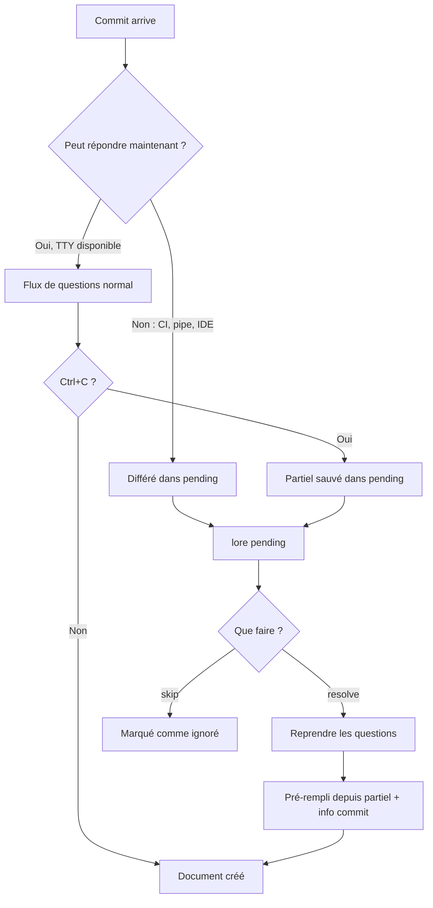

# lore pending

Gérer les commits non documentés (différés, interrompus ou ignorés).

## Synopsis

```
lore pending [list|resolve|skip] [flags]
```

## Qu'est-ce que ça fait ?

Parfois les commits ne peuvent pas être documentés immédiatement :
- Vous étiez en **CI** (pas de terminal pour répondre)
- Vous avez pressé **Ctrl+C** (interrompu les questions)
- Git faisait un **rebase** (pas le bon moment)

Ces commits vont dans la **file d'attente pending**. `lore pending` aide à gérer cette file.

> **Analogie :** Pensez aux commits pending comme des post-its sur votre bureau qui disent "documente-moi plus tard." `lore pending` c'est regarder ces post-its et décider quoi faire de chacun.

## Scénario concret

> Vous venez de finir un gros rebase — 5 commits rejoués. Lore a tout différé dans pending (impossible de poser des questions pendant un rebase). Maintenant vous rattrapez :
>
> ```bash
> lore pending
> # 5 commits en attente
> lore pending resolve 1
> # Reprend les questions pour chacun
> ```


<!-- Generate: vhs assets/vhs/pending-resolve.tape -->

## Sous-commandes

### `lore pending` — Voir ce qui attend

```
#  HASH     MESSAGE                       PROGRESS    ÂGE
1  abc1234  feat(auth): add JWT           2/5 champs  2 jours
2  def5678  fix: rate limit bypass        0/5 champs  1 heure
3  ghi9012  chore: update dependencies    0/5 champs  30 min
```

| Colonne | Signification |
|---------|---------------|
| **#** | Index (utilisez-le avec `resolve`) |
| **HASH** | Hash du commit (court) |
| **MESSAGE** | Votre message de commit |
| **PROGRESS** | Combien de champs remplis avant interruption (récupération Ctrl+C !) |
| **ÂGE** | Depuis quand le commit a été fait |

### `lore pending resolve` — Documenter un commit en attente

```bash
# Par numéro
lore pending resolve 1

# Par hash
lore pending resolve --commit abc1234

# Un seul pending → auto-résolution
lore pending resolve
```

**Flags pour `resolve` :**

| Flag | Type | Description |
|------|------|-------------|
| `--commit` | string | Résoudre par hash |
| `--type` | string | Pré-remplir le type |
| `--what` | string | Pré-remplir "what" |
| `--why` | string | Pré-remplir "why" |

> **Récupération Ctrl+C :** Si vous avez appuyé Ctrl+C pendant les questions, vos réponses partielles sont sauvées. `resolve` les pré-remplit — vous reprenez là où vous vous êtes arrêté.

### `lore pending skip` — Ignorer intentionnellement

```bash
lore pending skip abc1234
# → Marqué comme ignoré, n'apparaît plus dans pending
```

## Flux



## Exemples

### Après un rebase

```bash
git rebase main
lore pending
# → 3 commits rebasés en attente

lore pending resolve 1
lore pending resolve 1   # (#2 est devenu #1)
lore pending resolve 1   # (dernier)
```

### Utilisateurs IDE (VS Code, JetBrains)

Quand vous committez depuis le panneau Git de l'IDE (non-TTY), Lore diffère et envoie une notification :

```
🔔 "Lore : 1 commit a besoin de documentation. Lancez : lore pending resolve"
```

Ouvrez le terminal intégré et lancez `lore pending resolve`.

### Scripting (pré-remplir les réponses)

```bash
lore pending resolve --commit abc1234 \
  --type feature \
  --why "Amélioration de performance pour l'endpoint de recherche"
```

## Questions fréquentes

### "Les commits pending peuvent-ils expirer ?"

Non. Les commits pending restent jusqu'à ce que vous les résolviez ou les ignoriez. C'est par design — le contexte perdu est le problème que Lore résout.

### "J'ai 50 commits pending"

Soyez sélectif. Les commits récents (derniers jours) ont encore du contexte frais — résolvez ceux-là. Les plus anciens : parcourez `git show <hash>` et soit écrivez un rapide "pourquoi", soit `lore pending skip` pour les triviaux.

### "Pourquoi Lore n'a pas posé de questions pendant le commit ?"

Vérifiez `lore decision --explain <hash>` pour le score. Causes courantes : non-TTY (commit IDE), rebase, merge, ou `[doc-skip]` dans le message. Voir [Détection contextuelle](../guides/contextual-detection.md).

## Tips & Tricks

- **Après un rebase :** Les commits rebasés vont toujours dans pending. Habitude : `git rebase` → `lore pending`.
- **Ctrl+C est sûr :** Ne perd jamais de données. Les réponses partielles sont sauvées.
- **Batch en CI :** `lore pending --quiet | wc -l` donne le comptage pour les gates CI.
- **Ne laissez pas s'accumuler :** Résolvez tant que le contexte est frais. Une semaine plus tard, vous ne vous rappellerez plus "pourquoi."
- **Ignorez libéralement :** Pas chaque commit a besoin de doc. `lore pending skip` pour les triviaux.

## Codes de sortie

| Code | Signification |
|------|---------------|
| `0` | Succès |
| `1` | Erreur |
| `2` | Aucun commit en attente |

## Voir aussi

- [lore new --commit](new.md) — Alternative pour documenter un commit passé
- [Détection contextuelle](../guides/contextual-detection.md) — Pourquoi les commits sont différés
- [lore doctor](doctor.md) — Nettoyer le corpus après résolution
