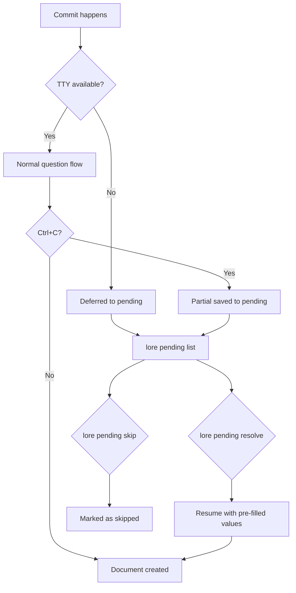

# lore pending

Gérer les commits non documentés (différés, interrompus où ignorés).

## Synopsis

```
lore pending [list|resolve|skip] [flags]
```

## Description

Lorsqu'un commit ne peut pas être documenté immédiatement (non-TTY, Ctrl+C, rebase), il est placé en attente. Cette commande gère la file d'attente des commits en attente.

## Sous-commandes

### `lore pending` / `lore pending list`

Lister tous les commits en attente avec leur progression.

**Flags :**

| Flag | Type | Description |
|------|------|-------------|
| `--quiet` | bool | Sortie séparée par des tabulations (hash, message, progression) |

**Sortie :**
```
#  HASH     MESSAGE                    PROGRESS    AGE
1  abc1234  feat(auth): add JWT        2/5 fields  2 days ago
2  def5678  fix: rate limit bypass     0/5 fields  1 hour ago
```

### `lore pending resolve [NUMBER]`

Reprendre la documentation d'un commit en attente.

**Arguments :**

| Argument | Requis | Description |
|----------|--------|-------------|
| `number` | Non | Index dans la liste (commence à 1) |

**Flags :**

| Flag | Type | Description |
|------|------|-------------|
| `--commit` | string | Résoudre par préfixe de hash du commit |
| `--type` | string | Pré-remplir le type de document |
| `--what` | string | Pré-remplir le champ « what » |
| `--why` | string | Pré-remplir le champ « why » |
| `--alternatives` | string | Pré-remplir les alternatives |
| `--impact` | string | Pré-remplir l'impact |

**Comportement :**
- **Un seul en attente + TTY** → Résolution automatique (aucune sélection nécessaire)
- **Plusieurs + TTY** → Affiche une liste numérotée, demande une sélection
- **Plusieurs + non-TTY** → Résout automatiquement le plus récent (premier de la liste)
- Reprend avec les valeurs pré-remplies issues des réponses partielles (récupération après Ctrl+C)

### `lore pending skip <HASH>`

Marquer un commit comme intentionnellement ignoré.

**Arguments :**

| Argument | Requis | Description |
|----------|--------|-------------|
| `hash` | Oui | Préfixe du hash du commit |

## Flux de processus



## Exemples

```bash
# Voir ce qui est en attente
lore pending

# Résoudre le premier
lore pending resolve 1

# Résoudre par hash
lore pending resolve --commit abc1234

# Pré-remplir les réponses pour le scripting
lore pending resolve 1 --type feature --why "performance improvement"

# Résolution par lot dans le terminal de l'IDE
lore pending resolve --batch

# Ignorer un commit
lore pending skip abc1234
```

## Tips & Tricks

- Après un rebase, vérifiez `lore pending` — les commits rebasés ont pu être différés.
- Ctrl+C pendant les questions sauvegarde la progression partielle. `lore pending resolve` reprend là où vous vous êtes arrêté.
- Utilisez la sortie `--quiet` en CI : `[ $(lore pending --quiet | wc -l) -eq 0 ] || echo "Pending docs!"`
- Utilisateurs d'IDE : Lore envoie une notification quand des commits sont différés. Utilisez `lore pending resolve` dans le terminal intégré.

## Codes de sortie

| Code | Signification |
|------|---------------|
| `0` | Succès |
| `1` | Erreur |
| `2` | Aucun commit en attente |

## Voir aussi

- [lore new](new.fr.md) — Documenter un commit spécifique avec `--commit`
- [Détection contextuelle](../guides/contextual-detection.md) — Quand les commits sont différés
