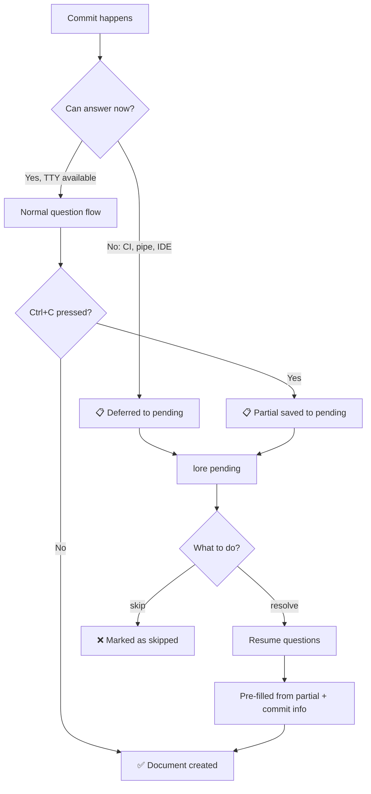

# lore pending

Manage commits that weren't documented yet.

## Synopsis

```
lore pending [list|resolve|skip] [flags]
```

## What Does This Do?

Some commits cannot be documented right away:
- You committed from **CI** (no terminal available)
- You pressed **Ctrl+C** (questions were interrupted)
- Git was performing a **rebase** (not the right time to ask)

These commits enter the **pending queue**. `lore pending` helps you manage that queue.

> **Analogy:** Pending commits are sticky notes that say "document me later." `lore pending` helps you work through each one.

## Real World Scenario

> You just finished a big rebase — 5 commits replayed. Lore deferred all of them to pending (can't ask questions during rebase). Now you catch up:
>
> ```bash
> lore pending
> # 5 commits waiting
> lore pending resolve 1
> # Resume questions for each
> ```


<!-- Generate: vhs assets/vhs/pending-resolve.tape -->

## Subcommands

### `lore pending` — See What's Waiting

```bash
lore pending
```

```
#  HASH     MESSAGE                       PROGRESS    AGE
1  abc1234  feat(auth): add JWT           2/5 fields  2 days ago
2  def5678  fix: rate limit bypass        0/5 fields  1 hour ago
3  ghi9012  chore: update dependencies    0/5 fields  30 min ago
```

| Column | Meaning |
|--------|---------|
| **#** | Index number (use this with `resolve`) |
| **HASH** | Git commit hash (short) |
| **MESSAGE** | Your commit message |
| **PROGRESS** | How many fields were filled before interruption (Ctrl+C recovery!) |
| **AGE** | How long ago the commit was made |

### `lore pending resolve` — Document a Pending Commit

```bash
# Resolve by number
lore pending resolve 1
# → Opens the question flow for commit abc1234
# → Pre-fills any partial answers from Ctrl+C

# Resolve by hash
lore pending resolve --commit abc1234

# If only 1 pending → auto-resolves (no selection needed)
lore pending resolve
```

**Flags for `resolve`:**

| Flag | Type | Description |
|------|------|-------------|
| `--commit` | string | Resolve by commit hash |
| `--type` | string | Pre-fill document type |
| `--what` | string | Pre-fill "what" field |
| `--why` | string | Pre-fill "why" field |
| `--alternatives` | string | Pre-fill alternatives |
| `--impact` | string | Pre-fill impact |

> **Ctrl+C Recovery:** If you pressed Ctrl+C during questions, your partial answers are saved. When you `resolve`, they're pre-filled — you pick up where you left off.

### `lore pending skip` — Intentionally Skip a Commit

```bash
lore pending skip abc1234
# → Marked as skipped, won't appear in pending anymore
```

Use this for commits that don't need documentation (dependency bumps, formatting changes, etc.).

## Process Flow



## Examples

### Typical Workflow After a Rebase

```bash
# After rebasing, check what's pending
git rebase main
lore pending
# → 3 rebased commits in pending

# Document each one
lore pending resolve 1
lore pending resolve 1   # (now #2 became #1)
lore pending resolve 1   # (last one)
```

### IDE Users (VS Code, JetBrains)

When you commit from the IDE's Git panel (non-TTY), Lore defers to pending and sends a notification:

```
🔔 "Lore: 1 commit needs documentation. Run: lore pending resolve"
```

Open the integrated terminal and run:
```bash
lore pending resolve
```

### Scripting (Pre-fill Answers)

```bash
lore pending resolve --commit abc1234 \
  --type feature \
  --why "Performance improvement for the search endpoint"
# → Creates document with pre-filled values, no prompts
```

## Tips & Tricks

- **Check after rebase:** Rebased commits always go to pending. Make it a habit: `git rebase` → `lore pending`.
- **Ctrl+C is safe:** Pressing Ctrl+C during questions never loses data. Partial answers are saved.
- **Batch in CI:** `lore pending --quiet | wc -l` gives you the count for CI gates.
- **Don't let pending pile up:** Resolve commits while the context is fresh. A week later, the "why" is harder to recall.
- **Skip liberally:** Not every commit needs documentation. Use `lore pending skip` for trivial changes.

## Exit Codes

| Code | Meaning |
|------|---------|
| `0` | Success |
| `1` | Error |
| `2` | No pending commits |

## Common Questions

### "Can pending commits expire?"

No. Pending commits stay until you resolve or skip them. Lost context is the problem Lore solves — expiring would defeat the purpose.

### "I have 50 pending commits"

Be selective. Resolve recent commits first — their context is still fresh. For older ones, skim `git show <hash>` and either write a quick "why" or run `lore pending skip` for trivial commits.

### "Why didn't Lore ask me during the commit?"

Check `lore decision --explain <hash>` for the score. Common causes: non-TTY (IDE commit), rebase, merge, or `[doc-skip]` in the message. See [Contextual Detection](../guides/contextual-detection.md).

## See Also

- [lore new --commit](new.md) — Alternative way to document a past commit
- [Contextual Detection](../guides/contextual-detection.md) — Why commits get deferred
- [lore doctor](doctor.md) — Clean up corpus after resolving
