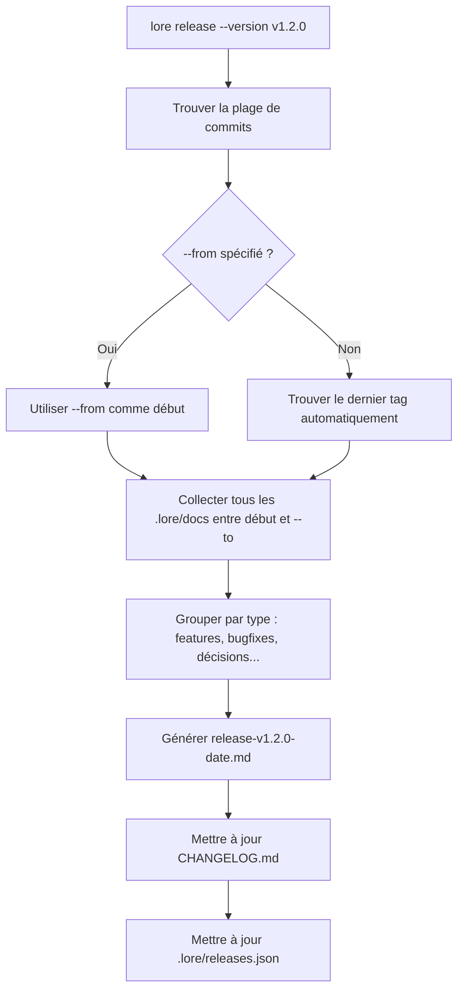

# lore release

Générer des notes de version depuis votre corpus de documentation.

## Synopsis

```
lore release [flags]
```

## Qu'est-ce que ça fait ?

`lore release` lit votre corpus et génère des notes de version automatiquement. Au lieu d'écrire "ce qui a changé dans la v1.2.0" de mémoire, Lore collecte tous les documents créés entre deux tags et les regroupe par type : features, bugfixes, décisions, refactors.

> **Analogie :** Imaginez une secrétaire qui a assisté à chaque réunion et pris des notes. À la fin du trimestre, vous lui demandez de tout résumer. C'est `lore release` — sauf que les "réunions" sont vos commits et les "notes" sont vos documents Lore.

## Scénario concret

> Vendredi après-midi. Vous êtes sur le point de tagger v1.2.0. Au lieu d'écrire les notes de version à la main (scroller dans `git log`, essayer de se rappeler ce qui comptait), vous laissez Lore les générer :
>
> ```bash
> lore release --version v1.2.0
> ```
>
> 3 features, 2 bugfixes, 1 décision — tout documenté au moment du commit, maintenant agrégé en notes de version professionnelles. 5 secondes au lieu de 30 minutes.

## Flags

| Flag | Type | Défaut | Description |
|------|------|--------|-------------|
| `--from` | string | Dernier tag | Début de la plage de commits (tag ou SHA) |
| `--to` | string | HEAD | Fin de la plage |
| `--version` | string | — | Label de version pour les notes |
| `--quiet` | bool | `false` | Afficher uniquement le chemin du fichier généré |

## Comment ça marche



## Sortie

Le fichier généré dans `.lore/docs/` :

```markdown
# Release v1.2.0 (2026-03-16)

## Features
- Add rate limiting to API endpoints
- Add user authentication middleware

## Bug Fixes
- Fix token refresh race condition

## Decisions
- Switch to PostgreSQL for data persistence
```

Met également à jour :
- **`CHANGELOG.md`** — Nouveau header de version en haut
- **`.lore/releases.json`** — Métadonnées des releases

## Exemples

### Le plus courant : release depuis le dernier tag

```bash
lore release --version v1.2.0
# → Collecte les documents depuis v1.1.0
# → Génère .lore/docs/release-v1.2.0-2026-03-16.md
# → Met à jour CHANGELOG.md
```

### Entre deux tags spécifiques

```bash
lore release --version v1.2.0 --from v1.0.0
```

### Workflow de release typique

```bash
# 1. Vérifier la cohérence du corpus
lore angela review

# 2. Générer les notes de version
lore release --version v1.2.0

# 3. Relire les notes générées
lore show "release v1.2.0"

# 4. Committer les notes
git add .lore/docs/release-*.md CHANGELOG.md
git commit -m "docs: release notes for v1.2.0"

# 5. Tagger et pousser
git tag v1.2.0
git push origin main v1.2.0
# → GoReleaser récupère CHANGELOG.md automatiquement
```

## Questions fréquentes

### "Pas de documents dans la plage"

Signifie que personne n'a documenté ses commits. Corrigez avec `lore pending resolve`.

### "Ça marche avec GoReleaser ?"

Oui. GoReleaser lit `CHANGELOG.md` par défaut. `lore release` met à jour ce fichier.

### "Le document de release est cherchable ?"

Oui. C'est un document Lore normal avec `type: release`. Trouvez-le avec `lore show --type release`.

## Tips & Tricks

- **Avant `git tag`** — pour inclure les notes dans le commit taggé.
- **`lore angela review` d'abord** — détectez les contradictions avant de publier.
- **Le document fait partie du corpus** — cherchable avec `lore show --type release`.
- **Pair avec GoReleaser** — `CHANGELOG.md` alimente directement `goreleaser release`.
- **Automatisez en CI** — `lore release --version $TAG --quiet` dans votre pipeline.

## Codes de sortie

| Code | Signification |
|------|---------------|
| `0` | Notes de version générées |
| `1` | Erreur (pas de documents, pas de tags) |

## Voir aussi

- [lore list](list.md) — Voir tous les documents avant de générer
- [lore angela review](angela-review.md) — Vérification de cohérence avant release
- [lore status](status.md) — Vérifier la couverture documentaire
