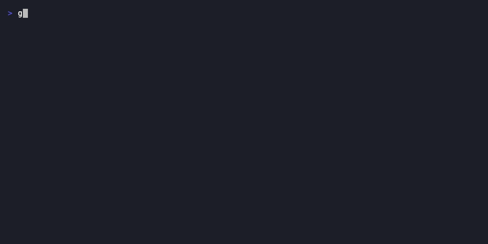
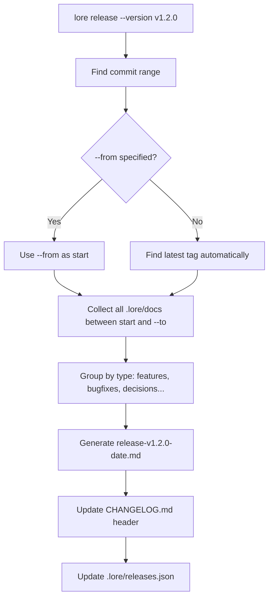

# lore release

Generate release notes from your documentation corpus.

## Synopsis

```
lore release [flags]
```

## What Does This Do?

`lore release` reads your corpus and generates release notes automatically. Instead of reconstructing "what changed in v1.2.0" from memory, Lore collects every document created between two tags and groups them by type: features, bugfixes, decisions, refactors.

> **Analogy:** Because every commit was documented as it happened, `lore release` just aggregates those records — turning your corpus into a structured changelog.

## Real World Scenario

> Friday afternoon. You're about to tag v1.2.0. Instead of writing release notes by hand (scrolling through `git log`, trying to remember what mattered), you let Lore generate them:
>
> ```bash
> lore release --version v1.2.0
> ```
>
> 3 features, 2 bugfixes, 1 decision — all documented at commit time, now aggregated into professional release notes. 5 seconds instead of 30 minutes.


<!-- Generate: vhs assets/vhs/release.tape -->

## Flags

| Flag | Type | Default | Description |
|------|------|---------|-------------|
| `--from` | string | Latest tag | Start of commit range (tag or SHA) |
| `--to` | string | HEAD | End of commit range |
| `--version` | string | — | Version label for the release notes |
| `--quiet` | bool | `false` | Output only the generated file path |

## How It Works



## Output

The generated file in `.lore/docs/`:

```markdown
# Release v1.2.0 (2026-03-16)

## Features
- Add rate limiting to API endpoints
- Add user authentication middleware

## Bug Fixes
- Fix token refresh race condition

## Decisions
- Switch to PostgreSQL for data persistence

## Refactors
- Extract auth middleware into dedicated package
```

Additionally:
- **`CHANGELOG.md`** — Updated with a new version header at the top
- **`.lore/releases.json`** — Metadata about all releases (for programmatic access)

## Examples

### Most Common: Release Since Last Tag

```bash
# You're on main, last tag was v1.1.0, HEAD has 15 new commits
lore release --version v1.2.0
# → Collects documents since v1.1.0
# → Generates .lore/docs/release-v1.2.0-2026-03-16.md
# → Updates CHANGELOG.md
```

### Between Two Specific Tags

```bash
lore release --version v1.2.0 --from v1.0.0
# → Collects documents between v1.0.0 and HEAD
```

### Quiet Mode (Scripting)

```bash
filepath=$(lore release --version v1.2.0 --quiet)
echo "Release notes at: $filepath"
# → .lore/docs/release-v1.2.0-2026-03-16.md
```

### Typical Release Workflow

```bash
# 1. Review the corpus for coherence
lore angela review

# 2. Generate release notes
lore release --version v1.2.0

# 3. Review the generated file
lore show "release v1.2.0"

# 4. Commit the release notes
git add .lore/docs/release-*.md CHANGELOG.md
git commit -m "docs: release notes for v1.2.0"

# 5. Tag and push
git tag v1.2.0
git push origin main v1.2.0
# → GoReleaser picks up CHANGELOG.md automatically
```

## Common Questions

### "What if there are no documents in the range?"

```bash
lore release --version v1.2.0
# → Error: no documents found between v1.1.0 and HEAD
# No commits in this range were documented. Fix with: lore pending resolve
```

### "What if I haven't tagged before?"

If no tags exist, use `--from` with a commit hash:

```bash
lore release --version v1.0.0 --from $(git rev-list --max-parents=0 HEAD)
# → Uses the very first commit as the start
```

### "Does this work with GoReleaser?"

Yes. GoReleaser reads `CHANGELOG.md` by default. `lore release` updates that file. The workflow is:

1. `lore release --version v1.2.0` → updates CHANGELOG.md
2. `git tag v1.2.0 && git push --tags`
3. GoReleaser runs → reads CHANGELOG.md → creates GitHub Release with your notes

### "The release doc itself — is it searchable?"

Yes. It's a normal Lore document with `type: release`. Find it with:

```bash
lore show --type release
lore list --type release
```

## Tips & Tricks

- **Run before `git tag`** — so the release notes are included in the tagged commit.
- **Run `lore angela review` first** — catch contradictions before publishing.
- **The release document is part of the corpus** — searchable with `lore show --type release`.
- **Pair with GoReleaser** — `CHANGELOG.md` feeds directly into `goreleaser release`.
- **Automate in CI** — `lore release --version $TAG --quiet` in your release pipeline.

## Exit Codes

| Code | Meaning |
|------|---------|
| `0` | Release notes generated |
| `1` | Error (no documents in range, no tags found) |

## See Also

- [lore list](list.md) — See all documents before generating notes
- [lore angela review](angela-review.md) — Corpus coherence check before release
- [lore status](status.md) — Check documentation coverage
