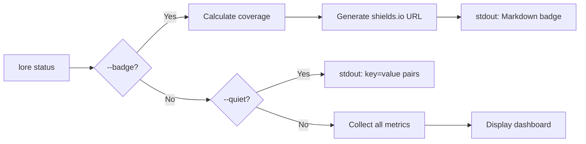

# lore status

Tableau de bord de la santé documentaire du dépôt.

## Synopsis

```
lore status [flags]
```

## Description

Affiche un tableau de bord complet : couverture documentaire, commits en attente, état de l'analyse Angela, résultats de revue et santé globale. Trois modes de sortie disponibles.

## Flags

| Flag | Type | Défaut | Description |
|------|------|--------|-------------|
| `--badge` | bool | `false` | Générer un badge Markdown shields.io avec le pourcentage de couverture |
| `--quiet` | bool | `false` | Sortie machine : paires `key=value` vers stdout |

## Sortie du tableau de bord

```
Project     my-project
Hook        installed
Docs        12 documented, 2 pending
Express     25% express (3 docs), 75% complète
Angela      draft [anthropic], 2 docs need review
Review      3 findings, 2 days ago
Health      ✓ all good
```

## Sortie silencieuse (key=value)

```
hook=installed
docs=12
pending=2
health=ok
angela=draft
angela_review=3
review_findings=3
review_age=2026-03-28
```

## Sortie badge

Génère un badge shields.io pour votre README :

```bash
lore status --badge
# → [](...)
```

**Couleurs du badge :**

| Couverture | Couleur | Hex |
|------------|---------|-----|
| < 50% | Gris | `#999` |
| 50–79% | Vert | `#4c1` |
| 80%+ | Or | `#d4a` |
| 100% | Or + étoile | `#d4a` |

**Calcul de la couverture :** Commits documentés / total de commits (hors merges, rebases, documents de démo). `[doc-skip]` est compté comme couvert. Avertissement si le taux de skip dépasse 70%.

**Localisé :** EN : `documented`, FR : `documenté` (selon la configuration `language`).

## Flux de processus



## Tips & Tricks

- Ajoutez la sortie de `lore status --badge` à votre README pour afficher la couverture en direct.
- Utilisez `lore status --quiet` en CI pour vérifier `health=ok` et faire échouer le build si ce n'est pas le cas.
- Lancez après `lore doctor --fix` pour confirmer que tous les problèmes ont été résolus.
- Le ratio « Express » indique combien de documents ont été créés en mode express (rapide) par rapport au mode complet (détaillé).

## Codes de sortie

| Code | Signification |
|------|---------------|
| `0` | Succès |
| `1` | Erreur (`.lore/` introuvable) |

## Voir aussi

- [lore doctor](doctor.fr.md) — Diagnostiquer et corriger les problèmes
- [lore list](list.fr.md) — Liste complète des documents
- [lore pending](pending.fr.md) — Gérer les commits non documentés
