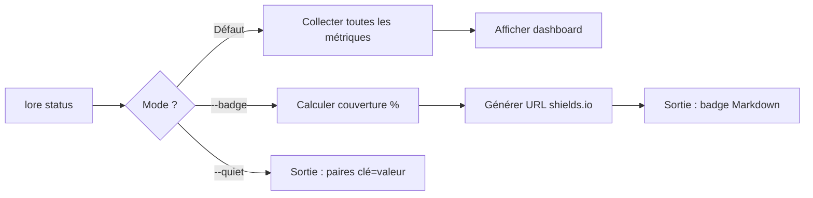

# lore status

Tableau de bord de santé documentaire de votre dépôt.

## Synopsis

```
lore status [flags]
```

## Qu'est-ce que ça fait ?

`lore status` vous donne une vue d'ensemble de la santé documentaire de votre projet. C'est comme un tracker de fitness pour le savoir de votre codebase.

> **Analogie :** Si `git status` montre la santé de votre *code*, `lore status` montre la santé de votre *savoir*.

## Scénario concret

> Lundi matin. Première chose : vérifier la santé de la documentation.
>
> ```bash
> lore status
> ```
>
> 12 documentés, 2 en attente, santé bonne. Vous savez où vous en êtes.


<!-- Generate: vhs assets/vhs/status-badge.tape -->

## Flags

| Flag | Type | Défaut | Description |
|------|------|--------|-------------|
| `--badge` | bool | `false` | Générer un badge shields.io avec le % de couverture |
| `--quiet` | bool | `false` | Sortie machine : paires `clé=valeur` |

## Sortie Dashboard

```
Project     mon-projet
Hook        installed
Docs        12 documented, 2 pending
Express     25% express (3 docs), 75% complete
Angela      draft [anthropic], 2 docs need review
Review      3 findings, 2 days ago
Health      ✓ all good
```

| Ligne | Signification |
|-------|---------------|
| **Project** | Nom du projet |
| **Hook** | Hook post-commit installé ? |
| **Docs** | Commits documentés vs en attente |
| **Express** | % docs rapides vs détaillés |
| **Angela** | Mode IA. "Need review" = docs pas encore analysés |
| **Health** | ✓ = bon. ✗ = lancez `lore doctor` |

## Mode Badge

```bash
lore status --badge
# → [](...)
```

| Couverture | Couleur |
|------------|---------|
| < 50% | Gris |
| 50–79% | Vert |
| 80%+ | Or |
| 100% | Or + étoile |

## Mode Quiet (`--quiet`)

Sortie machine pour CI/CD :

```bash
lore status --quiet
# hook=installed
# docs=12
# pending=2
# health=ok
# angela=draft
# review_findings=3
```

## Flux



### Exemple CI

```bash
# Échouer le build si des docs sont en attente
pending=$(lore status --quiet | grep "pending=" | cut -d= -f2)
if [ "$pending" -gt 0 ]; then
  echo "⚠ $pending commits ont besoin de documentation"
  exit 1
fi
```

## Exemples

```bash
# Vérification quotidienne
lore status

# Badge pour le README
lore status --badge

# Gate CI
health=$(lore status --quiet | grep "health=" | cut -d= -f2)
[ "$health" = "ok" ] || exit 1
```

## Questions fréquentes

### "Que signifie 'Express 25%' ?"

25% des docs créés en mode express (rapide), 75% en mode complet. Ni l'un ni l'autre n'est meilleur.

### "Le badge est gris ?"

Couverture = documentés / total. Pour améliorer : `lore pending` et `lore new --commit`. Vert à 50%, or à 80%.

### "Health montre ✗"

Lancez `lore doctor` puis `lore doctor --fix`.

## Tips & Tricks

- **Badge README :** `lore status --badge` génère le Markdown prêt à coller.
- **Vérification quotidienne :** Lancez en début de journée.
- **Gate CI :** `--quiet` pour parser et échouer le build si nécessaire.

## Codes de sortie

| Code | Signification |
|------|---------------|
| `0` | Succès |
| `1` | Erreur (`.lore/` non trouvé) |

## Voir aussi

- [lore doctor](doctor.md) — Corriger les problèmes
- [lore list](list.md) — Voir tous les documents
- [lore pending](pending.md) — Résoudre les commits en attente
