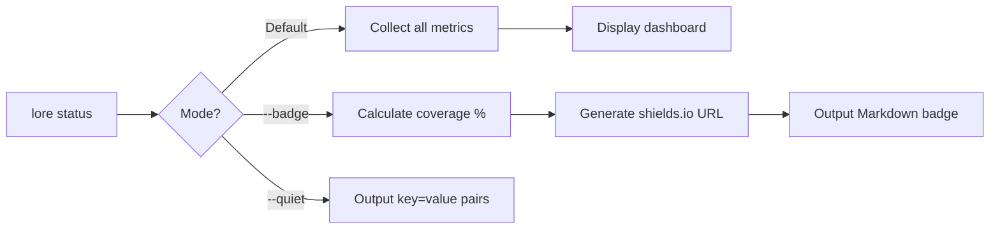

# lore status

Your repository's documentation health dashboard.

## Synopsis

```
lore status [flags]
```

## What Does This Do?

`lore status` gives you an overview of your project's documentation health: how many commits are documented, what is pending, and what needs attention.

> **Analogy:** `git status` shows the health of your code. `lore status` shows the health of your knowledge.

## Real World Scenario

> Monday morning. First thing you do: check the health of your project documentation.
>
> ```bash
> lore status
> ```
>
> 12 documented, 2 pending, health good. You know exactly where you stand.


<!-- Generate: vhs assets/vhs/status-badge.tape -->

## Flags

| Flag | Type | Default | Description |
|------|------|---------|-------------|
| `--badge` | bool | `false` | Generate a shields.io badge for your README |
| `--quiet` | bool | `false` | Machine output: `key=value` pairs |

## Dashboard Output (Default)

```bash
lore status
```

```
Project     my-project
Hook        installed
Docs        12 documented, 2 pending
Express     25% express (3 docs), 75% complete
Angela      draft [anthropic], 2 docs need review
Review      3 findings, 2 days ago
Health      ✓ all good
```

### What Each Line Means

| Line | Meaning |
|------|---------|
| **Project** | Your project name (from `.lorerc` or folder name) |
| **Hook** | Is the post-commit hook installed? If not, commits won't trigger Lore |
| **Docs** | How many commits are documented vs waiting in pending |
| **Express** | Share of docs created in express mode (quick) vs full mode (all 5 questions) |
| **Angela** | AI mode and provider. "Need review" = documents Angela has not yet analyzed |
| **Review** | Findings from `lore angela review`. "No issues" = clean corpus |
| **Health** | Overall status. `✓` = good. `✗` = run `lore doctor` |

## Badge Mode (`--badge`)

Generate a badge for your README showing documentation coverage:

```bash
lore status --badge
```

Output:
```
[](https://github.com/greycoderk/lore)
```

This renders as: 

### Badge Colors

| Coverage | Color | Meaning |
|----------|-------|---------|
| < 50% | Gray | Low coverage — many undocumented commits |
| 50–79% | Green | Good — most commits documented |
| 80%+ | Gold | Excellent — well-documented project |
| 100% | Gold + star | Perfect coverage |

> **How coverage is calculated:** Documented commits ÷ total commits. Merges, rebases, and demo docs are excluded. `[doc-skip]` counts as covered (intentional skip).

> **Warning:** If more than 70% of your "documented" commits are actually `[doc-skip]`, the badge shows a warning. Skipping is fine for trivial commits, but too much means you're avoiding documentation.

### Badge Localization

| Language | Badge text |
|----------|------------|
| EN (`language: "en"`) | `lore \| documented 85%` |
| FR (`language: "fr"`) | `lore \| documenté 85%` |

## Quiet Mode (`--quiet`)

Machine-readable output for CI/CD:

```bash
lore status --quiet
```

```
hook=installed
docs=12
pending=2
health=ok
angela=draft
review_findings=3
```

### CI Example

```bash
# Fail CI if there are pending docs
pending=$(lore status --quiet | grep "pending=" | cut -d= -f2)
if [ "$pending" -gt 0 ]; then
  echo "⚠ $pending commits need documentation"
  exit 1
fi
```

## Process Flow



## Tips & Tricks

- **Add the badge to your README:** `lore status --badge >> README.md` (then move it to the badges section).
- **Daily check:** Run `lore status` at the start of your day to see if anything needs attention.
- **CI gate:** Use `--quiet` to parse values and fail builds if documentation is behind.
- **After `lore doctor --fix`:** Run `lore status` to confirm health is `✓ all good`.

## Exit Codes

| Code | Meaning |
|------|---------|
| `0` | Success |
| `1` | Error (`.lore/` not found) |

## Examples

```bash
# Daily health check
lore status
# → Project: my-project | Hook: installed | Docs: 12, 2 pending | Health: ✓

# Generate badge for README
lore status --badge
# → [](...)

# CI gate
health=$(lore status --quiet | grep "health=" | cut -d= -f2)
[ "$health" = "ok" ] || exit 1
```

## Common Questions

### "What does 'Express 25%' mean?"

25% of documents were created in express mode (quick, Type + What only), 75% in full mode (all 5 questions). Neither is better — it depends on your workflow.

### "The badge shows gray — how do I improve?"

Coverage = documented commits ÷ total commits. Resolve pending commits with `lore pending`, and document older ones with `lore new --commit`. The badge turns green at 50% and gold at 80%.

### "Health shows a problem"

Run `lore doctor` for details, then `lore doctor --fix` to auto-repair.

## See Also

- [lore doctor](doctor.md) — Fix issues that `status` reports
- [lore list](list.md) — See all documents
- [lore pending](pending.md) — Resolve undocumented commits
