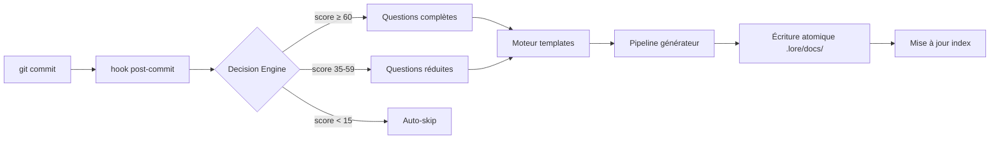

# Architecture (pour contributeurs)

Vue d'ensemble concise du codebase lore. Pour les directives de contribution, voir `CONTRIBUTING.md` à la racine du projet.

## Structure du projet

```text
cmd/           Commandes Cobra — un fichier par commande CLI (le "quoi")
internal/
  domain/      Interfaces et types partagés — contrat entre packages (aucune dep interne)
  config/      Cascade de configuration — pourquoi : système de surcharge à 5 niveaux pour la flexibilité
  git/         Adaptateur Git — pourquoi : abstraire Git pour ne jamais shell-outer de façon non sécurisée
  storage/     Stockage documents — pourquoi : Markdown est la source de vérité, tout en dérive
                 plain_reader.go — PlainCorpusStore pour le mode standalone (tout répertoire Markdown, sans front matter obligatoire)
  workflow/    Réactif (hook) + proactif (lore new) — pourquoi : deux points d'entrée, même pipeline
  generator/   Génération de documents — pourquoi : découpler le rendu de templates du stockage
  angela/      Logique IA — pourquoi : maintenir l'IA séparée du core (opt-in, non obligatoire)
                 langdetect.go   — détection de 24 langues (dont la syntaxe de tapes VHS)
                 vhs_signals.go  — vérification croisée tape↔doc↔GIF↔commandes CLI
                 multipass.go    — découpe les grands docs en sections pour le polissage séquentiel
                 preflight.go    — estimation tokens/coût/timeout avant les appels API
                 postprocess.go  — balisage auto des blocs de code, normalisation indentation Mermaid
  ai/          Fournisseurs IA — pourquoi : interface-based, permuter Anthropic/OpenAI/Ollama librement
  i18n/        Catalogues bilingues — pourquoi : EN/FR dès le départ, pas rajouté après
  ui/          Interface terminal — pourquoi : pattern IOStreams (stderr=humain, stdout=machine)
  engagement/  Milestones, prompt star — pourquoi : hooks comportementaux pour ancrer l'habitude de documentation
  fileutil/    Écritures atomiques — pourquoi : .tmp + rename évite la corruption sur Ctrl+C
  notify/      Notification IDE — pourquoi : les commits non-TTY ont besoin de visibilité
  status/      Collecteur de santé — pourquoi : un seul endroit pour rassembler toutes les métriques
  template/    Templates Go — pourquoi : stdlib, aucune dépendance à un moteur externe
.lore/
  docs/        Le corpus — LA source de vérité. Supprimez tout le reste, reconstruisez depuis ici.
  pending/     Commits différés — pourquoi : ne jamais perdre un commit, même sur Ctrl+C
  store.db     Index LKS — reconstructible. Si corrompu : lore doctor --rebuild-store
```

## Flux de données



**En résumé :**

```text
commit → hook → Decision Engine → questions (si nécessaire)
  → template → générateur → écriture atomique → mise à jour index
```

## Qu'est-ce que le LKS ?

Le **LKS** (Lore Knowledge Store) est la base de données SQLite dans `.lore/store.db`. C'est un **index dérivé** — une couche de recherche et de requêtes construite sur le corpus Markdown de `.lore/docs/`.

| Propriété | Valeur |
|-----------|--------|
| Format | SQLite (`.lore/store.db`) |
| Reconstructible | Oui — `lore doctor --rebuild-store` reconstruit depuis `.lore/docs/` |
| Ce qu'il stocke | Métadonnées, tags, associations commits, scope/branche |
| Pourquoi il existe | Requêtes rapides sans parser chaque fichier Markdown à chaque fois |

Le LKS n'est **jamais la source de vérité**. En cas de désaccord entre la base de données et les fichiers Markdown, les fichiers Markdown l'emportent. Traitez `store.db` comme un artefact de build.

## Patterns clés

- **Markdown = source de vérité** — index, cache, LKS sont tous reconstructibles
- **Écritures atomiques** — `.tmp` + `os.Rename()` évite la corruption
- **IOStreams** — `stderr` pour les humains, `stdout` pour les machines
- **Zéro réseau implicite** — l'IA est opt-in, tout fonctionne hors ligne
- **Front-matter en tête** — chaque document porte ses métadonnées YAML

## Scores du Decision Engine

Le Decision Engine applique trois seuils pour déterminer combien de questions poser :

| Plage de score | Comportement | Seuil par défaut |
|----------------|-------------|-----------------|
| ≥ 60 | Questions complètes (Quoi + Pourquoi + Alternatives + Impact) | `threshold_full: 60` |
| 35 – 59 | Questions réduites (Quoi + Pourquoi uniquement) | `threshold_reduced: 35` |
| 15 – 34 | Suggestion seulement | `threshold_suggest: 15` |
| < 15 | Auto-skip — aucune question | — |

Les seuils sont configurables dans `.lorerc`. Voir [Détection contextuelle](../guides/contextual-detection.md) pour les 7 signaux de scoring.

## Comment étendre

Les patterns ci-dessous sont les chemins les plus courts dans le code quand on ajoute une fonctionnalité qui touche Angela, la couche IA ou les TUI. Ils sont pérennes — les noms de fichiers et signatures peuvent évoluer, mais la forme du point d'extension reste stable.

### Ajouter une langue pour les blocs de code

Ajoutez une entrée au slice `langRules` dans `internal/angela/langdetect.go` :

```go
{Language: "rust", Prefixes: []string{"fn ", "let ", "use ", "impl ", "pub ", "mod "}},
```

- `Prefixes` : correspondance avec `strings.HasPrefix`.
- `Contains` : correspondance avec `strings.Contains` (priorité plus basse).
- Positionnez `CaseInsensitive: true` pour les langages type SQL.
- En cas d'égalité, l'index de la première ligne-votante départage (déterministe entre OS).

### Ajouter un fixer autofix

Dans `internal/angela/autofix.go`, implémentez l'interface `fixer` et ajoutez-le au slice `safeFixer` ou `aggressiveFixer` (le tier est l'intégralité du contrat) :

```go
var myFixer fixer = func(content string, meta *domain.DocumentMeta) (string, []FixedItem, error) {
    // retourner le contenu modifié, la liste des fixes appliqués, toute erreur
}
```

Toutes les écritures passent par `fileutil.AtomicWrite` ; un backup est écrit dans `.lore/backups/` avant modification.

### Ajouter un critère de score qualité

Dans `internal/angela/score.go`, étendez `ScoreDocument()` :

```go
if yourCondition(content, meta) {
    score.Total += N
    score.Details = append(score.Details, ScoreDetail{
        Category: "your-category", Points: N, MaxPoints: N, Present: true,
    })
} else {
    score.Missing = append(score.Missing, "Ajouter X pour améliorer Y")
}
```

Mettez à jour la constante `maxScore` et ajustez les seuils de notation si nécessaire. Le score a deux profils (`scoreStrict` pour `decision`/`feature`/`bugfix`/`refactor`, `scoreFreeForm` pour tout le reste) — choisissez celui qui correspond au type visé par votre critère.

### Ajouter un persona

Dans `internal/angela/persona.go`, ajoutez au `personaRegistry` :

```go
{
    Name:            "your-key",
    DisplayName:     "Nom affiché",
    Icon:            "🔧",
    Expertise:       "focus sur une ligne",
    DraftDirective:  "Instructions pour polish/draft...",
    ReviewDirective: "Instructions pour review (cohérence corpus)...",
    ...
}
```

`ReviewDirective` est spécifique à review — il cadre la lentille du persona sur la cohérence inter-documents, pas sur le polish d'un seul document. Si le persona doit être boosté pour une audience, ajoutez à `audiencePersonaBoosts` :

```go
"your-audience-keyword": {"your-key", "other-persona-key"},
```

Tous les champs de persona passent par `sanitizeShortField` / `sanitizePromptContent` avant d'atteindre le prompt LLM — tout nouveau champ doit être sanitisé de la même façon.

### Ajouter une clé i18n pour l'UI Angela

1. Ajoutez le champ dans `internal/i18n/messages_angela.go`.
2. Ajoutez la chaîne EN dans `internal/i18n/catalog_en.go`.
3. Ajoutez la chaîne FR dans `internal/i18n/catalog_fr.go`.
4. Utilisez-la via `i18n.T().Angela.YourKey`.

Les arguments de format doivent correspondre entre les catalogues EN et FR — le test de complétude par réflexion dans `i18n_test.go` attrape les désalignements.

### Appeler Preflight depuis une nouvelle commande

```go
pf := angela.Preflight(userContent, systemPrompt, cfg.AI.Model, maxTokens, timeout)

if pf.ShouldAbort {
    return fmt.Errorf("interrompu : %s", pf.AbortReason)
}
for _, w := range pf.Warnings {
    fmt.Fprintf(streams.Err, "⚠ %s\n", w)
}
if pf.EstimatedCost >= 0 {
    fmt.Fprintf(streams.Err, "Coût : ~$%.4f\n", pf.EstimatedCost)
}
```

Les lookups coût/fenêtre-de-contexte/vitesse sont exposés via `angela.ModelContextLimit`, `angela.ModelOutputSpeed`, `angela.ExpectedOutputTokens` pour les appelants qui ont besoin des mêmes chiffres sans dupliquer la formule (voir `cmd/angela_review_preview.go`).

### Étendre un TUI (Bubbletea)

Les trois TUIs (`review_interactive.go`, `draft_interactive.go`, `polish_interactive.go`) partagent des patterns dans `internal/angela/tui_common.go` :

- `IsTTYAvailable()` — à appeler en entrée de tout TUI ; fallback mode texte quand false.
- `isSafePath(filename)` — obligatoire avant de lancer `$EDITOR` ; rejette les chemins vides, absolus ou contenant `..`.
- Styles Lipgloss exportés (`TUIStyleTitle`, `TUIStyleDim`, `TUIStyleHelpKey`, `TUIStyleCursor`, `TUIStyleSpinner`, `TUIStyleError`, `TUIStyleWarning`, `TUIStyleInfo`) — ne pas redéfinir par fichier.

Ajouter une action clavier est un seul `case` dans le handler `Update()` :

```go
case "x":
    m.applyMyAction(m.findings[m.cursor])
    return m, nil
```

### Suivi d'usage côté provider

Les nouveaux providers IA doivent implémenter à la fois `domain.AIProvider` et `domain.UsageTracker` :

```go
type UsageTracker interface {
    LastUsage() *AIUsage
}
```

`LastUsage` est protégé par un `sync.Mutex` dans les trois providers existants — les nouveaux providers doivent suivre le même pattern pour que la lecture des stats et l'appel provider ne puissent pas courser.

### Choix architecturaux à connaître

| Choix | Pourquoi |
|-------|----------|
| `atomic.Bool` pour le flag warned du spinner | Lock-free, pattern set-once |
| `sync.Mutex` pour `lastUsage` des providers | Read/write simple, pas de contention |
| Variadique `configMaxTokens ...int` | Rétro-compatible, aucune rupture callsite |
| `unicode.IsLetter()` dans `sanitizeAudience` | Accents français dans les noms de fichiers |
| Post-processing après l'IA, pas dans le prompt | Déterministe, gratuit, l'IA oublie ~30% des règles en prompt |
| Cap de 200 caractères sur l'audience | Éviter le gonflement de prompt depuis l'input CLI |
| `os.Lstat` pour la détection `.lore/` | Rejette les répertoires corpus symlinkés |
| Registry persona via `sync.Once` | Deep-copy à la lecture : une mutation appelant ne pollue pas le registre |

## Comment contribuer

1. Fork depuis `main`
2. Écrire des tests (`go test ./...`)
3. Exécuter `go vet ./...`
4. Ouvrir une PR — voir le modèle dans `.github/PULL_REQUEST_TEMPLATE.md`
