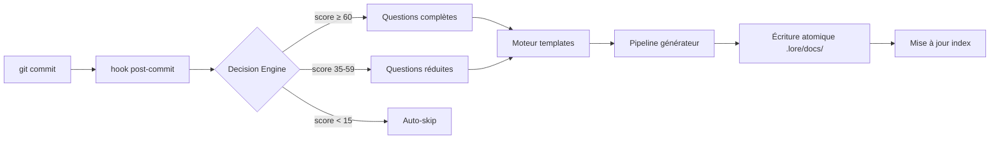

# Architecture (pour contributeurs)

Vue d'ensemble concise du codebase lore. Pour les directives de contribution, voir `CONTRIBUTING.md` à la racine du projet.

## Structure du projet

```text
cmd/           Commandes Cobra — un fichier par commande CLI (le "quoi")
internal/
  domain/      Interfaces et types partagés — contrat entre packages (aucune dep interne)
  config/      Cascade de configuration — pourquoi : système de surcharge à 5 niveaux pour la flexibilité
  git/         Adaptateur Git — pourquoi : abstraire Git pour ne jamais shell-outer de façon non sécurisée
  storage/     Stockage documents — pourquoi : Markdown est la source de vérité, tout en dérive
                 plain_reader.go — PlainCorpusStore pour le mode standalone (tout répertoire Markdown, sans front matter obligatoire)
  workflow/    Réactif (hook) + proactif (lore new) — pourquoi : deux points d'entrée, même pipeline
  generator/   Génération de documents — pourquoi : découpler le rendu de templates du stockage
  angela/      Logique IA — pourquoi : maintenir l'IA séparée du core (opt-in, non obligatoire)
                 langdetect.go   — détection de 24 langues (dont la syntaxe de tapes VHS)
                 vhs_signals.go  — vérification croisée tape↔doc↔GIF↔commandes CLI
                 multipass.go    — découpe les grands docs en sections pour le polissage séquentiel
                 preflight.go    — estimation tokens/coût/timeout avant les appels API
                 postprocess.go  — balisage auto des blocs de code, normalisation indentation Mermaid
  ai/          Fournisseurs IA — pourquoi : interface-based, permuter Anthropic/OpenAI/Ollama librement
  i18n/        Catalogues bilingues — pourquoi : EN/FR dès le départ, pas rajouté après
  ui/          Interface terminal — pourquoi : pattern IOStreams (stderr=humain, stdout=machine)
  engagement/  Milestones, prompt star — pourquoi : hooks comportementaux pour ancrer l'habitude de documentation
  fileutil/    Écritures atomiques — pourquoi : .tmp + rename évite la corruption sur Ctrl+C
  notify/      Notification IDE — pourquoi : les commits non-TTY ont besoin de visibilité
  status/      Collecteur de santé — pourquoi : un seul endroit pour rassembler toutes les métriques
  template/    Templates Go — pourquoi : stdlib, aucune dépendance à un moteur externe
.lore/
  docs/        Le corpus — LA source de vérité. Supprimez tout le reste, reconstruisez depuis ici.
  pending/     Commits différés — pourquoi : ne jamais perdre un commit, même sur Ctrl+C
  store.db     Index LKS — reconstructible. Si corrompu : lore doctor --rebuild-store
```

## Flux de données



**En résumé :**

```text
commit → hook → Decision Engine → questions (si nécessaire)
  → template → générateur → écriture atomique → mise à jour index
```

## Qu'est-ce que le LKS ?

Le **LKS** (Lore Knowledge Store) est la base de données SQLite dans `.lore/store.db`. C'est un **index dérivé** — une couche de recherche et de requêtes construite sur le corpus Markdown de `.lore/docs/`.

| Propriété | Valeur |
|-----------|--------|
| Format | SQLite (`.lore/store.db`) |
| Reconstructible | Oui — `lore doctor --rebuild-store` reconstruit depuis `.lore/docs/` |
| Ce qu'il stocke | Métadonnées, tags, associations commits, scope/branche |
| Pourquoi il existe | Requêtes rapides sans parser chaque fichier Markdown à chaque fois |

Le LKS n'est **jamais la source de vérité**. En cas de désaccord entre la base de données et les fichiers Markdown, les fichiers Markdown l'emportent. Traitez `store.db` comme un artefact de build.

## Patterns clés

- **Markdown = source de vérité** — index, cache, LKS sont tous reconstructibles
- **Écritures atomiques** — `.tmp` + `os.Rename()` évite la corruption
- **IOStreams** — `stderr` pour les humains, `stdout` pour les machines
- **Zéro réseau implicite** — l'IA est opt-in, tout fonctionne hors ligne
- **Front-matter en tête** — chaque document porte ses métadonnées YAML

## Scores du Decision Engine

Le Decision Engine applique trois seuils pour déterminer combien de questions poser :

| Plage de score | Comportement | Seuil par défaut |
|----------------|-------------|-----------------|
| ≥ 60 | Questions complètes (Quoi + Pourquoi + Alternatives + Impact) | `threshold_full: 60` |
| 35 – 59 | Questions réduites (Quoi + Pourquoi uniquement) | `threshold_reduced: 35` |
| 15 – 34 | Suggestion seulement | `threshold_suggest: 15` |
| < 15 | Auto-skip — aucune question | — |

Les seuils sont configurables dans `.lorerc`. Voir [Détection contextuelle](../guides/contextual-detection.md) pour les 7 signaux de scoring.

## Comment contribuer

1. Fork depuis `main`
2. Écrire des tests (`go test ./...`)
3. Exécuter `go vet ./...`
4. Ouvrir une PR — voir le modèle dans `.github/PULL_REQUEST_TEMPLATE.md`
