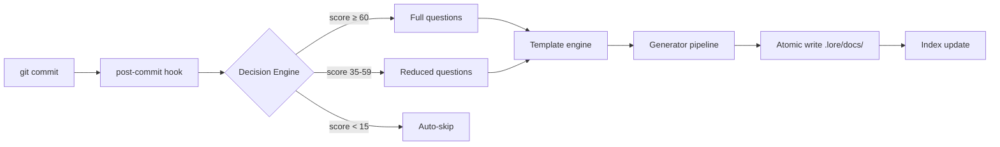

# Architecture (for Contributors)

A simplified overview of the Lore codebase. For contribution guidelines, see `CONTRIBUTING.md` at the project root.

## Project Structure

```
cmd/           Cobra commands — one file per CLI command (the "what")
internal/
  domain/      Shared interfaces and types — the contract between packages (no deps)
  config/      Configuration cascade — why: 5-level override system for flexibility
  git/         Git adapter — why: abstract Git so we never shell out unsafely
  storage/     Document storage — why: Markdown is source of truth, everything derives from it
                 plain_reader.go — PlainCorpusStore for standalone mode (any Markdown dir, no front matter required)
  workflow/    Reactive (hook) + proactive (lore new) — why: two entry points, same pipeline
  generator/   Document generation — why: decouple template rendering from storage
  angela/      AI logic — why: keep AI separate from core (opt-in, not required)
                 langdetect.go   — 24-language detection (including VHS tape syntax)
                 vhs_signals.go  — cross-check tape↔doc↔GIF↔CLI commands
                 multipass.go    — split large docs into sections for sequential polishing
                 preflight.go    — token/cost/timeout estimation before API calls
                 postprocess.go  — auto-tag code fences, normalize Mermaid indent
  ai/          AI providers — why: interface-based, swap Anthropic/OpenAI/Ollama freely
  i18n/        Bilingual catalogs — why: EN/FR from day one, not bolted on later
  ui/          Terminal UI — why: IOStreams pattern (stderr=human, stdout=machine)
  engagement/  Milestones, star prompt — why: behavioral hooks to build documentation habit
  fileutil/    Atomic writes — why: .tmp + rename prevents corruption on Ctrl+C
  notify/      IDE notification — why: non-TTY commits need visibility
  status/      Health collector — why: one place to gather all metrics
  template/    Go templates — why: stdlib, no external engine dependency
.lore/
  docs/        The corpus — THE source of truth. Delete everything else, rebuild from here.
  pending/     Deferred commits — why: never lose a commit, even on Ctrl+C
  store.db     LKS index — reconstructible. If corrupted: lore doctor --rebuild-store
```

## Data Flow



**In words:**
```
commit → hook → Decision Engine scores → questions (if needed)
  → template → generator → atomic write → index update
```

## Key Patterns

- **Markdown is source of truth** — index, cache, LKS are all reconstructible
- **Atomic writes** — `.tmp` + `os.Rename()` prevents corruption
- **IOStreams** — `stderr` for humans, `stdout` for machines (`--quiet`)
- **Zero implicit network** — AI is opt-in, everything works offline
- **Front-matter-first** — YAML metadata in every document

## How to Contribute

1. Fork from `main`
2. Write tests (`go test ./...`)
3. Run `go vet ./...`
4. Open a PR — see the PR template in `.github/PULL_REQUEST_TEMPLATE.md`
