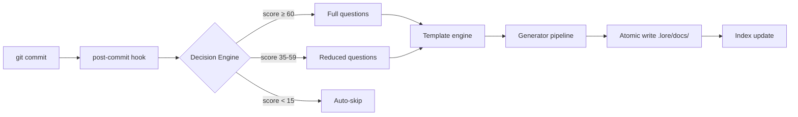

# Architecture (for Contributors)

A concise overview of the lore codebase. For contribution guidelines, see `CONTRIBUTING.md` at the project root.

## Project Structure

```text
cmd/           Cobra commands — one file per CLI command (the "what")
internal/
  domain/      Shared interfaces and types — the contract between packages (no deps)
  config/      Configuration cascade — why: 5-level override system for flexibility
  git/         Git adapter — why: abstract Git so we never shell out unsafely
  storage/     Document storage — why: Markdown is source of truth, everything derives from it
                 plain_reader.go — PlainCorpusStore for standalone mode (any Markdown dir, no front matter required)
  workflow/    Reactive (hook) + proactive (lore new) — why: two entry points, same pipeline
  generator/   Document generation — why: decouple template rendering from storage
  angela/      AI logic — why: keep AI separate from core (opt-in, not required)
                 langdetect.go   — 24-language detection (including VHS tape syntax)
                 vhs_signals.go  — cross-check tape↔doc↔GIF↔CLI commands
                 multipass.go    — split large docs into sections for sequential polishing
                 preflight.go    — token/cost/timeout estimation before API calls
                 postprocess.go  — auto-tag code fences, normalize Mermaid indent
  ai/          AI providers — why: interface-based, swap Anthropic/OpenAI/Ollama freely
  i18n/        Bilingual catalogs — why: EN/FR from day one, not bolted on later
  ui/          Terminal UI — why: IOStreams pattern (stderr=human, stdout=machine)
  engagement/  Milestones, star prompt — why: behavioral hooks to build documentation habit
  fileutil/    Atomic writes — why: .tmp + rename prevents corruption on Ctrl+C
  notify/      IDE notification — why: non-TTY commits need visibility
  status/      Health collector — why: one place to gather all metrics
  template/    Go templates — why: stdlib, no external engine dependency
.lore/
  docs/        The corpus — THE source of truth. Delete everything else, rebuild from here.
  pending/     Deferred commits — why: never lose a commit, even on Ctrl+C
  store.db     LKS index — reconstructible. If corrupted: lore doctor --rebuild-store
```

## Data Flow



**In words:**

```text
commit → hook → Decision Engine scores → questions (if needed)
  → template → generator → atomic write → index update
```

## What is LKS?

**LKS** (Lore Knowledge Store) is the SQLite database at `.lore/store.db`. It is a **derived index** — a search and query layer built on top of the Markdown corpus in `.lore/docs/`.

| Property | Value |
|----------|-------|
| Format | SQLite (`.lore/store.db`) |
| Reconstructible | Yes — `lore doctor --rebuild-store` rebuilds from `.lore/docs/` |
| What it stores | Document metadata, tags, commit associations, scope/branch info |
| Why it exists | Fast lookups without parsing every Markdown file on every query |

The LKS is **never the source of truth**. When the database and the Markdown files disagree, Markdown wins. Treat `store.db` as a build artifact.

## Key Patterns

- **Markdown is source of truth** — the index, cache, and LKS are all reconstructible from `.lore/docs/`
- **Atomic writes** — `.tmp` + `os.Rename()` prevents corruption on `Ctrl+C`
- **IOStreams** — `stderr` for human output, `stdout` for machine output (`--quiet`)
- **Zero implicit network** — AI is opt-in; everything works offline
- **Front-matter-first** — every document carries YAML metadata

## Decision Engine Scores

The Decision Engine applies three thresholds to determine how many questions to ask:

| Score range | Behavior | Default threshold |
|-------------|----------|------------------|
| ≥ 60 | Full questions (What + Why + Alternatives + Impact) | `threshold_full: 60` |
| 35 – 59 | Reduced questions (What + Why only) | `threshold_reduced: 35` |
| 15 – 34 | Suggest only — minimal prompt | `threshold_suggest: 15` |
| < 15 | Auto-skip — no questions | — |

All thresholds are configurable in `.lorerc`. See [Contextual Detection](../guides/contextual-detection.md) for the 7 scoring signals.

## How to Extend

The patterns below are the shortest paths through the codebase when adding a feature that touches Angela, the AI layer, or the TUI. They are evergreen — file names and function signatures may drift, but the shape of the extension point does not.

### Add a new code-fence language

Append one entry to the `langRules` slice in `internal/angela/langdetect.go`:

```go
{Language: "rust", Prefixes: []string{"fn ", "let ", "use ", "impl ", "pub ", "mod "}},
```

- `Prefixes` match with `strings.HasPrefix`.
- `Contains` match with `strings.Contains` (lower priority).
- Set `CaseInsensitive: true` for SQL-like languages.
- Ties break by first-vote line index (earliest wins) so output is deterministic across OSes.

### Add a new autofix fixer

In `internal/angela/autofix.go`, implement the `fixer` interface and append to either the `safeFixer` or `aggressiveFixer` slice (tier is the entire contract):

```go
var myFixer fixer = func(content string, meta *domain.DocumentMeta) (string, []FixedItem, error) {
    // return modified content, list of fixes applied, any error
}
```

All writes go through `fileutil.AtomicWrite`; a backup lands in `.lore/backups/` before modification.

### Add a new quality-score criterion

In `internal/angela/score.go`, extend `ScoreDocument()`:

```go
if yourCondition(content, meta) {
    score.Total += N
    score.Details = append(score.Details, ScoreDetail{
        Category: "your-category", Points: N, MaxPoints: N, Present: true,
    })
} else {
    score.Missing = append(score.Missing, "Add X to improve Y")
}
```

Update the `maxScore` constant and adjust grade thresholds if needed. The score has two profiles (`scoreStrict` for `decision`/`feature`/`bugfix`/`refactor`, `scoreFreeForm` for everything else) — pick the profile that matches the type your criterion targets.

### Add a new persona

In `internal/angela/persona.go`, append to `personaRegistry`:

```go
{
    Name:            "your-key",
    DisplayName:     "Display Name",
    Icon:            "🔧",
    Expertise:       "one-line focus",
    DraftDirective:  "Instructions for polish/draft...",
    ReviewDirective: "Instructions for review (corpus coherence)...",
    ...
}
```

`ReviewDirective` is review-specific — it frames a persona's lens over cross-document coherence, not single-doc polish. If the persona should boost for an audience, add to `audiencePersonaBoosts`:

```go
"your-audience-keyword": {"your-key", "other-persona-key"},
```

All persona fields pass through `sanitizeShortField` / `sanitizePromptContent` before they hit the LLM prompt — any new field must be sanitized the same way.

### Add an i18n key for Angela UI

1. Add the field to `internal/i18n/messages_angela.go`.
2. Add the EN string to `internal/i18n/catalog_en.go`.
3. Add the FR string to `internal/i18n/catalog_fr.go`.
4. Use it via `i18n.T().Angela.YourKey`.

Format args must match between EN and FR catalogs — a mismatch is caught by the reflection-based completeness check in `i18n_test.go`.

### Call Preflight from a new command

```go
pf := angela.Preflight(userContent, systemPrompt, cfg.AI.Model, maxTokens, timeout)

if pf.ShouldAbort {
    return fmt.Errorf("aborted: %s", pf.AbortReason)
}
for _, w := range pf.Warnings {
    fmt.Fprintf(streams.Err, "⚠ %s\n", w)
}
if pf.EstimatedCost >= 0 {
    fmt.Fprintf(streams.Err, "Cost: ~$%.4f\n", pf.EstimatedCost)
}
```

Cost/context-window/speed lookups are exposed as `angela.ModelContextLimit`, `angela.ModelOutputSpeed`, `angela.ExpectedOutputTokens` for callers that need the same numbers without re-implementing the formula (see `cmd/angela_review_preview.go`).

### Extend a TUI (Bubbletea)

All three TUIs (`review_interactive.go`, `draft_interactive.go`, `polish_interactive.go`) share patterns in `internal/angela/tui_common.go`:

- `IsTTYAvailable()` — call at the top of any TUI entry point; fall back to plain text when false.
- `isSafePath(filename)` — mandatory before shelling out `$EDITOR`; rejects empty, absolute, or `..`-containing paths.
- Exported Lipgloss styles (`TUIStyleTitle`, `TUIStyleDim`, `TUIStyleHelpKey`, `TUIStyleCursor`, `TUIStyleSpinner`, `TUIStyleError`, `TUIStyleWarning`, `TUIStyleInfo`) — do not redefine per file.

Adding a new key action is a single case in the `Update()` method's key handler:

```go
case "x":
    m.applyMyAction(m.findings[m.cursor])
    return m, nil
```

### Provider usage tracking

New AI providers must implement both `domain.AIProvider` and `domain.UsageTracker`:

```go
type UsageTracker interface {
    LastUsage() *AIUsage
}
```

`LastUsage` lives behind a `sync.Mutex` in all three existing providers — new providers must follow the same pattern so token-stats reads and provider calls cannot race.

### Key architectural choices worth knowing

| Choice | Why |
|--------|-----|
| `atomic.Bool` for spinner warned flag | Lock-free, set-once pattern |
| `sync.Mutex` for provider `lastUsage` | Simple read/write, no contention |
| Variadic `configMaxTokens ...int` | Retro-compatible, no callsite breakage |
| `unicode.IsLetter()` in `sanitizeAudience` | French accents in filenames |
| Post-processing after AI, not in prompt | Deterministic, free, AI forgets ~30% of in-prompt rules |
| Audience cap 200 chars | Prevent prompt bloat from CLI input |
| `os.Lstat` for `.lore/` detection | Reject symlinked corpus dirs |
| `sync.Once` persona registry | Deep-copy on read so caller mutation cannot pollute the registry |

## How to Contribute

1. Fork from `main`
2. Write tests (`go test ./...`)
3. Run `go vet ./...`
4. Open a PR — see the PR template in `.github/PULL_REQUEST_TEMPLATE.md`
