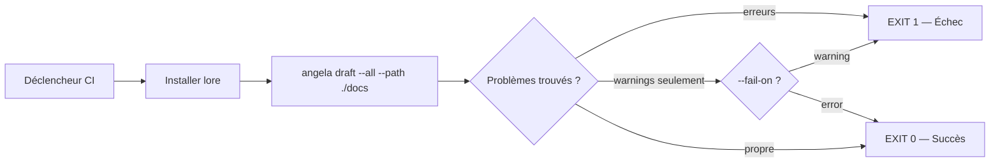
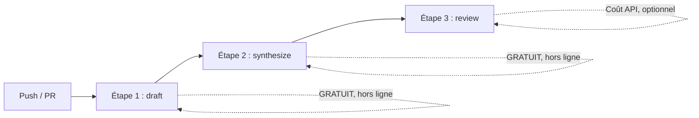
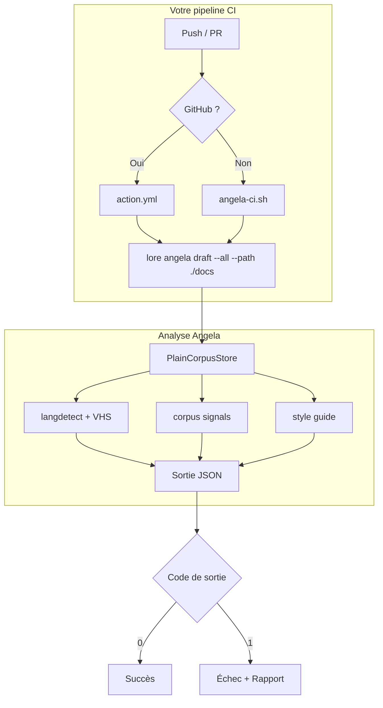

# Angela en CI — Quality Gate Documentation

Angela peut s'exécuter comme quality gate dans n'importe quel pipeline CI/CD, en analysant votre documentation Markdown pour détecter les problèmes structurels, les incohérences et les problèmes de cohérence — **sans nécessiter `lore init`**.

## Démarrage rapide

### GitHub Actions

```yaml
# .github/workflows/docs.yml
- uses: GreyCoderK/lore@v1
  with:
    mode: draft        # hors-ligne, gratuit — pas de clé API nécessaire
    path: ./docs       # votre répertoire markdown
    fail_on: error     # ou : warning, none
```

### GitLab CI

```yaml
doc-review:
  stage: test
  script:
    - ./scripts/angela-ci.sh --path docs --fail-on warning --install
```

### Jenkins / Bitbucket / Tout CI

```bash
./scripts/angela-ci.sh --path docs --fail-on error --install
```

## Comment ça marche



> **Vous ne voyez pas le diagramme ?**
> Voir la section [Visualisation des diagrammes](#visualisation-des-diagrammes) en bas de cette page.

## Modes

| Mode | Clé API | Coût | Ce qu'il vérifie |
|------|---------|------|------------------|
| `draft` | Non | Gratuit | Structure, style, cohérence, personas |
| `synthesize` | Non | Gratuit | Génère automatiquement des exemples API, requêtes SQL depuis le contenu du doc (hors ligne) |
| `review` | Oui | ~0,01-0,05 $ | Contradictions corpus-wide, lacunes, obsolescence |

### Pipeline CI en 3 étapes recommandé



Les étapes 1 et 2 sont entièrement hors ligne — pas de clé API, pas de coût. L'étape 3 (review) est optionnelle et uniquement nécessaire pour les vérifications de cohérence corpus-wide (pré-release, audits périodiques).

### GitHub Actions (pipeline 3 étapes)

```yaml
# .github/workflows/docs.yml
name: Documentation Quality
on: [push, pull_request]

jobs:
  docs:
    runs-on: ubuntu-latest
    steps:
      - uses: actions/checkout@v4

      # Étape 1 : Vérification structurelle hors ligne (gratuit)
      - uses: GreyCoderK/lore@v1
        with:
          mode: draft
          path: ./docs
          fail_on: error

      # Étape 2 : Génération automatique d'exemples API depuis le contenu existant (gratuit)
      - run: |
          for f in docs/*.md; do
            lore angela polish "$(basename $f)" --synthesize --set-status reviewed || true
          done

      # Étape 3 : Revue de cohérence IA (optionnel, uniquement sur les tags)
      - if: startsWith(github.ref, 'refs/tags/v')
        uses: GreyCoderK/lore@v1
        with:
          mode: review
          path: ./docs
          api_key: ${{ secrets.ANTHROPIC_API_KEY }}
```

### Docs externes pré-planifiées (sans lore init)

Angela fonctionne sur **n'importe quel répertoire Markdown** — votre équipe peut planifier la documentation en dehors de lore (dans un wiki, un export Confluence, un export Notion, ou un site MkDocs fait main) et bénéficier quand même de l'analyse et de l'enrichissement synthesizer d'Angela :

```bash
# Projet externe — pas de répertoire .lore/ nécessaire
lore angela draft --all --path ./external-wiki/

# Générer des exemples Postman depuis des specs API dans un arbre de docs externe
lore angela polish api-endpoints.md --synthesize --path ./swagger-docs/
```

En mode autonome :
- Les fichiers avec front matter YAML reçoivent l'analyse complète
- Les fichiers sans front matter reçoivent des métadonnées synthétiques (type=note)
- Le synthesizer détecte les endpoints, filtres et sections sécurité que le doc ait été créé par lore ou non
- Pas besoin de `.lorerc` — les valeurs par défaut s'appliquent

### Mode Draft (recommandé pour la CI)

Fonctionne entièrement hors-ligne. Vérifie :
- Sections manquantes (Why, What, Alternatives) — **uniquement sur les types stricts lore**
- Conformité au guide de style
- Cohérence inter-documents (tags partagés, clusters de scope)
- Cohérence tapes VHS ↔ documentation (info uniquement, ne bloque jamais)
- Score de qualité par personas (types stricts uniquement)

### Utiliser Angela sur un site de doc non-lore

Angela peut **tourner sans risque sur n'importe quel site de doc Markdown** —
mkdocs, docusaurus, astro, diátaxis, fait main — même si vous n'avez jamais
utilisé `lore init`. L'analyse se branche sur le champ `type` du front matter :

- **Types stricts** (`decision`, `feature`, `bugfix`, `refactor`) — reçoivent
  le traitement lore complet : exigences What/Why/Alternatives/Impact,
  checks personas, notation poids fort.
- **Tout le reste** — profil libre. Aucune exigence de sections, aucun check
  persona, notation rééquilibrée qui récompense la structure, la densité
  et les exemples de code plutôt que les conventions lore.

Vos blog posts, tutoriels, guides, concept pages, landing pages et tout
type personnalisé ne produiront donc pas de faux warnings. Un tutoriel
bien écrit peut atteindre 95/100 (A) sur le profil libre.

**Les paires de traductions** (par ex. `installation.md` et
`installation.fr.md`) sont détectées automatiquement — elles ne sont pas
marquées comme doublons. Codes supportés : `fr`, `en`, `es`, `de`, `it`,
`pt`, `zh`, `ja`, `ko`, `ru`, `ar`, `nl`, `pl`.

**Le front matter partiel est préservé** : un doc avec seulement
`type: decision` et `date:` (sans `status`) garde son type déclaré — il
n'est plus silencieusement dégradé en `note` comme auparavant.

### Mode Review (optionnel, pour les releases)

Utilise un seul appel API pour trouver des problèmes à l'échelle du corpus. Idéal pour les vérifications pré-release ou les revues périodiques, pas pour chaque commit. Fonctionne avec tous les fournisseurs supportés.

#### Avec Anthropic (Claude) — par défaut

```yaml
- uses: GreyCoderK/lore@v1
  if: startsWith(github.ref, 'refs/tags/v')
  with:
    mode: review
    path: ./docs
    api_key: ${{ secrets.ANTHROPIC_API_KEY }}
```

#### Avec OpenAI (GPT)

```yaml
- uses: GreyCoderK/lore@v1
  if: startsWith(github.ref, 'refs/tags/v')
  with:
    mode: review
    path: ./docs
    api_key: ${{ secrets.OPENAI_API_KEY }}
    provider: openai
    model: gpt-4o
```

#### Avec Ollama (auto-hébergé, gratuit)

Si vous exécutez Ollama sur votre runner CI (ou un service sidecar) :

```yaml
services:
  ollama:
    image: ollama/ollama
    ports:
      - 11434:11434

steps:
  - run: curl -s http://localhost:11434/api/pull -d '{"name":"llama3.1"}'
  - uses: GreyCoderK/lore@v1
    with:
      mode: review
      path: ./docs
      provider: ollama
      model: llama3.1
      endpoint: http://ollama:11434
```

#### Avec toute API compatible OpenAI

Tout fournisseur exposant un endpoint compatible OpenAI (Groq, Together, Mistral, Azure OpenAI, vLLM, LM Studio) fonctionne avec `provider: openai` :

```yaml
- uses: GreyCoderK/lore@v1
  with:
    mode: review
    path: ./docs
    api_key: ${{ secrets.GROQ_API_KEY }}
    provider: openai
    model: mixtral-8x7b-32768
    endpoint: https://api.groq.com
```

| Service | Endpoint | Exemples de modèles |
|---------|----------|---------------------|
| **Groq** | `https://api.groq.com` | `mixtral-8x7b-32768`, `llama-3.1-70b-versatile` |
| **Together** | `https://api.together.xyz` | `meta-llama/Meta-Llama-3.1-70B-Instruct-Turbo` |
| **Mistral** | `https://api.mistral.ai` | `mistral-large-latest` |
| **Azure OpenAI** | `https://VOTRE.openai.azure.com` | Votre nom de déploiement |
| **vLLM / LM Studio** | `http://localhost:8000` | N'importe quel modèle chargé |

## Options du script

Le script portable supporte les modes draft et review :

```
./scripts/angela-ci.sh [OPTIONS]

  --path <dir>        Chemin vers les docs markdown (défaut : ./docs)
  --mode <mode>       Mode d'analyse : draft (hors-ligne) ou review (IA) (défaut : draft)
  --fail-on <level>   error | warning | none (défaut : error)
  --filter <regex>    Regex pour filtrer les documents par nom de fichier (review uniquement)
  --all               Analyser tous les documents, pas d'échantillonnage 25+25 (review uniquement)
  --install           Installer lore automatiquement si absent du PATH
  --version <ver>     Version spécifique de lore (défaut : latest)
  --quiet             Supprimer la sortie lisible par l'humain
```

### Exemples

```bash
# Draft (hors-ligne, gratuit) — chaque push
./scripts/angela-ci.sh --path docs --fail-on warning --install

# Review (IA) — tous les docs
./scripts/angela-ci.sh --mode review --path docs --all --install

# Review — seulement les docs de commandes
./scripts/angela-ci.sh --mode review --path docs --filter "commands/.*" --install

# Review — silencieux pour parsing de logs
./scripts/angela-ci.sh --mode review --path docs --all --quiet --install
```

## Jenkins / Bitbucket / GitLab

Le script fonctionne dans n'importe quel système CI. Configurez les variables `LORE_AI_*` pour le mode review :

### Jenkins (Jenkinsfile)

```groovy
pipeline {
    environment {
        LORE_AI_PROVIDER = 'anthropic'
        LORE_AI_API_KEY  = credentials('anthropic-api-key')
        LORE_AI_TIMEOUT  = '120s'
    }
    stages {
        stage('Doc Draft') {
            steps {
                sh './scripts/angela-ci.sh --path docs --fail-on error --install'
            }
        }
        stage('Doc Review') {
            when { buildingTag() }
            steps {
                sh './scripts/angela-ci.sh --mode review --path docs --all --install'
            }
        }
    }
}
```

### Bitbucket Pipelines

```yaml
pipelines:
  default:
    - step:
        name: Qualité Doc (hors-ligne)
        script:
          - ./scripts/angela-ci.sh --path docs --fail-on warning --install

  tags:
    'v*':
      - step:
          name: Revue Doc (IA)
          script:
            - ./scripts/angela-ci.sh --mode review --path docs --all --install
          environment:
            LORE_AI_PROVIDER: openai
            LORE_AI_MODEL: gpt-4o
            LORE_AI_API_KEY: $OPENAI_API_KEY
            LORE_AI_TIMEOUT: 120s
```

### GitLab CI

```yaml
doc-draft:
  stage: test
  script:
    - ./scripts/angela-ci.sh --path docs --fail-on warning --install

doc-review:
  stage: test
  rules:
    - if: $CI_COMMIT_TAG =~ /^v/
  variables:
    LORE_AI_PROVIDER: anthropic
    LORE_AI_API_KEY: $ANTHROPIC_API_KEY
    LORE_AI_TIMEOUT: 120s
    LORE_ANGELA_MAX_TOKENS: 8192
  script:
    - ./scripts/angela-ci.sh --mode review --path docs --all --install
```

### Variables d'environnement

lore lit automatiquement les variables `LORE_AI_*` (via Viper auto-env). Pas besoin de fichier `.lorerc` en CI :

| Variable | Description | Exemple |
|----------|-------------|---------|
| `LORE_AI_PROVIDER` | Fournisseur IA | `anthropic`, `openai`, `ollama` |
| `LORE_AI_MODEL` | Nom du modèle | `claude-haiku-4-5-20251001`, `gpt-4o`, `llama3.1` |
| `LORE_AI_API_KEY` | Clé API (requis pour review, sauf ollama) | `sk-ant-...`, `sk-...` |
| `LORE_AI_ENDPOINT` | URL endpoint custom | `https://api.groq.com`, `http://localhost:11434` |
| `LORE_AI_TIMEOUT` | Timeout de requête | `120s` |
| `LORE_ANGELA_MAX_TOKENS` | Max tokens de sortie | `8192` |

Ces variables fonctionnent dans **n'importe quel système CI** — GitHub Actions, GitLab, Jenkins, Bitbucket, CircleCI, etc.

## Mode standalone

Angela fonctionne sur **n'importe quel répertoire de fichiers Markdown** — avec ou sans front matter YAML de lore :

- **Avec front matter** : Analyse complète (type, tags, dates, clusters de scope)
- **Sans front matter** : Métadonnées synthétiques à partir du nom de fichier et de la date de modification ; les vérifications structurelles et de style fonctionnent toujours

Cela signifie que vous pouvez ajouter Angela à n'importe quel projet ayant un dossier `docs/`, que vous utilisiez lore ou non.

## Architecture d'intégration



## Visualisation des diagrammes

Les diagrammes de cette documentation utilisent [Mermaid](https://mermaid.js.org/). Voici comment les visualiser selon votre environnement :

| Environnement | Solution | Lien |
|--------------|----------|------|
| **VS Code** | Extension Markdown Preview Mermaid | [Installer](https://marketplace.visualstudio.com/items?itemName=bierner.markdown-mermaid) |
| **JetBrains** (IntelliJ, GoLand, etc.) | Plugin Mermaid | [Installer](https://plugins.jetbrains.com/plugin/20146-mermaid) |
| **En ligne** | Coller le bloc dans l'éditeur en ligne | [mermaid.live](https://mermaid.live) |
| **MkDocs** | Rendu automatique via `pymdownx.superfences` | Déjà configuré dans ce projet |
| **GitHub** | Rendu natif dans les fichiers `.md` | Aucune action requise |

> **Audience non-technique ?** Si votre audience ne peut pas rendre les diagrammes Mermaid, vous pouvez les convertir en images PNG/SVG avec [mermaid-cli](https://github.com/mermaid-js/mermaid-cli) (`mmdc`) et les placer dans `assets/diagrams/`.
